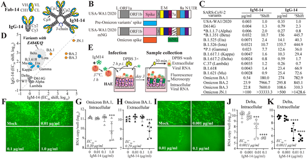

Antibodies are the body’s frontline defenders against viruses like SARS-CoV-2, the virus responsible for COVID-19. But as the virus evolves, many antibodies lose their effectiveness. What if an antibody could latch onto the virus in two different spots at once, making it harder for the virus to escape? Recent research uncovers exactly how an engineered IgM antibody, called IgM-14, achieves this feat, revealing a novel mechanism of viral neutralization with promising implications for future therapies.

> **TL;DR**
> - IgM-14, an engineered antibody designed for nasal delivery, neutralizes early SARS-CoV-2 variants with exceptional potency by binding two distinct sites on the viral spike protein’s receptor-binding domain.
> - The virus can evade IgM-14 through specific mutations, but understanding IgM-14’s unique dual binding offers a blueprint for designing more resilient antibody therapies against evolving SARS-CoV-2 variants.

SARS-CoV-2 infects human cells by using its spike protein to bind the ACE2 receptor on cell surfaces. This spike protein can shift between 'up' and 'down' shapes, exposing or hiding key regions. Most antibodies target the receptor-binding domain (RBD) of the spike, blocking its interaction with ACE2. However, as the virus mutates, especially in the Omicron lineage, many antibodies lose their ability to neutralize the virus effectively. IgM antibodies differ from the more common IgG antibodies by having multiple binding arms, potentially allowing them to attach more strongly and broadly to viruses. IgM-14 is an engineered IgM antibody derived from a potent IgG antibody, optimized for delivery through the nose to directly target respiratory infections.

The researchers evaluated IgM-14’s ability to neutralize a broad panel of SARS-CoV-2 variants, including early strains and several Omicron subvariants, using live virus neutralization assays and human airway epithelial cell cultures. To uncover how the virus might escape IgM-14, they cultured the virus in the presence of the antibody to select for resistant mutations. They then used cryo-electron microscopy (cryo-EM) to visualize the precise binding of IgM-14’s antigen-binding fragment (Fab) to the spike protein at near-atomic resolution. Site-directed mutagenesis and structural modeling helped identify the importance of two distinct binding sites on the spike’s RBD.

IgM-14 showed remarkable potency against early SARS-CoV-2 variants, neutralizing them at concentrations far lower than its IgG counterpart. However, its effectiveness dropped against Omicron variants, with complete loss of activity against the JN.1 subvariant. Resistance mutations identified in the spike’s receptor-binding motif (G476D and F486P) disrupted IgM-14 binding. Cryo-EM revealed that IgM-14’s Fab binds two separate epitopes on the RBD: a primary site overlapping the ACE2 receptor binding region (accessible when the RBD is 'up'), and a secondary, unique site that appears only when the RBD is in the 'down' conformation and involves a neighboring spike protomer. Unlike IgG-14, IgM-14 can simultaneously engage both sites through its multiple binding arms, a noncanonical avidity mechanism that enhances neutralization potency and breadth.

This study uncovers a previously unappreciated mechanism by which an engineered IgM antibody achieves strong neutralization of SARS-CoV-2 by dual engagement of two distinct spike epitopes. The ability to bind both the ACE2-accessible and inaccessible conformations of the spike protein simultaneously may explain IgM-14’s superior potency and resilience against viral escape compared to IgG antibodies. These insights provide a valuable framework for designing next-generation antibody therapies that can better withstand the ongoing evolution of SARS-CoV-2 and potentially other coronaviruses. Moreover, the intranasal delivery format of IgM-14 targets the primary site of infection, offering a promising route for prophylactic and therapeutic interventions.

While IgM-14 shows enhanced neutralization against many early SARS-CoV-2 variants, its reduced activity against Omicron subvariants, including complete loss of neutralization against JN.1, highlights the challenge posed by viral evolution. The identified resistance mutations underscore that even multivalent antibodies can be evaded by the virus. Further work is needed to design antibodies that maintain broad efficacy against current and future variants. Additionally, clinical development of IgM-14 was discontinued due to these limitations, so translating these mechanistic insights into effective therapies will require continued innovation and testing.

## Figures

*This figure shows how different antibody types block various COVID-19 variants and their effectiveness in human airway cells.*

## Sources

- [Neutralization of SARS-CoV-2 by IgM-14 via engagement of two distinct spike epitopes](https://journals.plos.org/plospathogens/article?id=10.1371/journal.ppat.1014071)
- DOI: [10.1371/journal.ppat.1014071](https://doi.org/10.1371/journal.ppat.1014071)
