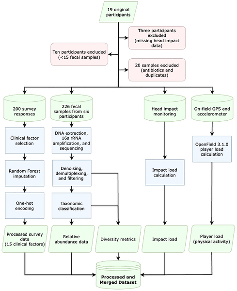
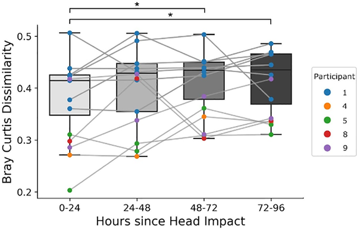
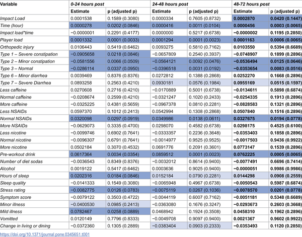

When we think of head injuries in sports, concussions usually come to mind—those sudden, obvious jolts to the brain that demand immediate attention. But what about the countless smaller hits that don’t cause symptoms or diagnosis? Recent research suggests these subtle, non-concussive head impacts, common in contact sports like American football, might quietly influence more than just the brain. Intriguingly, they appear to alter the complex community of microbes living in our gut, hinting at a surprising gut-brain connection.

> **TL;DR**
> - Non-concussive head impacts (NHIs) sustained by collegiate football players correlate with changes in the diversity and composition of their gut microbiomes within days.
> - Across a football season, cumulative NHIs contribute to significant shifts in gut bacteria, emphasizing the need to monitor even mild head impacts.

Mild traumatic brain injuries (mTBIs), including concussions, are known to affect brain function and can lead to lasting neurological problems. Beyond the brain, these injuries have also been linked to changes in the gut microbiome—the trillions of bacteria living in our intestines that play crucial roles in immune regulation, inflammation, and overall health. However, less is known about the effects of non-concussive head impacts (NHIs), which are hits or accelerations to the head that don’t produce clinical symptoms or meet concussion criteria. Athletes in contact sports, especially football players, can experience hundreds of these NHIs over a season. This study explores whether such seemingly mild impacts also influence the gut microbiome, potentially contributing to health risks that go unnoticed.

Researchers followed a group of NCAA Division I collegiate football players throughout a competitive season, closely monitoring their head impacts using helmet-based sensors that measured the force and frequency of hits. Alongside this, the team collected over 200 fecal samples from six players to analyze their gut microbiomes using 16S rRNA gene sequencing, a method that identifies bacterial species present. The study also gathered data on physical activity, clinical symptoms, and lifestyle factors through surveys and wearable GPS devices. By comparing microbiome samples taken before and after sessions with substantial head impacts, and analyzing changes over the entire season, the researchers used statistical modeling to detect correlations between NHIs and shifts in gut bacterial diversity and composition.

The study found that within three days following sessions with high levels of non-concussive head impacts, players showed measurable changes in their gut microbiomes. Specifically, the diversity of gut bacteria shifted, and certain bacterial groups known to be involved in inflammation and brain health—such as Coriobacteriales, Prevotella, and Ruminococcus—varied in abundance. Moreover, over the course of the season, the gut microbiomes of these athletes changed significantly, with evidence suggesting that the cumulative effect of repeated NHIs contributed to these long-term alterations. These findings provide the first direct evidence linking even mild, symptom-free head impacts to changes in gut microbial communities.

This research highlights a previously unrecognized biological consequence of non-concussive head impacts in contact sports. The gut microbiome plays a vital role in regulating inflammation and immune responses, both of which are critical in brain injury and recovery. Alterations in gut bacteria following NHIs could potentially influence neurological health and recovery trajectories, even in the absence of diagnosed concussions. These insights underscore the importance of monitoring all head impacts in athletes, not just those causing overt symptoms, and open new avenues for investigating gut-targeted therapies to mitigate brain injury effects.

While the findings are compelling, this study has limitations. The sample size was small, with detailed microbiome data analyzed from only six players, all from a single collegiate football team. The observational design means causality cannot be firmly established—other factors like diet, stress, or physical activity might also influence gut microbiota changes. Additionally, the study focused on one sport and demographic group, so results may not generalize broadly. Future research with larger, more diverse cohorts and controlled interventions will be necessary to confirm these findings and clarify the mechanisms linking head impacts and gut microbiome alterations.

## Figures

*Data from head impacts, activity, surveys, and gut samples were collected and processed from 6 players to study bacteria and physical strain.*

*Gut bacteria differences increase significantly 2-4 days after a severe head impact compared to the day of injury.*

*Table shows how recent head impacts and factors like player load affect brain changes, highlighting significant results in blue.*

## Sources

- [Non-concussive head impacts sustained during American football correlate with changes in gut microbiome diversity and composition](https://journals.plos.org/plosone/article?id=10.1371/journal.pone.0345651)
- DOI: [10.1371/journal.pone.0345651](https://doi.org/10.1371/journal.pone.0345651)
