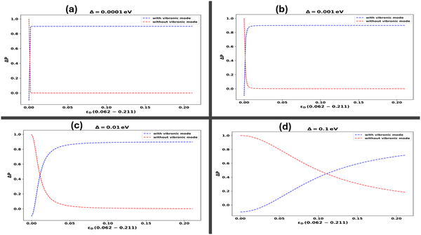

Could the strange world of quantum physics be helping the coronavirus infect our cells? Recent research proposes that tiny quantum effects—specifically, electron tunneling enhanced by vibrations in the virus and host cell membranes—may play a surprising role in how SARS-CoV-2 hijacks human cells. This fresh perspective blends quantum mechanics with virology, offering a new angle on viral infection mechanisms that might inspire innovative antiviral strategies.

> **TL;DR**
> - Quantum tunneling of electrons, assisted by specific vibrational modes in the SARS-CoV-2 spike protein and the host cell membrane, may enhance the virus’s ability to infect cells.
> - The study uses advanced non-Markovian quantum models to show that these quantum effects sustain coherence and optimize electron transfer, suggesting new targets for antiviral drug design.

Quantum biology is an emerging field that investigates whether quantum phenomena—usually observed at the atomic or subatomic scale—play functional roles in living systems. While quantum effects have been studied in photosynthesis and olfaction, their role in viral infections remains largely unexplored. SARS-CoV-2 infects human cells by binding its spike protein to the ACE2 receptor on the cell surface. This interaction is complex and involves molecular vibrations and electron transfers at the virus-host interface. Understanding these processes at the quantum level could reveal new insights into viral entry and infection.

The researchers applied a sophisticated quantum mechanical framework called non-Markovian quantum state diffusion (NMQSD) to model electron transfer between the viral spike protein and the ACE2 receptor within the structured environment of the lipid membrane. Unlike simpler semiclassical models, this approach accounts for memory effects and vibrational modes in the environment that influence electron tunneling. The spike protein’s vibrational frequencies were incorporated into the model, allowing the team to simulate how these vibrations assist electron transfer and maintain quantum coherence over time.

The study found that electron tunneling at the virus-receptor interface operates in an intermediate coupling regime where quantum coherence is crucial. Specific vibrational modes of the spike protein significantly enhance tunneling efficiency and sustain coherence longer than previously expected. The efficiency of tunneling depends critically on resonance conditions: below resonance, tunneling is enhanced through resonance-assisted mechanisms, while above resonance, decoherence sharply reduces tunneling rates. These findings parallel quantum coherence effects observed in photosynthesis, suggesting that the host cell membrane environment actively optimizes electron transfer to facilitate viral infection.

This research introduces a novel quantum perspective on virus-host interactions, highlighting how quantum tunneling and vibrational dynamics may contribute to SARS-CoV-2 infection. By revealing that modulation of vibrational frequencies can influence electron transfer efficiency, the study points to new potential targets for antiviral drug development. Although still theoretical, this quantum approach could inspire innovative strategies to disrupt viral entry by interfering with the quantum mechanical processes underlying infection.

It is important to note that these findings are based on theoretical modeling without direct experimental validation. Quantum tunneling and vibrational coherence in biological systems are challenging to observe and verify experimentally. The models rely on assumptions about the coupling strengths and vibrational modes that need further empirical support. Therefore, while the study opens exciting new directions, translating these quantum insights into practical antiviral therapies will require substantial future research and experimental confirmation.

## Figures

*This figure shows how vibrations in the SARS-CoV-2 spike protein boost electron transfer, especially as the connection strength between parts increases.*

## Sources

- [Non-markovian electron tunneling in SARS-CoV-2 virus infection in structured environments](https://journals.plos.org/plosone/article?id=10.1371/journal.pone.0344447)
- DOI: [10.1371/journal.pone.0344447](https://doi.org/10.1371/journal.pone.0344447)
