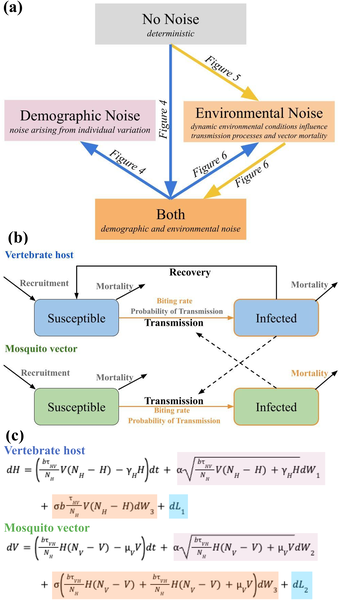
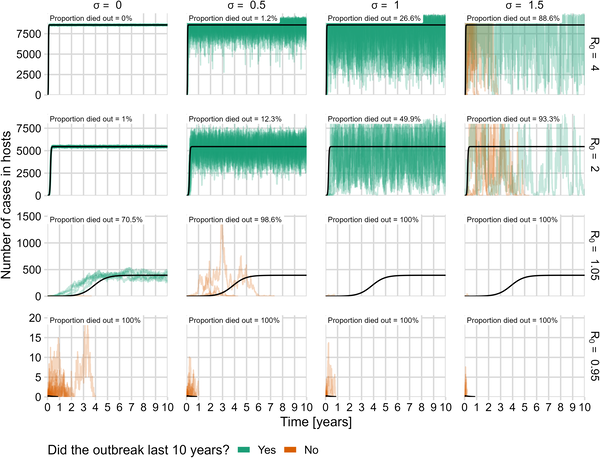
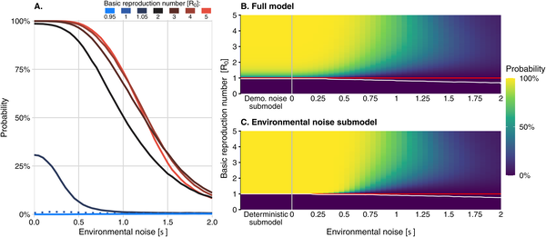
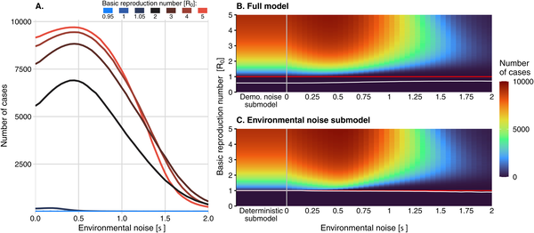

Could more extreme and unpredictable weather actually reduce the risk of mosquito-borne disease outbreaks? It might sound counterintuitive, but recent research suggests that the increasing variability in climate — the swings between droughts, heavy rains, and temperature extremes — can have complex effects on how diseases like dengue and malaria spread. Understanding these nonlinear effects is crucial as we face a future shaped by climate change.

> **TL;DR**
> - Increasing environmental noise (variability) can reduce the risk of sustained mosquito-borne disease outbreaks, but the largest outbreaks tend to occur at intermediate levels of environmental variability.
> - The basic reproduction number (R0), a common metric used to predict outbreak risk, is insufficient on its own in noisy, variable environments; stochastic effects must be considered for accurate forecasting.

Mosquito-borne diseases remain a major global health challenge, infecting hundreds of millions and causing hundreds of thousands of deaths annually. Climate change is expected to increase the variability of key weather factors like temperature and rainfall, which directly impact mosquito survival and reproduction. Traditional models often rely on average conditions and the basic reproduction number, R0, to predict outbreak risk. However, these approaches may miss critical effects of environmental fluctuations, which can alter disease dynamics in unexpected ways.

To explore these effects, researchers developed a mathematical model based on the classic Ross-Macdonald framework, incorporating both demographic randomness (natural variation in births, deaths, infections) and environmental noise (unpredictable changes in factors like temperature and rainfall). They ran extensive simulations varying the strength of environmental noise and R0 to examine how these factors influence the probability, size, and duration of outbreaks over a ten-year period.

The study found that increasing environmental noise generally lowers the probability that a mosquito-borne disease becomes endemic, sometimes reducing risk from near certainty to almost zero. Interestingly, the largest outbreaks occurred not at the highest noise levels but at intermediate levels of environmental variability. Moreover, outbreaks that did die out under noisy conditions tended to end quickly. These results challenge the notion that a higher R0 always means a higher outbreak risk; in noisy environments, R0 alone cannot reliably predict outbreak occurrence or severity.

These findings highlight the importance of considering environmental variability and stochastic effects when forecasting mosquito-borne disease outbreaks in a changing climate. They suggest that more extreme weather events could, in some cases, disrupt mosquito populations enough to reduce disease risk, offering a nuanced perspective that could inform public health planning and vector control strategies. This work underscores the need for models that move beyond averages to capture the complexity of real-world disease dynamics.

While the model provides valuable insights, it is based on simulations and simplifications of complex ecological and epidemiological processes. Real-world factors such as human behavior, mosquito species differences, and local environmental conditions may influence outcomes in ways not captured here. Further empirical studies and refined models are needed to fully understand how increasing climate variability will impact mosquito-borne diseases across diverse settings.

## Figures

*Diagram showing study models, how environmental and demographic factors affect infection spread, and how host and vector infections change over time.*

*Graph shows how infection numbers change over 10 years under different conditions, with some outbreaks lasting and others ending early.*

*This figure shows how likely a large outbreak is over 10 years, depending on infection spread and environmental factors.*

*Outbreak intensity varies with environmental noise and infection rates, showing when cases rise above one in 10 years across many simulations.*

## Sources

- [Nonlinear effects of noise on outbreaks of mosquito-borne diseases](https://journals.plos.org/ploscompbiol/article?id=10.1371/journal.pcbi.1013466)
- DOI: [10.1371/journal.pcbi.1013466](https://doi.org/10.1371/journal.pcbi.1013466)
