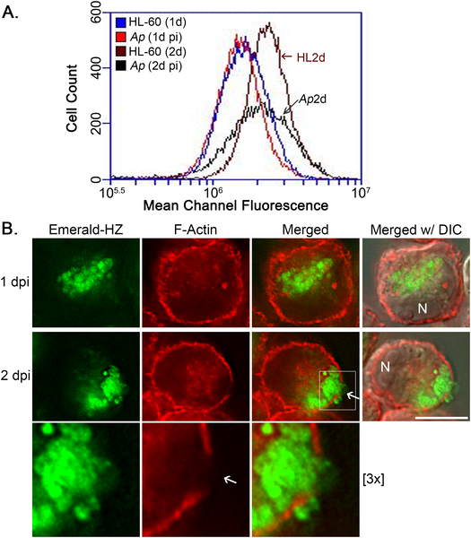
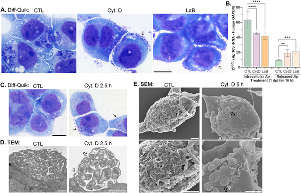
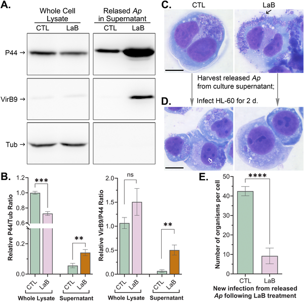
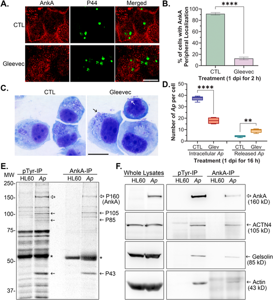

Imagine a microscopic invader that not only hides inside your cells but also cleverly rewires the cell’s internal scaffolding to time its escape perfectly. This is exactly what the bacterium Anaplasma phagocytophilum does to spread infection. By manipulating the host cell’s actin cytoskeleton, it controls when and how it bursts out to infect new cells, revealing a sophisticated survival strategy.

> **TL;DR**
> - Anaplasma phagocytophilum disrupts the host cell’s cortical actin at sites where it releases from infected cells, facilitating bacterial exit.
> - The bacterial effector protein AnkA interacts with host actin and actin-regulating proteins to control actin remodeling, coordinating bacterial growth and timely release.

Anaplasma phagocytophilum is an obligate intracellular bacterium responsible for human granulocytic anaplasmosis, an emerging infectious disease transmitted by ticks. It invades human neutrophils—key immune cells—and replicates inside membrane-bound vacuoles. The bacterium undergoes a developmental cycle transitioning from a replicative form to an infectious form, which must be released to infect new cells. Understanding how this bacterium controls its release from host cells is crucial, as premature or uncontrolled release could reduce its infectivity and survival.

Researchers infected human promyelocytic cells (HL-60) with A. phagocytophilum and used fluorescence microscopy and flow cytometry to observe changes in the host cell’s actin cytoskeleton during infection. They applied chemical inhibitors to disrupt actin polymerization and tracked bacterial release and infectivity. Protein interaction assays, including immunoprecipitation and mass spectrometry, identified host proteins interacting with the bacterial AnkA effector. Functional knockdowns of these host proteins were performed to assess their role in bacterial release. Additionally, in vitro actin polymerization assays and microscopy of cells expressing AnkA fragments helped elucidate AnkA’s role in actin dynamics.

The study found that as A. phagocytophilum matures inside host cells, localized disruption of cortical F-actin occurs precisely where bacterial vacuoles contact the plasma membrane to release bacteria. Chemical disruption of actin filaments caused premature, uncontrolled bacterial release, but these bacteria were less infectious than those released naturally. AnkA, a bacterial protein secreted via the type IV secretion system, colocalizes with cortical actin and binds directly to actin and actin-regulating proteins α-actinin 4 and gelsolin. These interactions allow AnkA to modulate actin filament remodeling and cross-linking. Knockdown of α-actinin 4 or gelsolin enhanced premature bacterial release, confirming their role in retention. AnkA’s C-terminal domain promotes actin polymerization, while its N-terminal domain interacts with α-actinin 4 and induces membrane ruffling. Together, these findings reveal AnkA as a unique bacterial effector that orchestrates host actin remodeling to regulate the timing and location of bacterial release.

This research uncovers a novel mechanism by which an intracellular pathogen controls its exit from host cells, a critical step for infection spread. By manipulating the host’s actin cytoskeleton through AnkA, A. phagocytophilum ensures it remains inside cells long enough to replicate but exits at the right time to maintain infectivity. Understanding this bacterial strategy provides new insights into microbial pathogenesis and highlights potential targets for therapeutic intervention against tick-borne diseases like human granulocytic anaplasmosis.

While the study provides compelling evidence of AnkA’s role in actin dynamics and bacterial release, these findings are based on cell culture models and biochemical assays. Further research is needed to confirm these mechanisms in vivo and to explore how these interactions affect disease progression in patients. Additionally, targeting such bacterial-host interactions therapeutically will require careful consideration to avoid disrupting essential host cell functions.

## Figures

*Infection by A. phagocytophilum lowers the amount of cortical actin in HL-60 cells over 2 days, shown by flow cytometry and microscopy.*

*Blocking actin polymerization causes infected cells to release many A. phagocytophilum bacteria, shown by staining and DNA analysis.*

*Treating infected cells to break down their skeleton releases less infectious bacteria, shown by protein tests and cell staining.*

*AnkA protein moves to cell edges and binds actin-related proteins, needing Abl-1 kinase; Gleevec disrupts this and triggers bacterial release.*

## Sources

- [Obligatory intracellular bacterium Anaplasma phagocytophilum AnkA regulates actin dynamics and spatiotemporal bacterial release](https://journals.plos.org/plospathogens/article?id=10.1371/journal.ppat.1014350)
- DOI: [10.1371/journal.ppat.1014350](https://doi.org/10.1371/journal.ppat.1014350)
