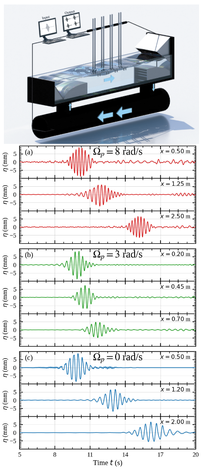
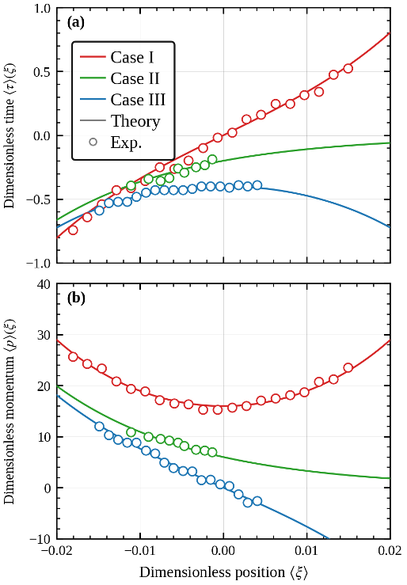
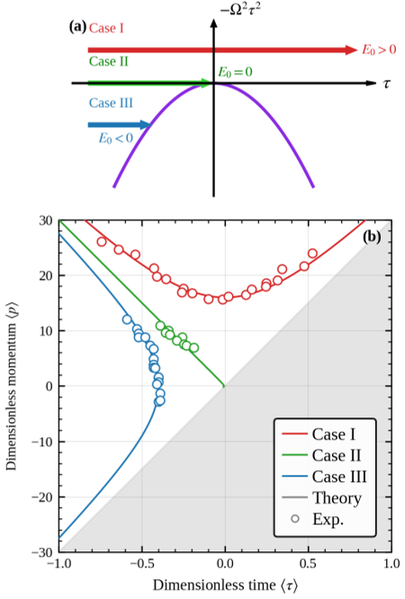

Imagine watching ripples on a water surface and seeing them behave like mysterious quantum particles trapped by an invisible barrier. This is not a trick of the eye but the result of a clever experiment where classical water waves mimic the dynamics of a fundamental quantum scattering model — the inverted harmonic oscillator. By shaping water currents in a tank, researchers have created a parabolic potential barrier that reveals how wave packets either pass over, hover near, or reflect off this barrier, bringing a classic quantum puzzle vividly to life.

> **TL;DR**
> - Water waves in a tank were used to experimentally simulate the inverted harmonic oscillator, a key quantum scattering system with a parabolic barrier.
> - The experiment visualized phase-space dynamics, showing a clear separatrix boundary that determines whether wave packets transmit, reflect, or hover at the barrier top.

*Note: this summary is based on a preprint — research shared ahead of formal peer review.*

The harmonic oscillator is a cornerstone of quantum mechanics, describing particles bound in potential wells. Its lesser-known counterpart, the inverted harmonic oscillator (IHO), flips this picture: instead of a well, it features a parabolic barrier. This barrier is central to understanding quantum scattering and tunneling, phenomena with broad implications from electronics to black hole physics. However, directly observing the IHO’s dynamics can be challenging. The new study cleverly uses surface gravity water waves, which obey wave equations analogous to quantum mechanics, to create a classical analog of the IHO. By controlling water currents to form a time-dependent parabolic barrier, the researchers can watch wave packets behave just like quantum particles encountering the IHO potential.

The experimental setup consisted of a 5-meter-long water tank where surface gravity waves were generated by a computer-controlled wave maker. A carefully designed, time-dependent water current created a parabolic potential barrier analogous to the IHO’s inverted harmonic potential. The wave packets launched into this environment had Gaussian envelopes with varying average energies. Four wave gauges along the tank measured the surface elevation at different points, allowing reconstruction of the wave packets’ amplitude and phase. Using mathematical tools like the Hilbert transform, the researchers extracted analogs of time and momentum coordinates to map the wave packets’ trajectories through phase space, revealing how they interacted with the barrier.

The experiments demonstrated three distinct behaviors depending on the wave packets’ energies relative to the barrier height: packets with energy above the barrier transmitted through it; those with energy below were reflected; and those exactly at the barrier top hovered along a special boundary called the separatrix. The researchers quantitatively mapped these trajectories in phase space, showing excellent agreement with theoretical predictions. Notably, wave packets at the separatrix gradually diminished in amplitude as they approached the barrier peak, consistent with the expected spreading and decay. These observations provide a clear visualization of the IHO’s phase-space dynamics, including the sharp boundary that separates different scattering regimes.

This work offers a rare and visually compelling experimental realization of a fundamental quantum scattering model using classical water waves. By bridging quantum physics and fluid dynamics, it provides an accessible platform to study complex quantum phenomena like tunneling and scattering in a tangible way. The clear observation of the separatrix and phase-space trajectories enriches our conceptual understanding of the IHO and opens pathways for exploring related effects such as quantum reflection and analog Hawking radiation. Beyond fundamental physics, this approach could inspire analogous experiments in optics, acoustics, and matter waves, fostering cross-disciplinary insights into wave dynamics and non-equilibrium systems.

While the water wave system closely mimics the quantum inverted harmonic oscillator, it remains a classical analog with inherent limitations. The effective potential is realized only near the barrier peak due to practical constraints on the water current, and the analogy involves an interchange of space and time variables. Additionally, the experiments did not observe quantum reflection effects that appear when the barrier length scale matches the wave packet size, a regime for future exploration. As the study is currently a preprint without peer review, further validation and extension of these results will strengthen their impact. Nonetheless, the experiment provides a robust and insightful demonstration of IHO phase-space dynamics.

## Figures

*Water waves in a tank mimic quantum waves, showing how wave packets pass, hover, or reflect off a parabolic barrier created by water currents. — Figure from Georgi Gary Rozenman et al., [CC BY 4.0](http://creativecommons.org/licenses/by/4.0/), caption edited.*

*Figure 3 shows how measured and predicted paths of time and momentum change for three different settings of Ωp. — Figure from Georgi Gary Rozenman et al., [CC BY 4.0](http://creativecommons.org/licenses/by/4.0/), caption edited.*

*Water wave experiments show how wave packets pass, stop, or reflect depending on energy, mapping their paths in phase space with clear boundaries. — Figure from Georgi Gary Rozenman et al., [CC BY 4.0](http://creativecommons.org/licenses/by/4.0/), caption edited.*

## Sources

- [Observation of Phase Space Dynamics of Inverted Harmonic Oscillator](https://arxiv.org/abs/2607.18297)
- DOI: [10.48550/arxiv.2607.18297](https://doi.org/10.48550/arxiv.2607.18297)

*This article reuses and adapts text and figures from the original research by Georgi Gary Rozenman et al., available via arXiv Quantum Physics, under the [CC BY 4.0](http://creativecommons.org/licenses/by/4.0/) license.*
