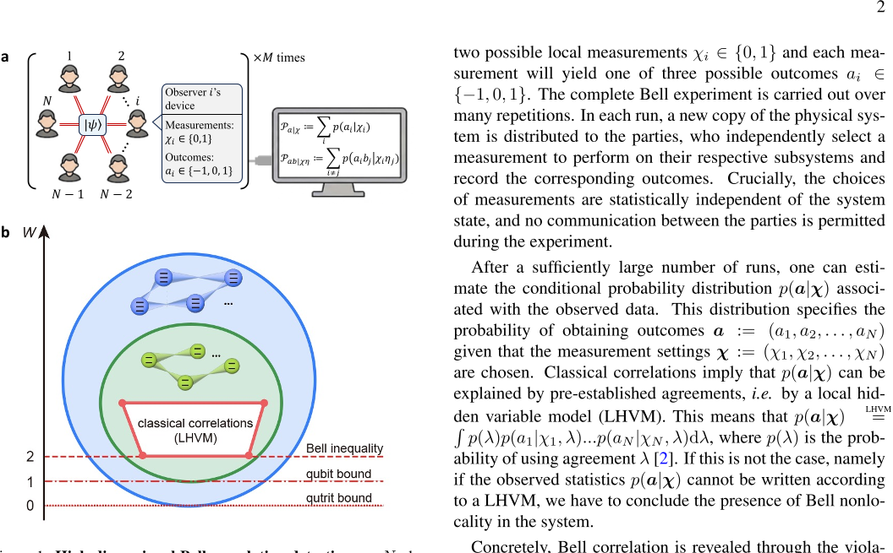
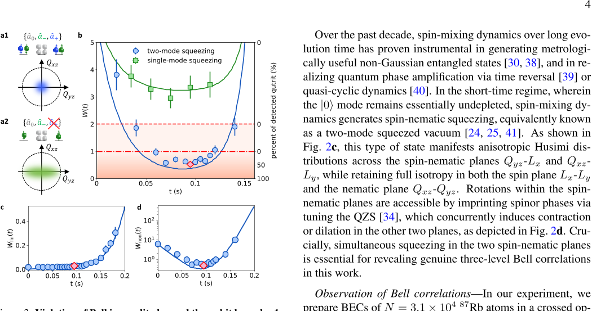

Quantum entanglement—the mysterious connection that can link particles across space—has fascinated scientists and the public alike for decades. Traditionally, experiments probing these quantum links have focused on the simplest quantum units: qubits, which have just two possible states. But what if the quantum world is richer than that? A recent breakthrough experiment with a cloud of over thirty thousand ultracold atoms reveals entanglement involving three-level quantum units, or qutrits, pushing the boundaries of quantum weirdness to a new dimension.

> **TL;DR**
> - Scientists have demonstrated Bell inequality violations involving qutrits—three-level quantum systems—in a large many-body atomic ensemble, surpassing the limits achievable with qubits.
> - Using spin-nematic squeezing in a spin-1 Bose-Einstein condensate of rubidium atoms, they certified genuine multipartite high-dimensional quantum correlations with collective measurements alone.

*Note: this summary is based on a preprint — research shared ahead of formal peer review.*

Bell inequalities are mathematical tests that distinguish quantum correlations from any classical explanation relying on local hidden variables. Violations of these inequalities confirm the presence of quantum nonlocality, a fundamental feature of quantum mechanics. While many experiments have demonstrated Bell violations with qubits—two-level systems—extending these tests to higher-dimensional quantum systems (qudits) remains challenging, especially in large many-body systems. Qudits can exhibit richer correlations and stronger violations, offering deeper insights into quantum mechanics and potential advantages for quantum technologies.

The researchers used a spinor Bose-Einstein condensate (BEC) of about 31,000 rubidium-87 atoms confined in an optical trap. Each atom acts as a spin-1 particle with three internal states, naturally forming qutrits. By exploiting spin-exchange collisions, they generated spin-nematic squeezed states—exotic quantum states with reduced noise in certain collective spin observables. They then measured collective spin and nematic tensor operators through carefully designed microwave and radio-frequency pulses followed by spin-resolved absorption imaging. These collective measurements allowed them to evaluate a Bell witness operator tailored to detect high-dimensional Bell correlations without requiring single-particle resolution.

The experiment revealed a violation of a Bell inequality that goes beyond what any ensemble of qubits could achieve. Specifically, the measured Bell witness dropped below the qubit bound, directly certifying the presence of genuine multipartite qutrit Bell correlations. The spin-nematic squeezing reached about -11.8 dB, indicating strong quantum correlations involving all three spin states. This is the first observation of such high-dimensional Bell correlations in a many-body atomic system, demonstrating that collective measurements on a macroscopic quantum state can reveal complex quantum entanglement structures.

This work establishes spinor Bose-Einstein condensates as a promising platform for exploring high-dimensional quantum correlations in large systems. By pushing beyond the qubit paradigm, it opens new avenues for fundamental tests of quantum mechanics and the study of many-body entanglement. Although immediate practical applications are not yet realized, these findings could inform future quantum information protocols that exploit higher-dimensional quantum units, potentially enhancing security, robustness, and computational power.

It is important to note that the Bell inequality violation observed here relies on collective measurements and does not close all loopholes associated with spatial separation or measurement independence. The system is not tested under strictly device-independent conditions, and the results pertain to a specific physical realization requiring careful calibration. Nevertheless, the methodology is robust and grounded in well-established quantum theory, providing strong evidence for genuine high-dimensional entanglement in a macroscopic atomic ensemble.

## Figures

*Scientists measure shared systems with three outcomes to test quantum links, using results to reveal the system's complexity and quantum dimension. — Figure from Wenxin Xu et al., [CC BY 4.0](http://creativecommons.org/licenses/by/4.0/), caption edited.*

*This figure shows how special squeezed states of atoms break classical limits, proving many atoms act as three-level quantum units over time. — Figure from Wenxin Xu et al., [CC BY 4.0](http://creativecommons.org/licenses/by/4.0/), caption edited.*

## Sources

- [Observing Bell Inequality Violation Beyond the Qubit Bound in a Spinor Bose--Einstein Condensate](https://arxiv.org/abs/2608.24981)
- DOI: [10.48550/arxiv.2608.24981](https://doi.org/10.48550/arxiv.2608.24981)

*This article reuses and adapts text and figures from the original research by Wenxin Xu et al., available via arXiv Quantum Physics, under the [CC BY 4.0](http://creativecommons.org/licenses/by/4.0/) license.*
