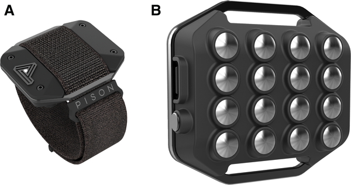
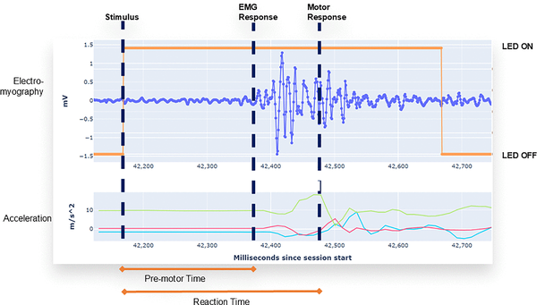
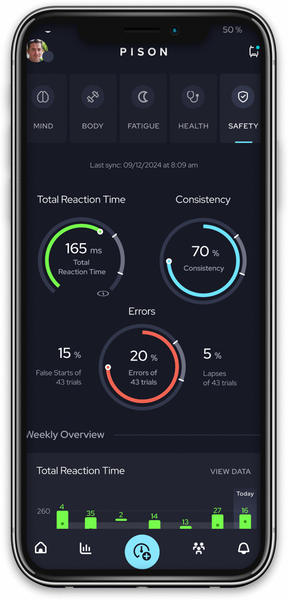
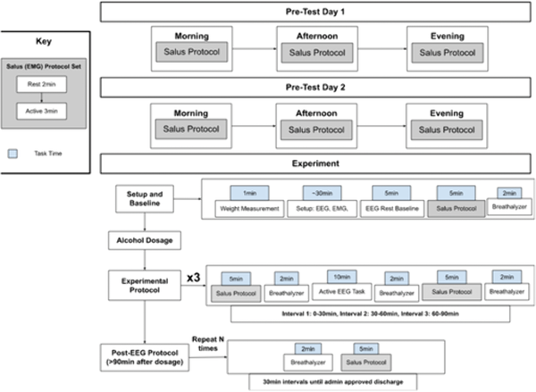

Could a simple wristband tell if you're too impaired to drive? Researchers have developed a wearable device that measures how quickly your brain and muscles respond to a stimulus, revealing changes in reaction time linked to alcohol consumption. This technology aims to provide a rapid, non-invasive way to detect intoxication before you get behind the wheel.

> **TL;DR**
> - The Pison wrist-worn device measures reaction time and premotor time using muscle and movement sensors on the wrist.
> - Reaction times measured by the device reliably increase as blood alcohol concentration rises, correlating with legal intoxication levels.

Excessive alcohol use remains a leading cause of preventable death worldwide, with impaired driving accounting for thousands of fatalities each year. Despite advances in sensor technology, there is currently no widely adopted, easy-to-use device that can accurately detect functional impairment from alcohol in real-world settings. Reaction time—a measure of how quickly a person responds to a stimulus—is known to slow down with increasing blood alcohol levels and is critical for safe driving. The challenge has been developing a practical, on-body sensor that can measure this reliably and unobtrusively.

In a pilot study, nineteen adults aged 21 to 36 wore the Pison device on their wrist while undergoing controlled alcohol consumption to raise their blood alcohol concentration (BAC) to between 0.10% and 0.12%. Five control participants did not consume alcohol. The device uses stainless steel electrodes to record muscle electrical activity (electromyography) and an accelerometer to detect movement onset. Participants performed reaction time tests by responding to a visual stimulus on the device, which measured the time from stimulus to muscle activation (premotor time) and from stimulus to movement (reaction time). These measurements were compared against BAC levels obtained via breathalyzer every 15 minutes during the 90-minute session.

The study found a clear and statistically significant relationship between rising BAC and slower reaction times. Participants with medium and high BAC levels (above the legal limit of 0.08%) showed significantly longer reaction times compared to controls. Even participants with low BACs below the legal limit had slower responses than sober controls. Premotor time also increased with higher BAC and decreased as BAC returned below legal intoxication levels. These results demonstrate that the Pison wearable can detect subtle neurophysiological changes caused by alcohol in real time, serving as a sensitive proxy for intoxication.

This research introduces the first use of an on-body neurophysiological sensor to measure reaction time changes linked to alcohol impairment, offering a promising approach to real-time intoxication detection. Such a device could empower individuals to make safer choices by providing immediate feedback on their functional capacity to drive or operate machinery. It also aligns with regulatory goals to integrate impairment detection technology into vehicles, potentially reducing alcohol-related accidents and fatalities.

While the results are encouraging, this pilot study involved a small and relatively homogenous sample, limiting generalizability. Larger and more diverse studies are needed to validate the device’s accuracy across different populations and real-world conditions. Reaction time can be influenced by factors other than alcohol, such as fatigue or distraction, which the device must account for to avoid false positives. Integration with additional physiological measures, such as brain activity, may improve accuracy. Nonetheless, this study lays important groundwork for wearable technology in public health and safety.

## Figures

*Pison is a wrist-worn device that uses stainless steel sensors to track body signals from the top of the wrist.*

*The Pison wearable tracks muscle and movement signals to measure the time between seeing a stimulus and starting a physical response.*

*The Pison app measures your reaction time to check your readiness by comparing it to baseline data.*

*Overview of the BAC study's experimental steps and procedures.*

## Sources

- [On-body measure of reaction time correlates with intoxication level](https://journals.plos.org/plosone/article?id=10.1371/journal.pone.0323858)
- DOI: [10.1371/journal.pone.0323858](https://doi.org/10.1371/journal.pone.0323858)
