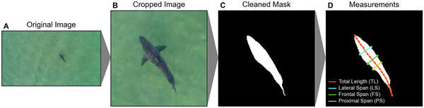
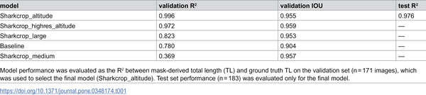
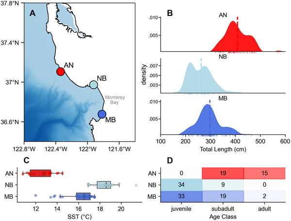
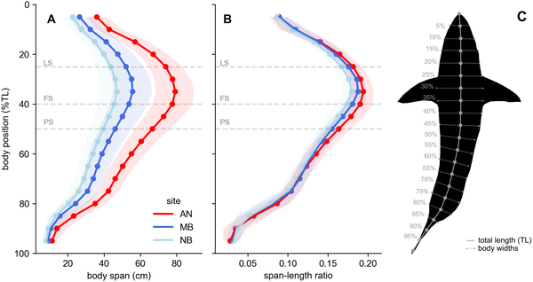

White sharks are among the ocean’s most iconic predators, yet studying their growth and behavior in the wild poses significant challenges. What if we could track how these sharks change shape and habitat over their lifetimes without ever touching them? Thanks to advances in drone technology and artificial intelligence, scientists are now doing just that—capturing stunning aerial images and using computer vision to measure shark size and body condition remotely in Monterey Bay.

> **TL;DR**
> - Researchers combined drone (UAS) imagery and deep learning to accurately measure white shark length and body shape without handling the animals.
> - They discovered that white sharks in Monterey Bay form size-structured groups linked to ocean conditions, with females showing greater girth as they mature, likely related to reproduction.

Body size is a key trait influencing an animal’s physiology, growth, and ecological role. For large, mobile marine species like white sharks, obtaining accurate size measurements in the wild is notoriously difficult. Traditional methods often require capturing or tagging sharks, which can be logistically complex and stressful for the animals. Moreover, white sharks undergo ontogenetic shifts—changes in diet, habitat, and morphology as they grow—that are important to understand for conservation and ecological studies. Monterey Bay National Marine Sanctuary has become a hotspot where juvenile, subadult, and adult white sharks congregate, providing a unique opportunity to study these life stages together. However, measuring these sharks across different ages and sexes in a consistent, non-invasive way remained a challenge—until now.

The research team deployed drones equipped with high-resolution cameras over three key white shark aggregation sites in Monterey Bay from 2022 to 2025. They captured still images of free-swimming sharks from altitudes between 10 and 70 meters. To identify individual sharks and determine their sex, underwater video footage was also collected using pole-mounted cameras. The aerial images were processed using a deep learning computer vision pipeline that segmented shark bodies from the background and extracted precise morphometric measurements. By analyzing the shape and size of the sharks’ bodies in these images, the team calculated total length and body spans at multiple points along the body. They validated their measurements against manual tracings and visual size estimates, ensuring accuracy. This approach allowed them to non-invasively quantify shark morphology across life stages and link it to environmental data such as water temperature.

The study revealed that white sharks in Monterey Bay form size-structured aggregations that align with oceanographic gradients. Juvenile sharks tended to occupy warmer, more protected nearshore areas, while subadult and adult sharks were found in cooler, deeper waters near Año Nuevo Island. Notably, eastern Pacific white sharks showed proportionally greater girth compared to other populations, with females exhibiting a marked increase in body condition as they matured. This increased girth in females likely reflects the energetic demands of reproduction or differences in foraging strategies between sexes. The researchers also observed that body condition metrics derived from drone imagery could detect subtle morphological changes across ontogeny, providing new insights into how white sharks grow and use their habitats over time.

This study demonstrates the power of combining drone technology with artificial intelligence to study large marine predators in their natural environment without disturbance. By accurately measuring shark size and body condition remotely, researchers can better understand life stage-specific habitat use and physiological changes. These insights are crucial for informing conservation strategies, especially as white shark populations and their habitats shift in response to environmental changes. Furthermore, the methods developed here can be applied to other elusive marine species, opening new avenues for ecological research and monitoring.

While this approach offers a non-invasive way to measure shark morphology, it relies on clear aerial imagery and the presence of sharks near the surface, which may limit data collection under certain conditions. The computational models require careful calibration and validation, and measurements can be influenced by factors such as water clarity and shark posture. Additionally, while body condition metrics suggest links to reproductive and foraging strategies, direct physiological or behavioral data would be needed to fully confirm these interpretations. Nonetheless, these findings represent a significant step forward in remote marine animal monitoring.

## Figures

*This figure shows how drone images are processed to measure shark size and body shape accurately using image cropping, cleaning, and calculations.*

*Table showing how different model setups perform, ranked from best to worst.*

*Map and data showing shark sizes, ages, and water temperatures at three sites in Monterey Bay National Marine Sanctuary.*

*Shark body widths were measured along their length at three sites, showing average sizes and variations standardized by total length.*

## Sources

- [Ontogenetic shifts in morphology and ecology of eastern Pacific white sharks revealed by computer vision](https://journals.plos.org/plosone/article?id=10.1371/journal.pone.0348174)
- DOI: [10.1371/journal.pone.0348174](https://doi.org/10.1371/journal.pone.0348174)
