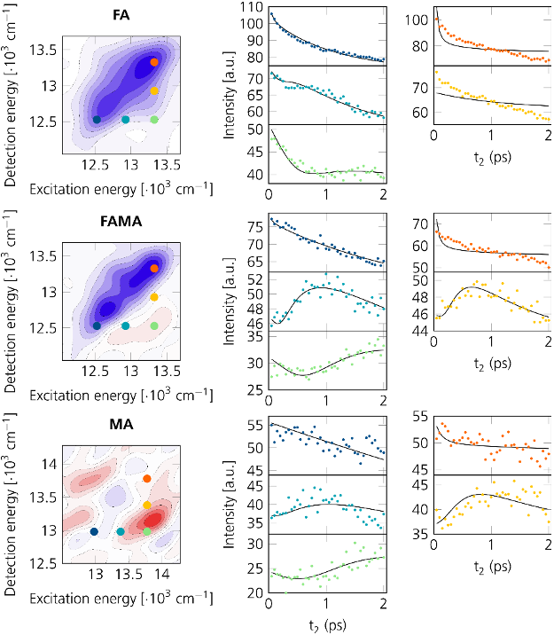
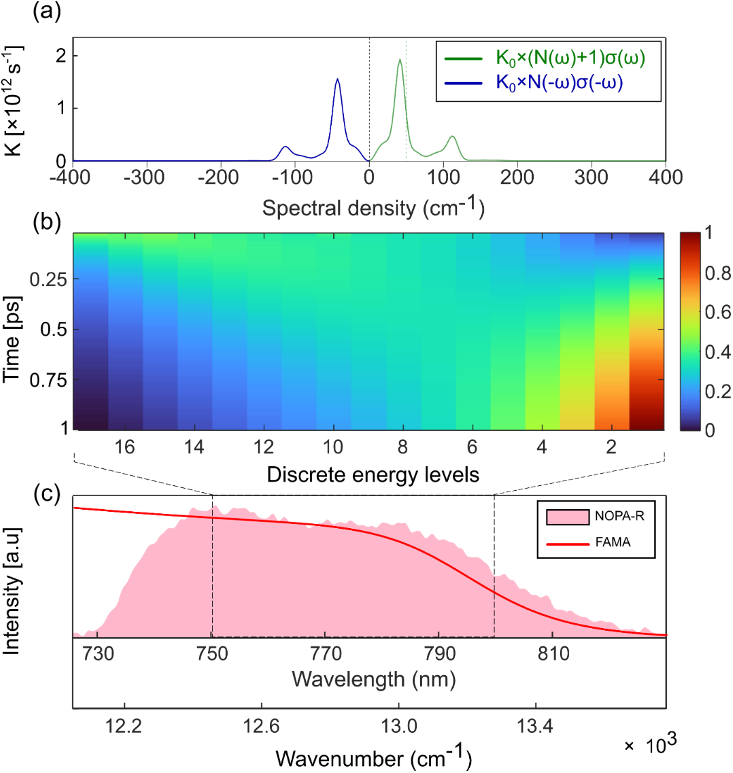
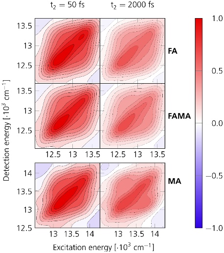

Imagine watching the invisible dance of energy inside a solar cell as sunlight hits it — carriers of electric charge excited to high energy levels quickly lose their excess energy before generating usable electricity. Recent advances have allowed scientists to observe this ultrafast process directly in operating perovskite solar cells, revealing how tiny changes in the material’s composition can speed up or slow down energy flow, with implications for solar efficiency.

> **TL;DR**
> - Researchers used photocurrent-detected two-dimensional electronic spectroscopy (PC-2DES) to track how excited charge carriers cool down inside fully functional perovskite solar cells.
> - They found that the rate of carrier cooling depends strongly on the type of organic cation in the perovskite, with formamidinium-based cells cooling fastest and methylammonium-based cells slowest.

*Note: this summary is based on a preprint — research shared ahead of formal peer review.*

Metal halide perovskite solar cells have rapidly emerged as promising candidates for next-generation solar energy conversion due to their strong light absorption and efficient charge extraction. However, the microscopic processes connecting the initial photoexcitation to the final electrical output are complex and not fully understood, especially under real operating conditions. When sunlight excites electrons in these materials, the electrons initially carry excess kinetic energy that must dissipate before the charge can be effectively extracted. This cooling process, occurring on ultrafast timescales, influences energy losses and device stability. The organic component of the perovskite, known as the A-site cation, subtly affects the lattice structure and vibrations, thereby shaping how quickly carriers cool.

To probe these ultrafast dynamics within fully encapsulated, working solar cells, the researchers employed photocurrent-detected two-dimensional electronic spectroscopy (PC-2DES). This technique uses sequences of precisely timed ultrafast laser pulses to excite the device and measures the resulting photocurrent as a function of excitation and detection energy over femtosecond to picosecond timescales. By comparing devices with identical architecture but different absorber compositions — methylammonium lead iodide (MAPbI₃), mixed formamidinium-methylammonium (FAMA), and formamidinium lead iodide (FAPbI₃) — the team could directly observe how carriers redistribute from high-energy states toward lower-energy band-edge states during operation.

The multidimensional photocurrent maps revealed a cascade-like intraband cooling process in all devices, where carriers excited at higher energies gradually relax to lower-energy states that contribute to photocurrent. Crucially, the rate of this cooling varied with absorber composition: FAPbI₃-based cells exhibited the fastest relaxation, mixed FAMA cells showed intermediate behavior, and MAPbI₃ cells cooled most slowly. This hierarchy reflects how the organic cation influences lattice vibrations and carrier-phonon interactions. A kinetic model incorporating phonon-mediated scattering and many-body effects successfully captured the observed energy-dependent relaxation trends, confirming that subtle compositional changes reshape carrier cooling pathways.

These findings demonstrate that ultrafast energy dissipation in perovskite solar cells is highly sensitive to the choice of A-site cation. By directly linking material composition to carrier cooling dynamics under real operating conditions, this work provides valuable design principles for engineering perovskite solar cells with optimized performance and stability. The use of PC-2DES as a device-level probe opens new avenues for studying fundamental photophysical processes in complex photovoltaic architectures, potentially accelerating the development of more efficient solar technologies.

While the study offers detailed insights into carrier cooling dynamics, it relies on a kinetic model that simplifies the complex microscopic interactions within the perovskite lattice. Additionally, the experiments were performed on specific device architectures and compositions; further work is needed to explore how these findings generalize across other materials and device designs. As the research is currently available on a preprint server, peer review may provide additional validation and refinement of the conclusions.

## Figures

*Figure 4 shows how charge carriers move in various perovskite materials using a special tracking method called PC-2DES. — Figure from Edoardo Amarotti et al., [CC BY 4.0](http://creativecommons.org/licenses/by/4.0/), caption edited.*

*Figure 5 shows how carriers relax over time during active operation. — Figure from Edoardo Amarotti et al., [CC BY 4.0](http://creativecommons.org/licenses/by/4.0/), caption edited.*

*Colorful maps showing how electric charges move and settle in a material when exposed to light. — Figure from Edoardo Amarotti et al., [CC BY 4.0](http://creativecommons.org/licenses/by/4.0/), caption edited.*

## Sources

- [Operando multidimensional spectroscopy reveals A-site-dependent carrier cooling in perovskite solar cells](https://arxiv.org/abs/2608.17577)
- DOI: [10.48550/arxiv.2608.17577](https://doi.org/10.48550/arxiv.2608.17577)

*This article reuses and adapts text and figures from the original research by Edoardo Amarotti et al., available via arXiv Chemical Physics, under the [CC BY 4.0](http://creativecommons.org/licenses/by/4.0/) license.*
