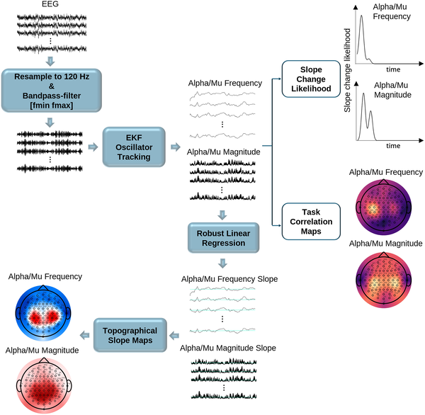
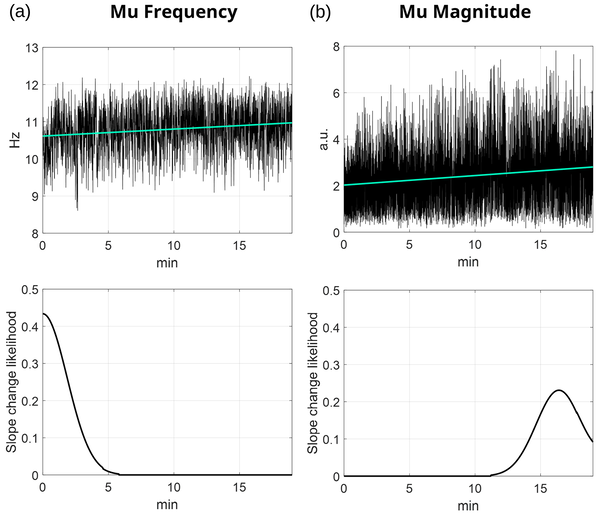
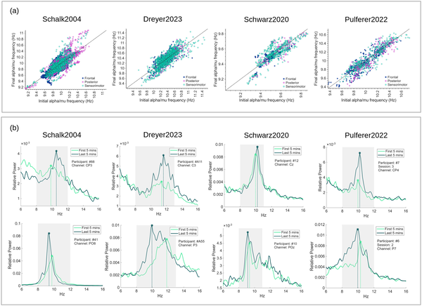

Imagine controlling a computer or a robotic arm just by thinking about moving your hand. This is the promise of brain-computer interfaces (BCIs), devices that translate brain activity into commands for external machines. But the brain’s electrical rhythms—its natural waves of activity—aren’t fixed; they change dynamically as we focus, move, or get tired. What if we could track these changes in real time to make BCIs more accurate and personalized? Recent research reveals a fascinating tug-of-war between two key brain rhythms during BCI training: while the motor cortex’s mu rhythm speeds up, alpha rhythms in other brain areas slow down. Understanding this opposing dance could unlock better ways to harness brain signals for technology and therapy.

> **TL;DR**
> - During motor-related BCI training, sensorimotor mu rhythms increase in frequency and strength, reflecting motor engagement and learning.
> - At the same time, alpha rhythms in posterior brain regions slow down, likely signaling reduced vigilance or cognitive fatigue.

Brain-computer interfaces rely heavily on detecting specific brain rhythms, especially those in the alpha frequency range (roughly 8–12 Hz). Within this range, mu rhythms over the sensorimotor cortex are closely tied to movement preparation and execution, while alpha rhythms in posterior regions relate more to attention and visual processing. Traditionally, BCI research has focused on the strength of these rhythms, but their frequencies can also shift. These shifts may indicate changes in brain states like fatigue, attention, or learning. Until now, continuous tracking of these frequency changes during BCI use had not been thoroughly explored.

Researchers developed a mathematical method using an extended Kalman filter to track the instantaneous frequency and magnitude of alpha and mu rhythms from EEG data. They applied this technique to four publicly available EEG datasets involving motor execution and motor imagery tasks. The method filtered brain signals to isolate the alpha/mu range and then continuously estimated how the frequency and strength of these rhythms changed over time and across different brain regions. They validated these trends by looking for sustained changes rather than brief fluctuations and correlated the brain rhythms with task performance.

Across all datasets, the researchers consistently found that mu rhythms over central sensorimotor areas increased in both frequency and magnitude during BCI training sessions. This suggests enhanced motor engagement and possible neuroplastic changes as participants learned or practiced motor tasks. In contrast, alpha rhythms in posterior and surrounding cortical areas tended to slow down, which may reflect declining vigilance, cognitive fatigue, or the brain’s way of reallocating resources by inhibiting areas irrelevant to the task. These opposing spatial patterns highlight the functional diversity of alpha-band activity across the cortex.

This study sheds light on the dynamic nature of brain rhythms during BCI use, revealing that different cortical areas can exhibit opposite frequency shifts simultaneously. Tracking these changes in real time offers a promising avenue to improve BCI decoding accuracy by adapting to the user’s current brain state. Beyond BCIs, this approach could help monitor cognitive effort, fatigue, and learning processes, with potential applications in clinical neurorehabilitation and cognitive neuroscience research.

While the findings are robust across multiple datasets, the study focuses on non-disabled participants performing specific motor tasks, so generalization to clinical populations or other BCI paradigms requires further investigation. The EEG signals and frequency tracking are inherently complex and can be influenced by various factors such as individual differences and experimental conditions. Additionally, interpreting alpha slowing as fatigue or resource reallocation remains somewhat speculative without direct behavioral measures of vigilance or fatigue.

## Figures

*This figure shows how brainwave data was cleaned, filtered, and analyzed to track changes in brain activity related to movement tasks over time.*

*Tracking brain wave frequency and strength over time shows early changes in frequency and gradual increases in strength during a session.*

*Graphs show how brain wave frequencies changed during sessions, with some increasing and others decreasing, plus examples of these shifts in brain activity.*

## Sources

- [Opposing cortical forces: Alpha slowing and sensorimotor mu acceleration during motor-related BCI training](https://journals.plos.org/ploscompbiol/article?id=10.1371/journal.pcbi.1014112)
- DOI: [10.1371/journal.pcbi.1014112](https://doi.org/10.1371/journal.pcbi.1014112)
