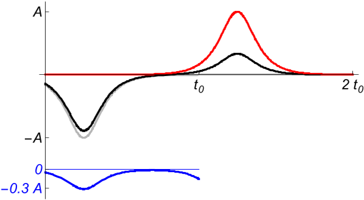
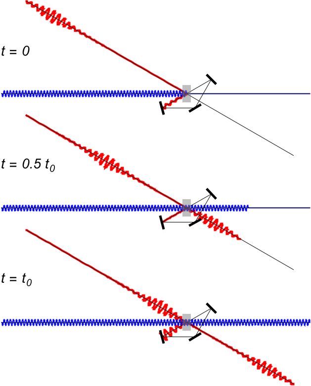
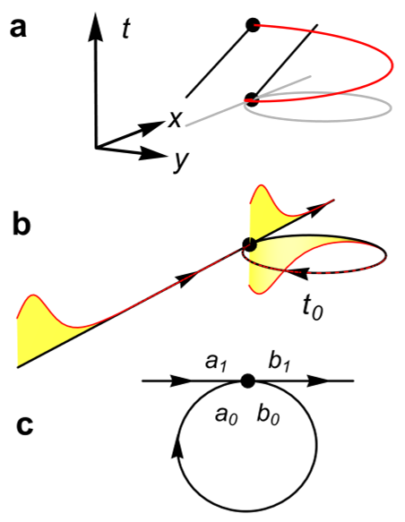
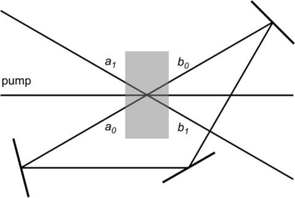

Could we test time travel using lasers? This intriguing question moves beyond science fiction in a recent theoretical proposal that uses light pulses and optical amplifiers to mimic time travel effects. Inspired by Stephen Hawking’s Chronology Protection Conjecture — the idea that quantum mechanics forbids paradoxical time travel — scientists have designed an experiment that could reveal how the universe protects its timeline using the physics of lasers.

> **TL;DR**
> - Classical general relativity allows for time travel through closed time-like curves, but quantum mechanics might prevent it, as suggested by Hawking’s Chronology Protection Conjecture.
> - An optical analogue using light pulses in fiber loops and parametric amplifiers can simulate time travel, showing that while classical light pulses can appear to travel back in time, quantum noise imposes fundamental limits.

*Note: this summary is based on a preprint — research shared ahead of formal peer review.*

Time travel has long captured our imaginations, but physics offers a more nuanced view. General relativity, Einstein’s theory of gravity and spacetime, permits scenarios where time loops back on itself, allowing a traveler to revisit the past. However, these closed time-like curves raise paradoxes and instabilities. Stephen Hawking proposed the Chronology Protection Conjecture, suggesting that quantum effects prevent such paradoxes by forbidding time travel. Until now, testing this idea experimentally has been out of reach. The new proposal uses an optical system to create a laboratory analogue of time travel, allowing researchers to explore the quantum limits of traveling back in time — at least for light pulses.

The experiment centers on an optical setup where light pulses travel through a fiber connected to a fiber loop via a parametric amplifier. The loop introduces a time delay, effectively allowing pulses to emerge before they enter the device, mimicking backward time travel. The parametric amplifier plays a crucial role, creating and annihilating photon pairs analogous to particle-antiparticle pairs in time travel scenarios. By adjusting the amplifier’s gain relative to losses in the system, the setup can simulate conditions where light pulses appear to move backward in time. The researchers analyze this system both classically and quantum mechanically, using mode expansions and Wigner functions to understand how quantum noise affects the process.

Classically, the system allows light pulses to exit the device before entering it, demonstrating a form of optical time travel with high fidelity under certain gain conditions. However, quantum mechanics introduces unavoidable fluctuations due to the uncertainty principle. These quantum vacuum fluctuations get amplified by the parametric amplifier, producing noise that grows exponentially with time travel attempts. This noise imposes a fundamental quantum limit, preventing perfect time travel and ensuring consistency between past and present states. The experiment thus reproduces the quantum instability Hawking predicted, supporting the Chronology Protection Conjecture within an optical analogue.

This proposal is significant because it offers a practical, experimentally feasible way to test a deep theoretical idea about the nature of time and causality, bridging quantum mechanics and general relativity. By using light and laser physics, it opens a new window into understanding how the universe might forbid paradoxical time travel. Although the setup does not enable actual human time travel, it provides a tangible platform to study the quantum limits of temporal manipulation. This could deepen our understanding of fundamental physics and inspire future experiments exploring the interplay between quantum effects and spacetime structure.

It is important to note that this work remains a theoretical proposal without experimental realization yet. The optical time travel described is an analogy — light pulses simulate time travel rather than actual matter or information traveling back in time. Moreover, the quantum noise that limits the process means that perfect time travel is impossible, preserving causality. The experiment’s utility lies in fundamental physics insight rather than practical applications. Future work will need to implement the setup and verify these predictions experimentally, and the interpretation of results must carefully distinguish analogy from literal time travel.

## Figures

*Output light pulse appears before input arrives, showing 80% accurate time travel with modest gain and no loss. — Figure from D. Bermudez and U. Leonhardt, [CC BY 4.0](http://creativecommons.org/licenses/by/4.0/), caption edited.*

*This figure shows how a signal pulse travels and interacts with a pump beam through an amplifier in three key time phases. — Figure from D. Bermudez and U. Leonhardt, [CC BY 4.0](http://creativecommons.org/licenses/by/4.0/), caption edited.*

*A time traveler meets their antiparticle copy, shown via particle paths and an optical setup that creates pulses to mimic time travel effects. — Figure from D. Bermudez and U. Leonhardt, [CC BY 4.0](http://creativecommons.org/licenses/by/4.0/), caption edited.*

*Our setup uses special crystals and mirrors to amplify light signals and create an optical time loop. — Figure from D. Bermudez and U. Leonhardt, [CC BY 4.0](http://creativecommons.org/licenses/by/4.0/), caption edited.*

## Sources

- [Optical time travel: proposal for testing Hawking's Chronology Protection Conjecture in an optical analogue](https://arxiv.org/abs/2607.22056)
- DOI: [10.48550/arxiv.2607.22056](https://doi.org/10.48550/arxiv.2607.22056)

*This article reuses and adapts text and figures from the original research by D. Bermudez and U. Leonhardt, available via Class. Quant. Grav. 43, 14LT01 (2026), under the [CC BY 4.0](http://creativecommons.org/licenses/by/4.0/) license.*
