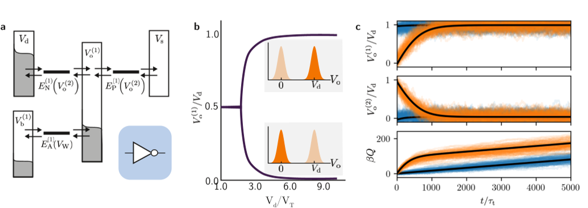
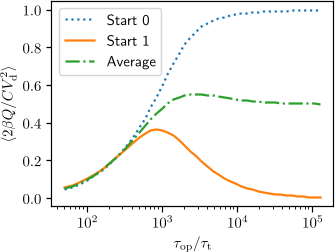
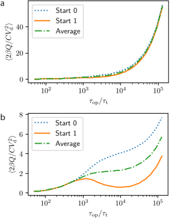
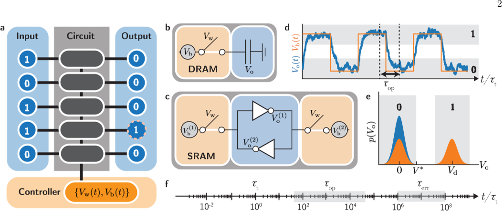

How much energy does it really take to erase a single bit of memory? This question sits at the intersection of physics, computer engineering, and our everyday digital lives. As the demand for data storage and processing grows exponentially, understanding and minimizing the energy costs of fundamental operations like bit erasure becomes crucial. Recent research dives deep into the physics behind memory chips, revealing surprising differences in how dynamic and static RAM handle energy dissipation during erasure.

> **TL;DR**
> - Dynamic RAM (DRAM) dissipates the least energy when bit erasure is performed very slowly, minimizing errors and energy waste.
> - Static RAM (SRAM), in contrast, is most energy efficient when operated over a finite, optimal time due to the energy needed to maintain its bit state.

*Note: this summary is based on a preprint — research shared ahead of formal peer review.*

The energy cost of information processing has long been a subject of scientific inquiry, famously bounded by Landauer’s principle which states that erasing one bit of information requires at least kBT ln 2 of energy. However, this theoretical limit applies to idealized, equilibrium systems and does not fully capture the realities of modern computer memory technologies that operate far from equilibrium and under time constraints. With data centers consuming increasing amounts of electricity worldwide, understanding the thermodynamics of bit erasure in realistic memory circuits—specifically CMOS-based DRAM and SRAM—is essential to pushing forward energy-efficient computing.

Researchers modeled the physical processes in DRAM and SRAM circuits using stochastic thermodynamics, a framework that accounts for thermal fluctuations and nonequilibrium conditions at the nanoscale. They represented the memory bits as voltages across capacitors controlled by time-dependent wordline and bitline voltages, which govern electron flow through transistors. Using kinetic Monte Carlo simulations and a mean field approximation, they tracked the probabilistic evolution of bit states and heat dissipation during erasure. To find the most energy-efficient protocols, they applied advanced numerical optimization techniques, including automatic differentiation and machine learning-inspired algorithms, to optimize voltage control sequences for different operation times.

The study found that DRAM achieves minimal energy dissipation when operated quasistatically—that is, very slowly—allowing the system to approach equilibrium and minimize errors. In this regime, the bit erasure process closely approaches the fundamental thermodynamic limits, with heat dissipation decreasing as operation time increases. Conversely, SRAM requires continuous energy input to maintain bit states, making slow operation energetically costly. Instead, SRAM’s optimal energy efficiency occurs at a finite operation time that balances the cost of maintaining the bit against the dissipation from erasure. These contrasting behaviors highlight how circuit architecture fundamentally influences the thermodynamics of information processing.

This work bridges a gap between theoretical physics and practical electrical engineering by providing a realistic, architecture-specific understanding of the energy costs of bit erasure. The insights gained can inform the design and operation of memory circuits to reduce energy consumption in computing devices, a critical consideration as data processing demands soar globally. By demonstrating how optimal control protocols can be devised using modern computational tools, the research opens pathways for thermodynamically informed hardware design that could contribute to more sustainable information technology.

While the models used capture key physical aspects of CMOS memory devices, they simplify some complexities of real-world circuits and do not include all sources of energy loss such as refreshing in DRAM or leakage currents in SRAM over long timescales. Additionally, the optimization focuses on idealized voltage control protocols that may be challenging to implement precisely in practical hardware. Further experimental validation and extension to more complex memory architectures will be necessary to fully translate these findings into commercial technologies.

## Figures

*This figure shows how a memory cell stores data using voltage changes, with stable states appearing above a critical voltage and examples of data erasure over time. — Figure from Songela W. Chen and David T. Limmer, [CC BY 4.0](http://creativecommons.org/licenses/by/4.0/), caption edited.*

*Heat released by DRAM as the bitline voltage changes steadily over time. — Figure from Songela W. Chen and David T. Limmer, [CC BY 4.0](http://creativecommons.org/licenses/by/4.0/), caption edited.*

*Heat lost in SRAM as bitline voltage changes, shown for driving voltages of 3V and 6V. — Figure from Songela W. Chen and David T. Limmer, [CC BY 4.0](http://creativecommons.org/licenses/by/4.0/), caption edited.*

*Illustration of how bits are erased and stored in memory circuits, showing voltage controls, bit changes, and key timing for reliable operation. — Figure from Songela W. Chen and David T. Limmer, [CC BY 4.0](http://creativecommons.org/licenses/by/4.0/), caption edited.*

## Sources

- [Optimal control of bit erasure in stochastic random access memory](https://arxiv.org/abs/2601.14387)
- DOI: [10.1103/bmsv-mlq5](https://doi.org/10.1103/bmsv-mlq5)

*This article reuses and adapts text and figures from the original research by Songela W. Chen and David T. Limmer, available via PRX Energy 5, 023011 (2026), under the [CC BY 4.0](http://creativecommons.org/licenses/by/4.0/) license.*
