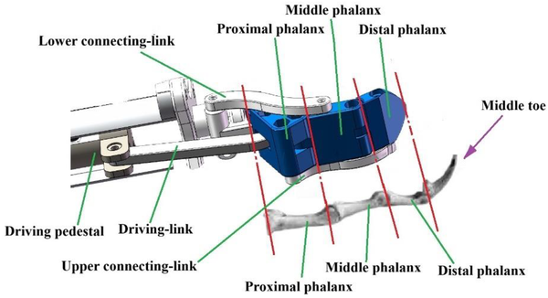
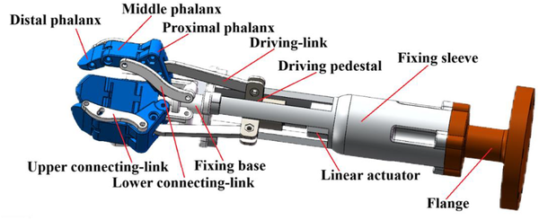

Imagine a robot hand that picks cherry tomatoes as skillfully as a vulture’s talons grasp prey. This might sound like science fiction, but a recent study has taken inspiration from the anatomy and mechanics of vulture legs to design a robotic gripper that can harvest cherry tomatoes efficiently and gently. By mimicking the way vultures use their toes to envelop and hold their catch, engineers have developed a bionic end-effector that could help automate the labor-intensive process of tomato harvesting.

> **TL;DR**
> - A robotic end-effector with three grippers modeled after vulture toe phalanges was optimized for cherry tomato picking using systematic experimental design methods.
> - The optimized design achieved a harvesting success rate of at least 88% while minimizing fruit damage, demonstrating practical potential for agricultural automation.

Harvesting cherry tomatoes is a delicate and time-consuming task typically done by hand, which makes it costly and labor-intensive. As agriculture faces challenges like labor shortages and rising expenses, robots offer a promising solution. However, designing robotic hands (end-effectors) that can pick soft, irregularly shaped fruits without bruising them is a complex engineering challenge. Previous robotic grippers have struggled with balancing a firm grip and gentle handling, especially when fruits are partially obscured by branches or leaves. Biomimicry—drawing inspiration from nature’s evolved designs—has become a powerful approach to improving robotic grippers. In this case, researchers looked to vultures, birds known for their strong, adaptable toes used to catch and hold prey, as a model for a new type of robotic end-effector.

The research team designed a robotic gripper based on the phalangeal chain—the linked bones in a vulture’s toes—that allows coordinated, flexible movement. To avoid damaging the tomatoes, they omitted the sharp talons vultures use and instead focused on the shape and motion of the phalanges. The gripper consists of three articulated segments (distal, middle, and proximal phalanges) connected by hinges and driven by an underactuated mechanism to mimic the natural movement of vulture toes. To optimize the design, they used Response Surface Methodology combined with a Box-Behnken experimental design, systematically varying four key parameters: the width and thickness of the phalanges, the angle at the end of the distal phalanx, and the distance between the heel phalanges and the central axis of the fixed seat. Two geometric measures served as proxies for performance: one related to how much the gripper compresses the fruit (to avoid damage) and one related to how well the gripper encloses the fruit (to prevent slipping).

Through this structured optimization, the researchers identified an ideal configuration of the gripper’s dimensions and angles that balanced a secure grip with minimal pressure on the fruit. When tested on cherry tomatoes with an average diameter of about 26 millimeters, the optimized end-effector achieved a harvesting success rate of at least 88%. This means the robot could reliably pick tomatoes without dropping or damaging them. The study demonstrates that the vulture-inspired phalangeal chain design enhances the gripper’s adaptability to different fruit orientations and improves its ability to gently but firmly grasp the tomatoes.

This work highlights how studying animal anatomy can inspire practical engineering solutions for agriculture, a sector increasingly in need of automation. By mimicking the natural mechanics of vulture toes, the researchers created a robotic gripper that is both effective and gentle, addressing key challenges in fruit harvesting robotics. The approach offers a blueprint for designing end-effectors tailored to other delicate crops, potentially reducing labor costs and increasing harvesting efficiency. As the global demand for fresh produce grows, innovations like this could play a vital role in sustainable food production.

While the results are promising, the study focused on cherry tomatoes within a specific size range and maturity stage, so performance with other varieties or sizes may vary. The robotic system was tested under controlled conditions, and real-world factors such as varying plant structures, weather, and fruit positioning could affect success rates. Additionally, the mechanical complexity of the gripper, including its underactuated joints, may pose challenges for large-scale deployment and maintenance. Future work will need to address these factors to fully realize the potential of bionic end-effectors in commercial agriculture.

## Figures

*Diagram of a bio-inspired gripper designed like the middle toe's phalangeal chain for better gripping ability.*

*Diagram showing the design of the bionic end-effector, a robotic tool inspired by natural movements.*

## Sources

- [Optimization of a bionic end-effector for automated cherry tomato harvesting using Response Surface Methodology and Box-Behnken design](https://journals.plos.org/plosone/article?id=10.1371/journal.pone.0352701)
- DOI: [10.1371/journal.pone.0352701](https://doi.org/10.1371/journal.pone.0352701)
