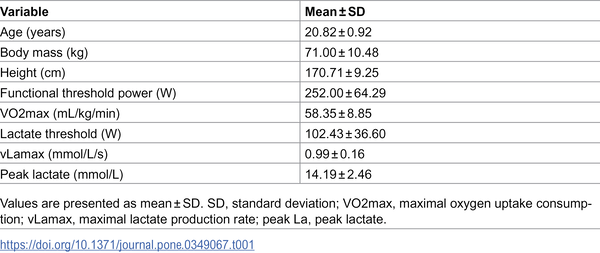
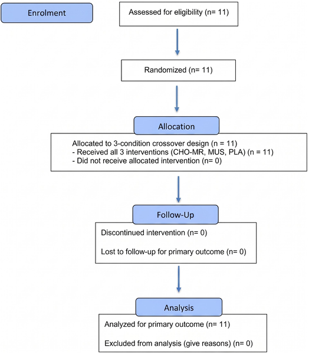
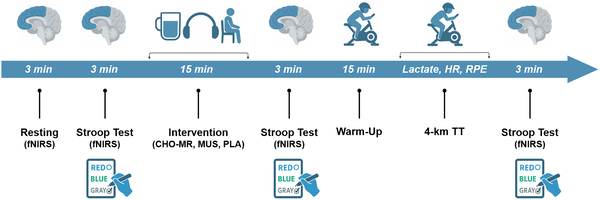

What if you could enhance your cycling performance without eating or drinking extra fuel? Recent research suggests that just rinsing your mouth with a carbohydrate solution—then spitting it out—can trick your brain into working more efficiently during intense exercise. This simple act boosts oxygen levels in a key brain region involved in decision-making and effort perception, helping cyclists pedal faster and feel less exhausted.

> **TL;DR**
> - Rinsing the mouth with a carbohydrate solution increases oxygenation in the dorsolateral prefrontal cortex (DLPFC), a brain area important for executive function and effort regulation.
> - This brain effect reduces perceived exertion and improves cycling performance in a 4-kilometer high-intensity time trial, without changing heart rate or blood lactate levels.

Athletes have long known that carbohydrates fuel muscles during endurance exercise, but recent studies reveal that tasting carbs alone—without swallowing—can activate brain regions linked to motivation and control. The dorsolateral prefrontal cortex (DLPFC) plays a critical role in managing effort and cognitive function during demanding tasks. Previous research hinted that carbohydrate mouth rinsing (CHO-MR) might reduce fatigue and improve performance, but the exact brain mechanisms and how it compares to other interventions like music listening were unclear. This study aimed to clarify these effects by measuring brain oxygen levels, cognitive function, perceived effort, and cycling performance in trained cyclists.

Eleven well-trained cyclists participated in a randomized, single-blind crossover trial involving three conditions: carbohydrate mouth rinse (CHO-MR), music listening (MUS), and a placebo mouth rinse (PLA). Each cyclist completed all three conditions in a balanced order, separated by several days. The CHO-MR involved swishing a maltodextrin solution in the mouth for 10 seconds, repeated five times, without swallowing. Brain oxygenation in the bilateral DLPFC was measured using functional near-infrared spectroscopy (fNIRS) at rest, during cognitive testing (a Stroop task), immediately after the intervention, and after a 4-kilometer cycling time trial (TT). Researchers also recorded Stroop test performance, perceived exertion every 500 meters, heart rate, power output, and blood lactate levels.

The carbohydrate mouth rinse significantly increased oxygenation in both sides of the DLPFC after the intervention and following the cycling time trial, compared to music listening and placebo. Cyclists also showed better executive function on the Stroop test after CHO-MR, while perceived exertion ratings were consistently lower than placebo and sometimes lower than music. Importantly, CHO-MR led to faster completion times, higher average power output, and greater mean speed during the 4-km TT. These performance gains occurred without changes in peak power, heart rate, or blood lactate, indicating the effects were centrally mediated rather than due to metabolic fuel availability.

These findings provide compelling evidence that carbohydrate sensing in the mouth can enhance brain oxygenation in regions critical for cognitive control and effort regulation during intense exercise. By reducing perceived exertion and preserving executive function, CHO-MR offers a practical, legal, and non-metabolic strategy to boost endurance performance. This neurocognitive mechanism opens new avenues for understanding how the brain integrates sensory signals to influence physical effort and may benefit athletes seeking performance gains without additional caloric intake.

While promising, this study involved a small sample of highly trained cyclists, which may limit generalizability to other populations or sports. The single-blind design means participants knew when they were listening to music, potentially influencing results. Also, the study focused on short, high-intensity cycling efforts; effects during longer or lower-intensity exercise remain to be explored. Finally, the exact neural pathways linking oral carbohydrate sensing to increased prefrontal oxygenation and performance improvements require further investigation.

## Figures

*Summary of key traits and performance of the 11 study participants.*

*Eleven participants completed three different tests—carb rinse, music listening, and placebo—in a balanced order for the study.*

*This study measured brain oxygen, heart rate, and effort during rest, after treatments, and after a 4-km cycling test to see effects of carbs, music, or placebo.*

## Sources

- [Oral carbohydrate sensing enhances prefrontal cortex oxygenation, reduces perceived exertion, and improves high-intensity cycling performance: A randomized crossover trial](https://journals.plos.org/plosone/article?id=10.1371/journal.pone.0349067)
- DOI: [10.1371/journal.pone.0349067](https://doi.org/10.1371/journal.pone.0349067)
