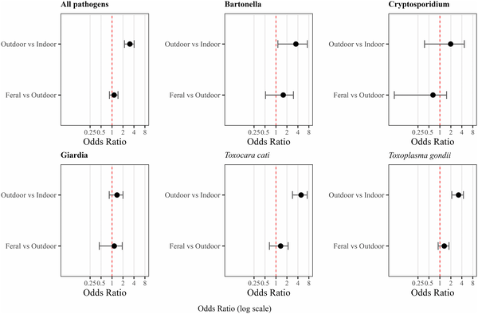
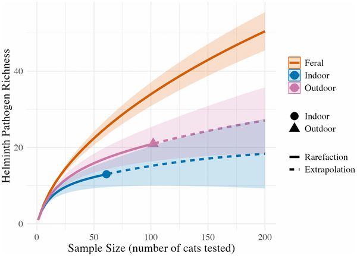

Did you know that letting your cat roam outside unsupervised might expose you and your community to hidden diseases? While many of us cherish our feline companions and enjoy watching their outdoor adventures, recent research shows that these excursions carry risks—not just for wildlife, but for human health as well. Surprisingly, owned cats that roam freely outdoors can harbor just as many zoonotic pathogens as feral cats, despite receiving veterinary care and regular feeding.

> **TL;DR**
> - Owned cats allowed to roam outdoors are three to five times more likely to carry zoonotic pathogens than indoor-only cats and have infection rates similar to feral cats.
> - Outdoor roaming enables cats to act as bridges for pathogen transmission between wildlife, domestic animals, and humans, underscoring the need for responsible pet management to reduce zoonotic disease risks.

Domestic cats are among the most common companion animals worldwide, with millions allowed outside to roam freely. This behavior brings them into contact with wildlife, other domestic animals, and humans. While the conservation impacts of free-roaming cats—such as predation on wildlife—are well documented, their role in spreading diseases that can jump from animals to humans (zoonoses) has been less clear. Traditionally, feral cats have been viewed as the main concern for zoonotic disease transmission. However, the extent to which ownership and veterinary care protect cats from acquiring and spreading pathogens when they roam outdoors has remained a key knowledge gap.

To address this, researchers conducted a global systematic review and meta-analysis, compiling data from 604 studies spanning 88 countries and over 174,000 cats. They categorized cats into three groups: indoor-only (no outdoor access), outdoor-owned (owned cats allowed to roam unsupervised), and feral or stray cats. Using advanced statistical models within a Bayesian framework, the team analyzed the prevalence and diversity of 124 pathogen species, including 97 known zoonotic pathogens, across these groups. They also examined specific pathogens relevant to human health, such as Toxoplasma gondii, Toxocara cati, Bartonella, and Leptospira.

The analysis revealed that outdoor-owned cats were three to five times more likely to carry zoonotic pathogens than indoor-only cats. Remarkably, their infection odds were statistically equivalent to those of feral cats, despite the presumed benefits of ownership like veterinary care and commercial diets. While feral cats exhibited the highest diversity of pathogens, outdoor-owned cats still harbored significantly more helminth species than indoor cats, indicating their potential as effective conduits for disease spillover. For many pathogens, outdoor access likely facilitates transmission through hunting infected prey, contact with wildlife, or exposure to vectors like fleas and ticks. Given that approximately 62% of owned cats worldwide roam freely—and rates exceed 90% in some regions—this represents a widespread and underappreciated risk.

These findings challenge the assumption that ownership alone protects cats and their human contacts from zoonotic diseases. They highlight how pet management practices directly influence disease transmission dynamics at the human–wildlife interface. Because owned outdoor cats frequently interact with people, infections acquired outdoors increase opportunities for onward exposure to owners and the broader public, including through environmental contamination. This research suggests that public health strategies and One Health frameworks, which have traditionally focused on feral cats, need to explicitly include outdoor-owned cats. Restricting unsupervised roaming and promoting responsible ownership could simultaneously benefit biodiversity conservation and reduce zoonotic disease risks.

While this global synthesis draws on a large and diverse dataset, it relies on published studies that vary in methodology and geographic coverage. Some pathogen-specific analyses had wide confidence intervals, reflecting uncertainty due to limited data for certain infections. Additionally, factors like frequency and duration of outdoor access, specific hunting behaviors, and regional differences in pathogen prevalence were not always detailed, which could influence infection risks. Veterinary care practices and anthelmintic treatments were also inconsistently reported, making it difficult to assess their protective effects fully. Future research could refine these aspects to better tailor recommendations for pet owners and public health policies.

## Figures

*Odds of cats catching various germs compared: outdoor-owned vs feral and outdoor-owned vs indoor cats worldwide.*

*Curves compare parasite diversity in indoor, outdoor, and feral cats, showing observed and predicted richness with confidence ranges.*

## Sources

- [Outdoor roaming of owned cats elevates risk of zoonotic pathogen exposure: A global synthesis](https://journals.plos.org/plospathogens/article?id=10.1371/journal.ppat.1014160)
- DOI: [10.1371/journal.ppat.1014160](https://doi.org/10.1371/journal.ppat.1014160)
