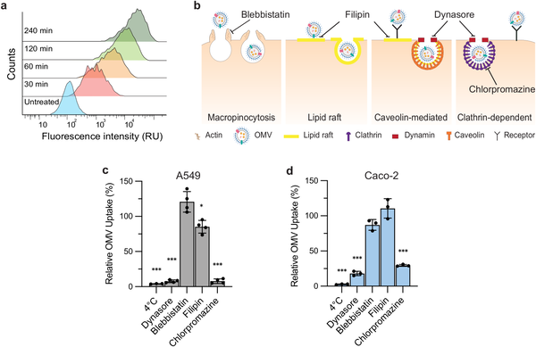
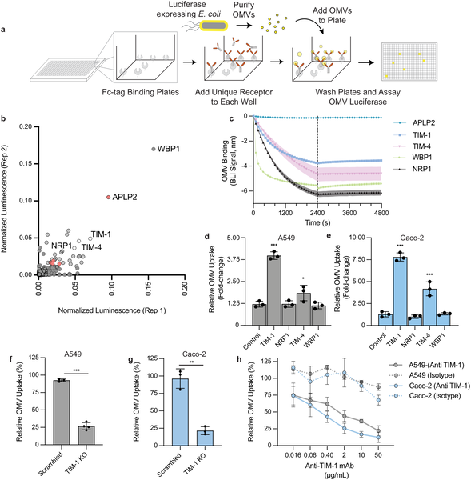
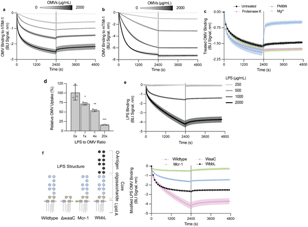
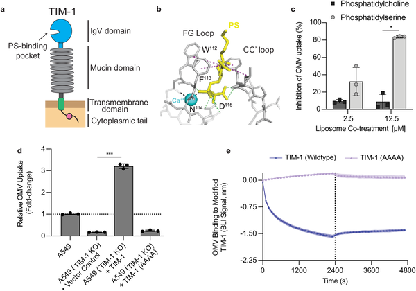

Did you know that bacteria can send tiny packages directly into our cells to influence them? These nanoscale parcels, called outer membrane vesicles (OMVs), are released by many harmful bacteria and carry proteins and molecules that can affect our health. Scientists have now discovered that OMVs hijack a specific human cell receptor called TIM-1 to sneak inside, opening new avenues for understanding infections and improving treatments.

> **TL;DR**
> - Bacterial OMVs enter human epithelial cells primarily through clathrin-mediated, receptor-dependent endocytosis involving the TIM-1 protein.
> - TIM-1 binds to lipopolysaccharide (LPS) on OMVs using its phosphatidylserine-binding domain, making this interaction a promising target for therapies and vaccine development.

Gram-negative bacteria, such as Escherichia coli, constantly shed tiny lipid-bound bubbles known as outer membrane vesicles. These OMVs carry bacterial proteins, toxins, and genetic material that can manipulate host cells and contribute to disease. While OMVs have been recognized as important players in bacterial pathogenesis, the precise ways they enter human cells remained unclear. Understanding this process is crucial not only for grasping infection mechanisms but also for harnessing OMVs as platforms for vaccines and targeted drug delivery.

To identify how OMVs gain entry into cells, researchers exposed human lung and intestinal epithelial cells to fluorescently labeled E. coli OMVs and tracked their uptake. They used inhibitors to block different cellular entry pathways, revealing that clathrin-mediated endocytosis was the main route. Next, they screened over 1,500 human single-pass transmembrane proteins to find which ones bind OMVs, pinpointing TIM-1 as a strong candidate. By genetically engineering cells to overexpress or knock out TIM-1 and using blocking antibodies, they confirmed TIM-1’s critical role in OMV internalization. Biochemical assays demonstrated that TIM-1 binds to bacterial LPS on OMVs through its phosphatidylserine-binding pocket.

The study showed that OMVs from multiple bacterial species exploit TIM-1 to enter human cells. Overexpressing TIM-1 increased OMV uptake several-fold, while knocking out TIM-1 or blocking it with antibodies significantly reduced vesicle internalization. Mechanistically, TIM-1 recognizes LPS molecules on OMV surfaces, engaging them via a conserved lipid-binding domain. This interaction triggers the cell’s uptake machinery and leads to proinflammatory responses. Importantly, blocking TIM-1 not only reduced OMV entry but also dampened inflammatory signaling, highlighting TIM-1 as a key mediator of OMV-driven host responses.

Discovering TIM-1 as a major receptor for bacterial OMVs advances our understanding of host-pathogen interactions at the molecular level. This knowledge opens exciting possibilities for developing antivirulence therapies that block OMV entry, potentially reducing bacterial infections without relying on antibiotics. Moreover, since OMVs are being explored as vaccine platforms and drug delivery vehicles, manipulating the TIM-1 pathway could enhance the effectiveness and specificity of these biotechnologies. Overall, this work provides a foundation for innovative strategies to combat bacterial diseases and improve human health.

While these findings are robust and supported by multiple experimental approaches, the complexity of OMV interactions with host cells means other receptors and pathways may also contribute to uptake. The variability in TIM-1 expression across different cell types and tissues suggests that OMV entry mechanisms might differ in vivo. Further studies are needed to explore how TIM-1-mediated uptake influences infection outcomes in whole organisms and to evaluate the safety and efficacy of targeting this pathway therapeutically.

## Figures

*E. coli OMVs enter human cells mainly through clathrin-mediated endocytosis, shown by reduced uptake when this pathway is blocked.*

*Certain cell receptors, especially TIM-1, bind and help cells absorb tiny vesicles called OMVs, shown by lab tests and cell experiments.*

*TIM-1 protein binds to bacterial LPS on OMVs, affecting cell uptake and varies with LPS structure and treatments.*

*TIM-1’s PS-binding pocket is essential for OMV attachment and uptake, shown by structural details and cell experiments blocking this interaction.*

## Sources

- [Outer membrane vesicles hijack TIM-1 for cellular uptake](https://journals.plos.org/plospathogens/article?id=10.1371/journal.ppat.1014256)
- DOI: [10.1371/journal.ppat.1014256](https://doi.org/10.1371/journal.ppat.1014256)
