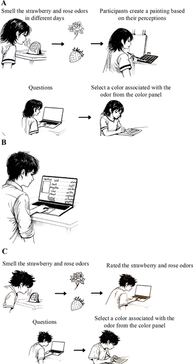
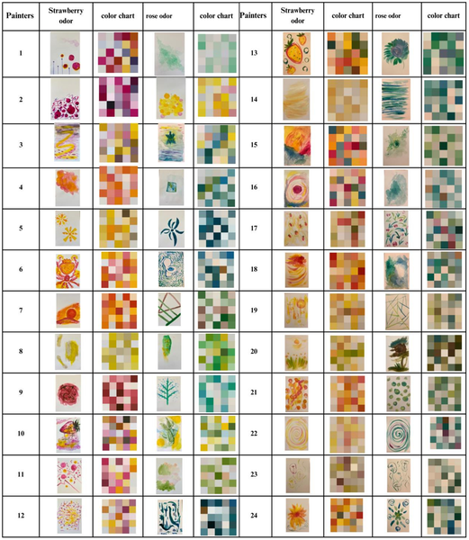
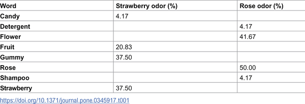
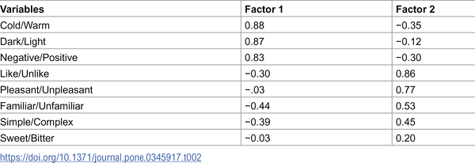

Can the smell of a rose change the colors you choose to paint? What if your nose could guide your artistic imagination? Recent research dives into the fascinating interplay between our sense of smell and how we perceive and create visual art. By exploring how strawberry and rose odors influence color selection, emotional response, and even object choice, this study uncovers surprising ways that scents shape our visual world.

> **TL;DR**
> - Exposure to strawberry and rose odors leads people to create paintings with distinct color palettes that reflect their sensory and emotional responses to these scents.
> - Ambient odors subtly influence which objects people choose to paint and the colors they associate with those objects, demonstrating consistent odor-color connections.

While we often think of our senses as separate channels, they frequently interact in complex ways. Previous studies have shown that smells can affect how we pay attention visually, and that colors can influence how we perceive odors. However, less is known about how odors might shape what we see and create visually. This study bridges psychology and art to investigate how two familiar and pleasant scents—strawberry and rose—affect visual perception and artistic expression. These odors were chosen because they differ in their semantic and cultural associations despite similar pleasantness, allowing researchers to explore how smell influences color choice and creativity beyond simple liking.

The research consisted of two studies. In the first, 24 participants were exposed to strawberry and rose scents on separate days and asked to create paintings inspired by each odor. Later, 60 other participants evaluated these paintings on emotional and perceptual qualities using semantic differential scales, while another 60 rated the odors themselves using the same scales. The paintings were analyzed digitally to extract dominant colors. In the second study, 60 participants were randomly assigned to rooms scented with strawberry, rose, or no odor. Each room contained five artificial objects—strawberries, lemons, and roses among them. Participants, unaware of the odors, chose one object to paint and then selected colors from a standardized panel to match the odor they perceived. This design tested whether ambient smells unconsciously influenced object choice and color perception.

The studies revealed consistent and meaningful connections between odors and colors. Paintings inspired by strawberry tended to feature warmer, redder hues, while those inspired by rose showed different color patterns reflecting the floral scent. Evaluators perceived these paintings differently, confirming that the odors influenced emotional and visual expression. In the second study, participants in strawberry- or rose-scented rooms were more likely to select objects congruent with the odor and chose colors that matched their olfactory experience. These results suggest that smells can bias visual perception and creative decisions, linking olfactory cues with color and object associations in a reliable way.

This research highlights the subtle yet powerful role of smell in shaping visual creativity and perception. It extends our understanding of cross-modal sensory interactions by showing that odors do not merely influence how we identify smells but also affect what we see and create. These findings have intriguing implications for fields like art therapy, design, and sensory marketing, where integrating scent could enhance emotional engagement and creative expression. More broadly, the study underscores how our senses work together to form rich, multisensory experiences that guide our choices and imagination.

While the findings are compelling, the sample sizes were moderate and focused on specific odors and cultural contexts, which may limit generalizability. The odors were delivered in controlled but not chemically calibrated ways, and the study did not explore underlying neural mechanisms in depth. Additionally, practical applications remain exploratory, as the influence of odors on artistic expression may vary widely among individuals and settings. Future research could expand to other scents, populations, and sensory modalities to deepen understanding of these complex interactions.

## Figures

*Diagram showing the setup for each of the three phases in Study 1.*

*Paintings made by participants inspired by strawberry and rose scents, shown with matching color charts.*

*Participants linked strawberry and rose scents to their paintings during the art session.*

*Table showing grouped data patterns identified through factor analysis for easier understanding.*

## Sources

- [Painting with odors: How olfactory stimuli influence artistic expression, emotional response, visual perception, and object selection](https://journals.plos.org/plosone/article?id=10.1371/journal.pone.0345917)
- DOI: [10.1371/journal.pone.0345917](https://doi.org/10.1371/journal.pone.0345917)
