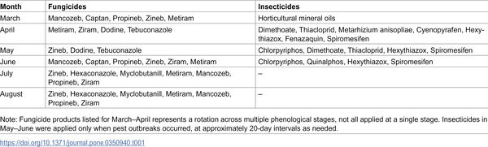
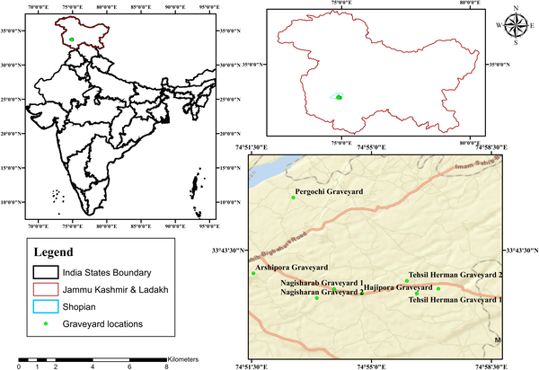
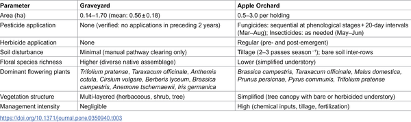

Imagine a flower that looks inviting to bees and other pollinators but secretly exposes them to harmful pesticides. This is not a scene from a science fiction story but a real ecological trap emerging in apple orchards in Kashmir. As pesticide applications peak during the spring bloom, certain non-crop flowers lure pollinators into contaminated foraging sites, causing a collapse in insect communities essential for pollination and ecosystem health.

> **TL;DR**
> - Intensive pesticide use in apple orchards drastically reduces insect abundance and species richness compared to nearby pesticide-free graveyard refuges.
> - Certain flowers, especially Brassica campestris, disproportionately attract pollinators during peak pesticide application, creating ecological traps that disrupt pollinator networks and functional diversity.

Global declines in insect populations have raised alarms about the stability of ecosystems and the security of food production worldwide. While the lethal effects of pesticides on insects are well known, less understood are the subtle ways these chemicals reshape the complex networks of plant-pollinator interactions. Apple orchards, heavily reliant on insect pollination yet managed with intensive pesticide regimes, present a paradoxical landscape where beneficial insects face hidden dangers. In Kashmir's apple-growing region, traditional pesticide-free graveyards offer a rare refuge for pollinators, providing a natural contrast to chemically treated orchards.

Researchers conducted a detailed field study from March to August 2025 in District Shopian, Kashmir, pairing eight conventional apple orchards with adjacent pesticide-free graveyards. They used pan traps and focused observational transects to sample insect communities and their foraging behavior across the growing season. Floral resources were assessed through permanent quadrats, and plant-pollinator interaction networks were constructed and analyzed using statistical models and network metrics. The timing and type of pesticide applications were documented through interviews and local records, allowing the team to link insect activity with pesticide exposure windows.

The study found that insect abundance in orchards was 68% lower and species richness 55% lower than in nearby graveyards. Hoverflies and solitary bees were especially suppressed. Network analyses revealed a structural collapse in plant-pollinator interactions within orchards: connectance and nestedness declined by nearly half, while specialization increased by 63%, indicating resource constraints rather than evolved mutualisms. Notably, during April—when neurotoxic insecticides were heavily applied—pollinators disproportionately visited Brassica campestris flowers, which made up 76% of visits despite being only 48% of available blooms. This disproportionate attraction to a contaminated resource meets the criteria for an ecological trap, exposing pollinators to elevated pesticide risk. This trap effect persisted through May and June, coinciding with the season’s peak insect activity. Functional diversity also declined sharply, with long-tongued pollinators dropping by 78% due to both direct toxicity and herbicide-driven loss of deep-corolla flowers.

These findings illuminate a previously underappreciated cascade where pesticide timing and floral resource availability combine to create ecological traps that disrupt pollinator networks and reduce biodiversity. The collapse of these networks threatens the pollination services vital for apple production and broader ecosystem health. Importantly, the study highlights the value of pesticide-free refuges, like traditional graveyards, as critical sanctuaries for pollinators. It also underscores the urgent need for temporally targeted pesticide regulations to protect pollinators during vulnerable bloom periods.

While this study provides robust evidence from paired sites within a key apple-producing region, its findings are geographically limited to Kashmir and may not directly extrapolate to all orchard systems globally. The complex interactions between pesticides, pollinator behavior, and floral resources require further investigation across diverse landscapes and crop types. Additionally, the study focused on a single growing season, and longer-term monitoring would help clarify the persistence and recovery dynamics of pollinator communities following pesticide exposure.

## Figures

*Schedule of pesticides used in Kashmir Valley apple orchards from March to August 2025.*

*Map showing where samples were collected in the study area.*

*Comparison of habitat features between graveyards and apple orchards in the study area.*

## Sources

- [Pesticide-induced ecological traps and insect pollinator foraging network disruption in apple orchards compared to adjacent graveyard refugia](https://journals.plos.org/plosone/article?id=10.1371/journal.pone.0350940)
- DOI: [10.1371/journal.pone.0350940](https://doi.org/10.1371/journal.pone.0350940)
