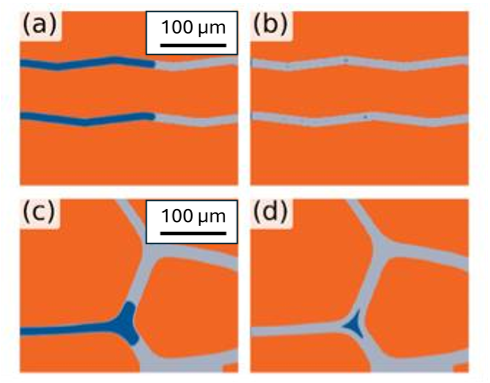
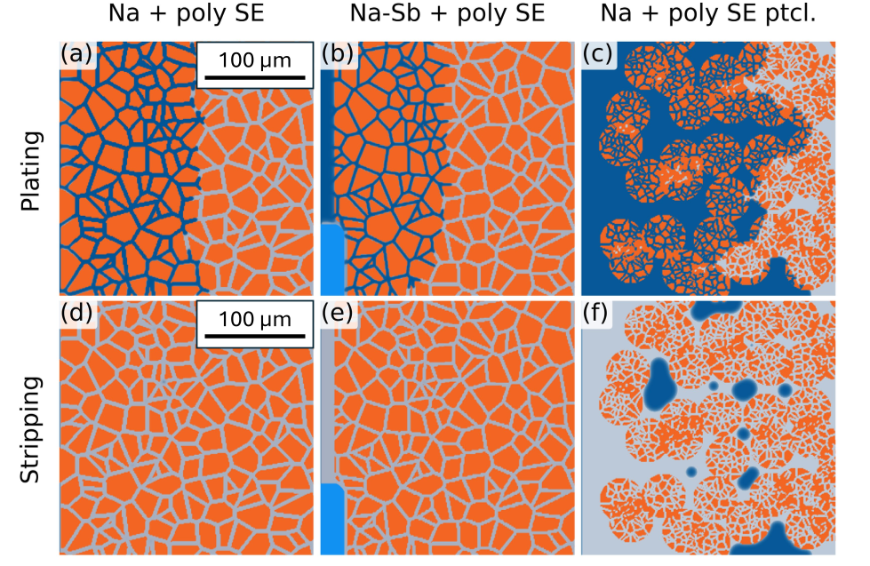
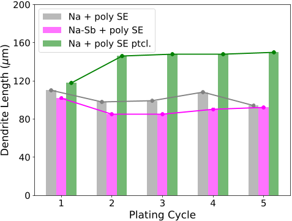
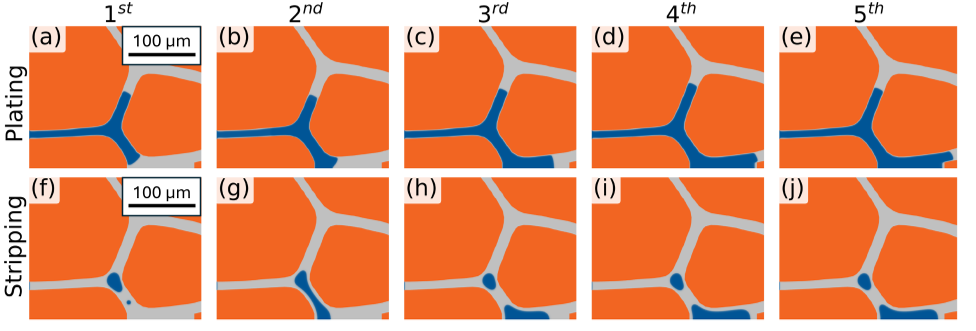

Imagine a next-generation battery that’s safer, more sustainable, and packed with energy — all without relying on scarce lithium. Sodium solid-state batteries promise just that, but they face a hidden foe: tiny metal filaments called dendrites that grow inside the battery during use, threatening its safety and lifespan. What if we could see exactly how these dendrites form and find ways to stop them? Recent research uses cutting-edge computer simulations to visualize and understand this microscopic growth, offering clues to design better batteries.

> **TL;DR**
> - Dendrite growth in sodium solid-state batteries occurs asymmetrically due to grain boundary geometry, leading to persistent isolated sodium metal that accelerates further dendrite penetration.
> - Phase-field simulations informed by quantum calculations reveal how applied voltage, microstructure, and anode chemistry influence dendrite evolution, guiding strategies to stabilize battery interfaces.

*Note: this summary is based on a preprint — research shared ahead of formal peer review.*

All-solid-state batteries (SSBs) are gaining attention because they promise higher energy density and enhanced safety compared to traditional liquid electrolyte batteries. While lithium-based SSBs have advanced, sodium-based alternatives offer a more abundant and cost-effective option. However, both face a critical challenge: dendrites, needle-like metal structures that grow during charging and discharging cycles, can pierce the solid electrolyte, causing battery failure or safety hazards. Experimentally capturing the detailed mechanisms of dendrite growth inside solid electrolytes is difficult due to their small scale and rapid dynamics. To overcome this, researchers turn to computational models that can simulate these processes at the nanoscale and mesoscale.

This study combines density functional theory (DFT) — a quantum mechanical modeling method — with phase-field simulations that track evolving microstructures over time. DFT calculations provide detailed data on electron distributions at the surfaces and grain boundaries of the solid electrolyte material Na3SbS4, which are critical sites for dendrite formation. The phase-field model uses this information to simulate how sodium metal deposits and dissolves during cycling, capturing the interplay of electrochemical reactions, ion transport, and microstructural features like grain boundaries. Simulations run in a two-dimensional half-cell setup explore how different voltages, microstructures, and anode chemistries affect dendrite growth patterns.

The simulations reveal that dendrite stripping (removal of sodium metal during discharge) is not simply the reverse of plating (deposition during charge). Grain boundaries in the electrolyte create asymmetric conditions that cause small pockets of isolated sodium metal to remain trapped between cycles. These residual sodium bits become kinetically stabilized at grain boundary junctions and can reactivate during subsequent plating, accelerating dendrite growth deeper into the electrolyte. The study also shows that factors such as applied voltage and the microstructure’s grain boundary shape and conductivity significantly influence how dendrites evolve. Different anode materials, like pure sodium versus sodium-antimony alloys, also impact dendrite behavior. Visualizations from the simulations illustrate how leftover sodium at grain boundaries acts as a persistent seed for dendrite propagation.

By illuminating the subtle but critical role of isolated sodium metal trapped at grain boundaries, this work advances our fundamental understanding of dendrite growth in sodium solid-state batteries. The insights offer practical design principles: stabilizing anode/electrolyte interfaces and engineering microstructures to minimize isolated sodium could reduce dendrite formation and improve battery longevity and safety. These findings contribute to the broader goal of developing sustainable, high-performance sodium-based energy storage technologies that could complement or even replace lithium-ion batteries in certain applications.

While phase-field simulations provide valuable mechanistic insights, they rely on approximations such as treating grain boundary electron densities based on surface calculations and modeling in two dimensions. Real batteries have more complex three-dimensional microstructures and additional factors like mechanical stresses and side reactions that were not included here. Experimental validation of these predictions remains essential. Nonetheless, the combination of quantum-informed modeling and mesoscale simulation represents a powerful approach to exploring phenomena difficult to capture experimentally, guiding future research and battery design.

## Figures

*Figure 4 shows how grain boundary shape and conductivity affect isolated sodium metal growth during plating and stripping. — Figure from Chengyin Wu et al., [CC BY 4.0](http://creativecommons.org/licenses/by/4.0/), caption edited.*

*Snapshots show how different sodium anode types and solid electrolytes change during the fifth plating–stripping cycle in batteries. — Figure from Chengyin Wu et al., [CC BY 4.0](http://creativecommons.org/licenses/by/4.0/), caption edited.*

*Bar chart showing how deep sodium dendrites grow over five plating–stripping cycles in different microstructures. — Figure from Chengyin Wu et al., [CC BY 4.0](http://creativecommons.org/licenses/by/4.0/), caption edited.*

*Images show how leftover sodium bits (blue) on grain boundaries (gray) in a solid electrolyte (orange) help dendrites grow during repeated charging cycles. — Figure from Chengyin Wu et al., [CC BY 4.0](http://creativecommons.org/licenses/by/4.0/), caption edited.*

## Sources

- [Phase-Field Simulation of Dendrite Evolution in All-Solid-State Sodium Batteries during Cycling](https://arxiv.org/abs/2607.15387)
- DOI: [10.48550/arxiv.2607.15387](https://doi.org/10.48550/arxiv.2607.15387)

*This article reuses and adapts text and figures from the original research by Chengyin Wu et al., available via arXiv Materials Science, under the [CC BY 4.0](http://creativecommons.org/licenses/by/4.0/) license.*
