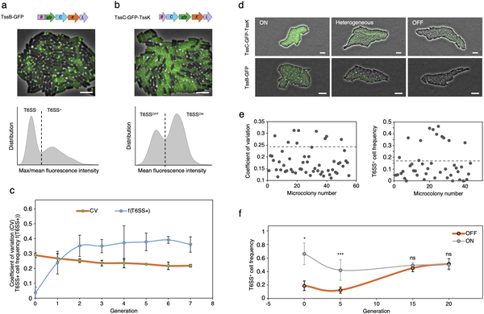
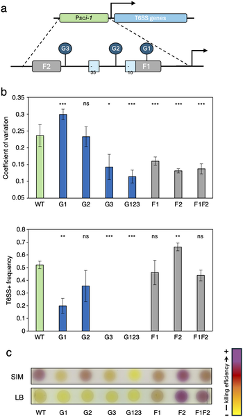
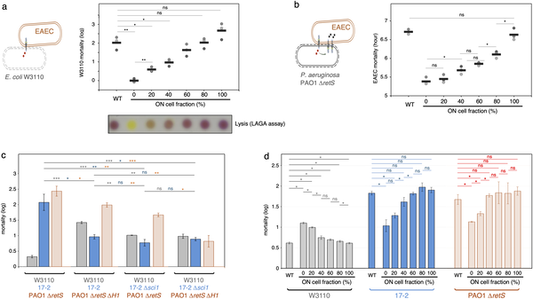
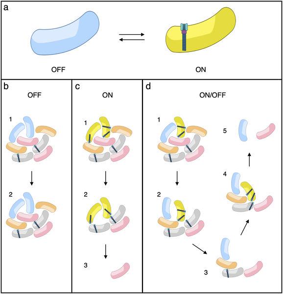

Did you know that bacteria wage microscopic battles using tiny nanoweapons? Some bacteria cleverly split their populations into attackers and defenders, balancing aggression with survival. Recent research uncovers how Escherichia coli controls these roles through genetic switches, revealing a sophisticated strategy in microbial warfare.

> **TL;DR**
> - Escherichia coli bacteria deploy the type VI secretion system (T6SS), a nanoweapon used to kill competing bacteria, but only a subset of cells express it at a time.
> - This division into T6SS 'ON' attackers and 'OFF' defenders is controlled epigenetically by DNA methylation and iron-responsive regulators, optimizing both competitive killing and survival.

Bacteria often live in crowded environments where competition for resources is fierce. To outcompete rivals, many bacteria use specialized protein machines called secretion systems to attack neighbors. The type VI secretion system (T6SS) acts like a molecular spear gun, injecting toxic proteins into competing cells. While it’s known that T6SS expression varies within bacterial populations, the reasons and mechanisms behind this heterogeneity have remained unclear. Understanding how bacteria regulate these nanoweapons can shed light on microbial community dynamics and infection processes.

Researchers studied enteroaggregative Escherichia coli (EAEC), focusing on the sci1 T6SS gene cluster. They used fluorescent protein reporters fused to T6SS components to visualize expression and assembly at the single-cell level with confocal microscopy and flow cytometry. By growing bacteria under iron-limiting conditions, which induce T6SS expression, they observed distinct subpopulations of cells with the T6SS turned ON or OFF. Genetic mutations disrupting DNA methylation sites and iron-responsive regulator binding sites allowed the team to dissect the molecular controls governing this heterogeneity. They also performed bacterial competition assays to test how these subpopulations affect survival and killing efficiency.

The study revealed that under iron starvation, EAEC populations split into stable, heritable subpopulations: some cells expressed and assembled the T6SS nanoweapon (ON state), while others did not (OFF state). This phenotypic heterogeneity is controlled epigenetically through DNA adenine methylation at specific GATC sites in the sci1 promoter and by the iron-responsive regulator Fur binding. Mutations that disrupted these regulatory elements shifted populations to uniform ON or OFF states. Functionally, ON cells actively killed competing bacteria, whereas OFF cells avoided lethal counterattacks from rival bacteria armed with their own T6SS. This balance between offense and defense optimized overall population survival during microbial competition.

This work uncovers a novel bacterial survival strategy: dividing labor between attacker and defender roles within a genetically identical population. By epigenetically regulating T6SS expression, bacteria finely tune their competitive behavior to maximize fitness in complex microbial communities. These insights deepen our understanding of bacterial ecology and pathogenesis, potentially informing future approaches to manipulate microbial populations in health and disease contexts.

While the study robustly demonstrates epigenetic control of T6SS heterogeneity in laboratory conditions, natural environments are more complex, and additional factors may influence these dynamics. The metabolic costs and benefits of T6SS expression might vary depending on ecological context, host interactions, and community composition. Further research is needed to explore how widespread this strategy is among other bacterial species and how it impacts infection outcomes in vivo.

## Figures

*T6SS protein levels vary among cells but stabilize over generations, shown by fluorescence imaging and intensity measurements.*

*Specific DNA sites control variable expression of a bacterial secretion system, affecting its activity and ability to kill other bacteria.*

*Bacterial mix ratios affect their ability to kill competitors and survive attacks, showing a balance between offense and defense.*

*Some bacteria switch T6SS on or off to balance killing rivals and avoiding attacks, helping them survive and colonize better.*

## Sources

- [Phenotypic heterogeneity optimizes trade-offs during adaptive deployment of the type VI secretion system](https://journals.plos.org/plosbiology/article?id=10.1371/journal.pbio.3003838)
- DOI: [10.1371/journal.pbio.3003838](https://doi.org/10.1371/journal.pbio.3003838)
