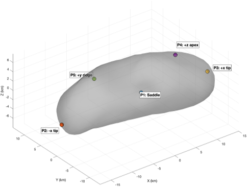
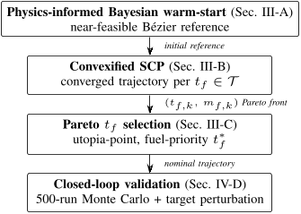

Imagine a robot explorer hopping across the rugged surface of an asteroid, carefully conserving its limited fuel while navigating an alien landscape shaped by irregular gravity and jagged terrain. This is not science fiction but a real challenge for future space missions aiming to explore small celestial bodies up close. How can spacecraft plan these complex hops efficiently and safely? Recent research introduces an innovative mathematical approach that blends physics knowledge with advanced optimization techniques to solve this problem.

> **TL;DR**
> - The study develops a physics-informed Bayesian optimization method to generate smart initial guesses for planning fuel-optimal hops on asteroid 433 Eros, overcoming challenges from irregular gravity and complex terrain.
> - This approach significantly improves the convergence and efficiency of sequential convex programming, enabling precise, fuel-saving trajectories validated through extensive simulations.

*Note: this summary is based on a preprint — research shared ahead of formal peer review.*

Exploring small bodies like asteroids is becoming a key goal in space science and exploration. Unlike planets, asteroids have weak, irregular gravity fields and highly uneven surfaces, making traditional wheeled rovers ineffective. Instead, hopping—a mode of locomotion where a spacecraft makes controlled ballistic jumps from one surface site to another—offers a promising alternative. However, designing fuel-efficient hops is a complex task. The spacecraft must navigate a nonconvex environment where gravity varies sharply, fuel consumption depends on thrust, and collisions with the surface must be avoided. Previous methods often struggled because simple straight-line guesses for trajectories frequently passed through the asteroid itself, leading to poor or failed optimization.

To tackle these challenges, the researchers introduced a three-part framework. First, they use physics-informed Bayesian optimization to warm-start the trajectory planning. This method searches for a near-feasible path by adjusting a single control point on a quadratic Bézier curve, guided by the physics of asteroid gravity and thrust constraints, without requiring any prior training data. This warm-start produces a reference trajectory that respects the asteroid’s shape better than a naive straight line. Next, a sequential convex programming (SCP) solver refines this initial guess by iteratively linearizing the problem, convexifying the thrust and mass coupling, and enforcing collision avoidance through half-space constraints derived from the asteroid’s detailed polyhedral model. Finally, the method performs a discrete sweep over possible flight times, selecting the best trade-off between time and fuel consumption using a Pareto front approach weighted to prioritize fuel savings. The entire process was tested on 20 different hops among five representative sites on asteroid 433 Eros, with multiple random seeds to ensure robustness.

The results demonstrate that the physics-informed Bayesian warm-start significantly improves the optimization process. Compared to a straight-line initial guess, it reduces the average number of SCP iterations from 8.8 to 5.9 and eliminates convergence failures. The optimized hops consume roughly one third less velocity change (ΔV) than idealized two-impulse ballistic trajectories, completing a five-site tour on Eros using only about 20% of the spacecraft’s propellant budget. The trajectories maintain meter-level accuracy in closed-loop Monte Carlo simulations that account for uncertainties, and smoothly vary with changes in landing targets, indicating stable and reliable solutions. Importantly, the method preserves low-altitude corridors close to the asteroid’s true surface, which previous bounding approximations often excluded, allowing for more realistic and efficient paths.

This work represents a meaningful step forward in planning fuel-efficient and safe mobility on small bodies. By integrating physics knowledge directly into the optimization warm-start, the method avoids costly offline training and improves convergence in a challenging nonconvex environment. Such advancements are crucial for future missions that may rely on hopping to explore multiple sites on asteroids or other small bodies, enabling more detailed scientific investigations and potentially aiding in resource utilization or planetary defense strategies. The approach also showcases how combining modern optimization techniques with detailed physical modeling can solve complex control problems in space exploration.

While promising, the solutions presented are locally optimal and depend on the initial warm-start and problem formulation; global optimality is not guaranteed. The method’s complexity and computational demands may limit real-time onboard implementation, suggesting it is best suited for pre-mission planning or ground-in-the-loop operations. Additionally, the study focuses on asteroid 433 Eros and five specific surface sites, so further work is needed to generalize the approach to other bodies with different shapes and gravity fields. Finally, the practical challenges of spacecraft hardware, sensor uncertainties, and environmental disturbances remain to be fully integrated into future mission designs.

## Figures

*Key surface spots P1–P5 are shown on the 3D model of asteroid 433 Eros. — Figure from Baran Ekşi and Tufan Kumbasar, [CC BY 4.0](http://creativecommons.org/licenses/by/4.0/), caption edited.*

*Our method starts with a smart guess, refines the path for time and fuel efficiency, and checks each solution for reliability. — Figure from Baran Ekşi and Tufan Kumbasar, [CC BY 4.0](http://creativecommons.org/licenses/by/4.0/), caption edited.*

## Sources

- [Physics-Informed Bayesian Optimization Warm-Starts for Sequential Convex Programming in Asteroid Surface Hopping](https://arxiv.org/abs/2608.20662)
- DOI: [10.48550/arxiv.2608.20662](https://doi.org/10.48550/arxiv.2608.20662)

*This article reuses and adapts text and figures from the original research by Baran Ekşi and Tufan Kumbasar, available via arXiv Mathematics, under the [CC BY 4.0](http://creativecommons.org/licenses/by/4.0/) license.*
