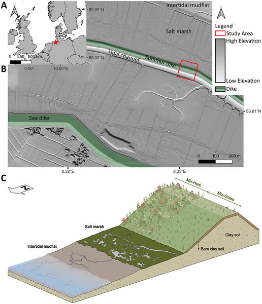
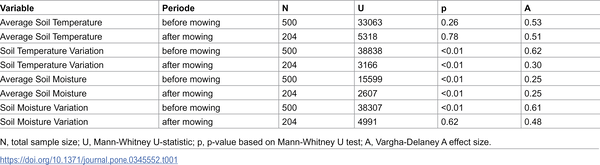
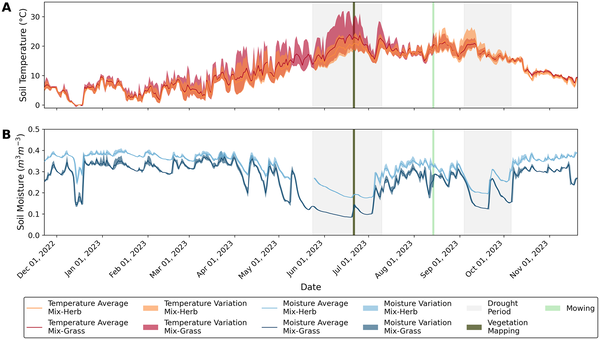
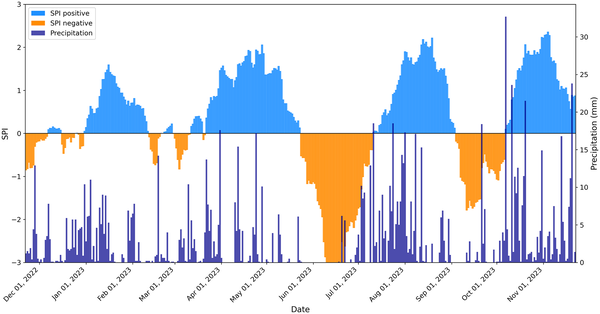

Coastal dikes are vital engineered structures that protect low-lying lands from flooding, but their stability depends heavily on the moisture content of the soil within them. When drought strikes, dry soils can crack and weaken these defenses. Could the diversity of plants growing on dikes help maintain soil moisture and temperature, making dikes more resilient to extreme weather? Recent research from northern Germany explores how different plant communities on dikes influence soil conditions during drought periods, revealing surprising insights about biodiversity and management practices like mowing.

> **TL;DR**
> - Herb-rich plant communities on coastal dikes moderate soil temperature swings and reduce moisture loss better than grass-dominated ones during droughts.
> - Mowing alters the soil’s thermal buffering, sometimes reversing benefits of plant diversity, indicating that management timing is crucial for dike soil health.

As climate change intensifies, extreme weather events such as droughts and heatwaves are becoming more frequent, posing challenges to coastal protection infrastructure worldwide. Sea dikes, often constructed with clay soils, rely on sufficient soil moisture to prevent cracking and erosion. Traditionally, these dikes are covered with dense grass, chosen mainly for erosion resistance, but this approach overlooks the potential benefits of plant diversity. Biodiversity not only supports ecosystem stability but also influences soil physical properties. Understanding how different plant communities affect soil moisture and temperature on dikes is key to developing more resilient coastal defenses that integrate ecological principles.

Researchers established an experimental setup on a summer dike along Germany’s North Sea coast, dividing a 24-meter stretch into two sections. One was sown with a herb-dominated seed mixture comprising 16 species, mostly herbs, while the other was sown with a grass-dominated mixture of 10 species. After two years of growth, soil sensors were installed at three depths (4 cm, 14 cm, and 24 cm) to continuously monitor soil temperature and moisture every 10 minutes over one year. The team also recorded vegetation diversity using the Shannon Index and tracked local weather conditions, including drought periods. Both sections were mowed once annually in late summer, following typical dike maintenance practices, allowing assessment of mowing effects on soil microclimate.

The study found that the herb-dominated plant community maintained higher species diversity and was more effective at buffering daily soil temperature fluctuations compared to the grass-dominated area. During a significant drought in June 2023, soils under the herb-rich vegetation experienced less heating and moisture loss. However, after mowing, this thermal buffering effect diminished, and soils in the herbaceous area showed greater temperature swings. In a subsequent drought in September 2023, soils in the grass-dominated section lost moisture more rapidly post-mowing. These results emphasize that plant functional diversity influences soil microclimate and that management actions like mowing can temporarily alter these benefits.

This research highlights the practical importance of plant community composition and management timing for maintaining soil health on coastal dikes, which are critical for flood protection. By promoting diverse plant assemblages rather than uniform grass swards, coastal managers can enhance the resilience of dikes against drought-induced soil degradation. Furthermore, adjusting mowing schedules to account for ecological and climatic conditions can help preserve the soil’s thermal and moisture buffering capacity. Such ecosystem-based approaches complement traditional engineering and offer a nature-positive path toward climate adaptation of coastal infrastructure.

While the study provides valuable in-situ data over a full year, it focuses on a single site and two specific plant mixtures, which may limit generalizability to other regions or dike types. The observed decline in species diversity over time suggests that maintaining high biodiversity may require ongoing management. Additionally, the complex interactions between plant traits, soil properties, and weather conditions warrant further research to optimize plant selection and maintenance for different coastal environments. Nonetheless, these findings offer a promising step toward integrating biodiversity into coastal engineering practices.

## Figures

*Map and setup of two planted dike sections on Germany's North Sea coast, showing soil layers and plant types used in the experiment.*

*Table showing statistical test results comparing soil temperature and moisture levels.*

*Soil temperature and moisture at 4 cm depth vary daily and differ between mixed herb and grass areas over a year, highlighting droughts, mowing, and sensor gaps.*

*This figure shows drought periods from 2022-2023 using the Standard Precipitation Index and daily rainfall data at Burhave weather station.*

## Sources

- [Plant trait diversity buffers soil moisture dynamics on coastal dikes during drought periods](https://journals.plos.org/plosone/article?id=10.1371/journal.pone.0345552)
- DOI: [10.1371/journal.pone.0345552](https://doi.org/10.1371/journal.pone.0345552)
