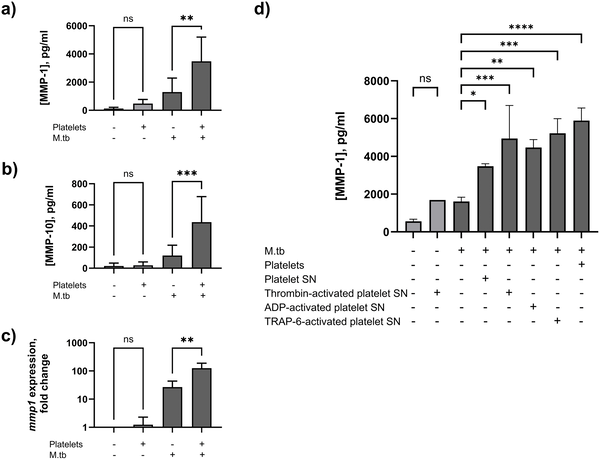
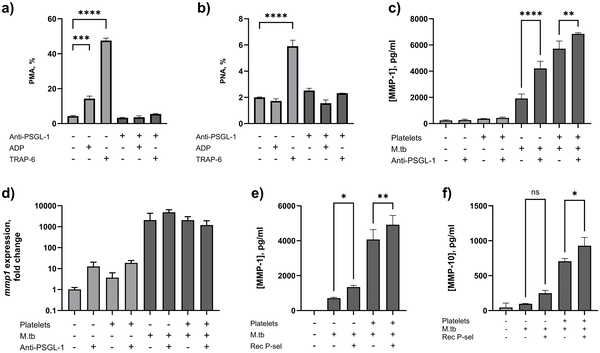
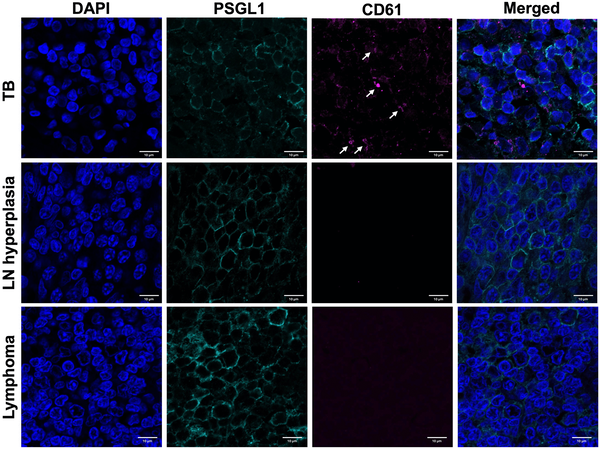

When we think of platelets, we usually picture tiny blood cells that rush to stop bleeding after a cut. But recent research shows platelets have a more complex role, especially in infectious diseases like tuberculosis (TB). Scientists have discovered that platelets don’t just patch up wounds—they can actually worsen lung damage in TB by teaming up with immune cells to unleash destructive enzymes. This surprising partnership opens new avenues for treatments aimed at protecting lung tissue in millions affected worldwide.

> **TL;DR**
> - Platelets interact with immune cells via P-selectin and PSGL-1 receptors to form aggregates that boost secretion of matrix metalloproteinases (MMPs), enzymes that break down lung tissue in TB.
> - Targeting these platelet-leukocyte interactions could reduce harmful inflammation and tissue damage in TB, offering a promising host-directed therapy approach.

Tuberculosis remains one of the deadliest infectious diseases globally, causing over a million deaths annually despite available treatments. Much of the damage in TB comes not directly from the bacteria but from the body’s own immune response. Immune cells release enzymes called matrix metalloproteinases (MMPs) that degrade lung tissue, leading to scarring and impaired lung function. While platelets are traditionally known for their role in blood clotting, emerging evidence suggests they also influence inflammation. However, their role in TB-related tissue damage was not well understood until now.

Researchers combined laboratory experiments with patient studies to unravel how platelets contribute to TB pathology. They used a co-culture system where human monocytes (a type of immune cell) were infected with Mycobacterium tuberculosis and then exposed to platelets. They measured MMP secretion and gene expression changes. Immunofluorescence microscopy was employed to visualize platelets and immune cells in infected lymph node tissues. Additionally, blood samples from TB patients, healthy controls, and patients with other respiratory symptoms were analyzed using flow cytometry and platelet aggregation assays to assess platelet-leukocyte interactions and platelet activation.

The study found that platelets significantly increased secretion of MMP-1 and MMP-10 enzymes from M.tb-infected monocytes, with gene expression of MMP-1 rising nearly fivefold. This effect was driven both by direct contact between platelets and monocytes through P-selectin (on platelets) binding to PSGL-1 (on monocytes) and by soluble factors released by activated platelets. In tissue samples from TB patients, platelets clustered around immune cells expressing PSGL-1, a pattern not seen in non-TB controls. Blood analysis revealed that TB patients had higher levels of platelet-monocyte and platelet-neutrophil aggregates, indicating active platelet-leukocyte interactions. Interestingly, these interactions were independent of platelet pathways involved in clotting, suggesting a distinct inflammatory role. Blocking PSGL-1 reduced platelet-leukocyte aggregation and altered MMP secretion, underscoring the importance of this receptor interaction.

This research highlights a novel inflammatory role for platelets in tuberculosis, showing they are not just bystanders but active participants in driving tissue damage. By forming aggregates with immune cells, platelets amplify the release of enzymes that degrade lung tissue, contributing to disease severity and long-term lung impairment. Importantly, the P-selectin/PSGL-1 interaction emerges as a potential therapeutic target. Drugs that disrupt this interaction could dampen harmful inflammation and tissue destruction without impairing the body’s ability to fight the infection. Such host-directed therapies could complement existing antibiotics and improve outcomes for TB patients. Moreover, similar mechanisms might be relevant in other lung diseases characterized by fibrosis and inflammation.

While these findings are promising, the study primarily focuses on cellular and molecular mechanisms observed in laboratory models and patient samples. Further clinical trials are needed to test whether targeting platelet-leukocyte interactions can safely and effectively reduce lung damage in TB patients. Additionally, the complexity of immune responses in TB means that interventions must be carefully balanced to avoid weakening protective immunity. The study’s patient cohorts were relatively small, and further research in diverse populations will help validate and extend these results.

## Figures

*Platelets boost enzymes linked to tissue breakdown in immune cells infected with tuberculosis bacteria.*

*Blocking PSGL-1 reduces platelet-leucocyte clumping and boosts MMP-1 release from infected immune cells, with or without platelets.*

*Platelets cluster on certain immune cells in TB-infected lymph nodes but not in non-TB lymph node diseases, shown by special staining and microscopy.*

## Sources

- [Platelet-leucocyte interactions drive MMP-mediated tissue damage in tuberculosis](https://journals.plos.org/plospathogens/article?id=10.1371/journal.ppat.1014205)
- DOI: [10.1371/journal.ppat.1014205](https://doi.org/10.1371/journal.ppat.1014205)
