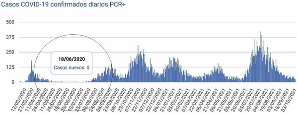
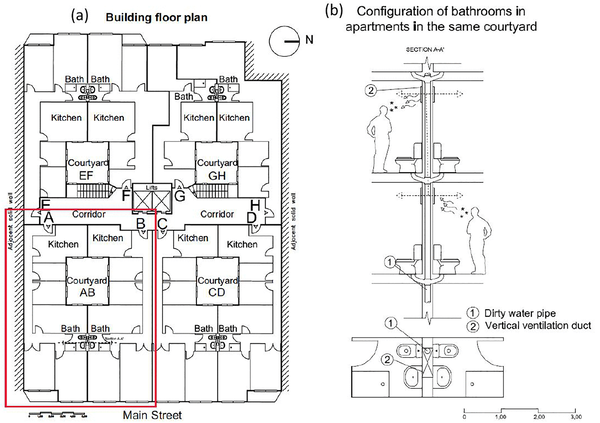
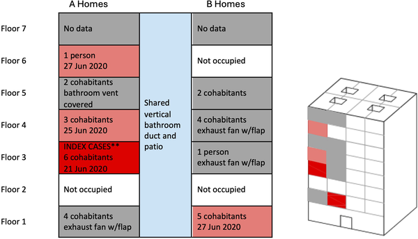
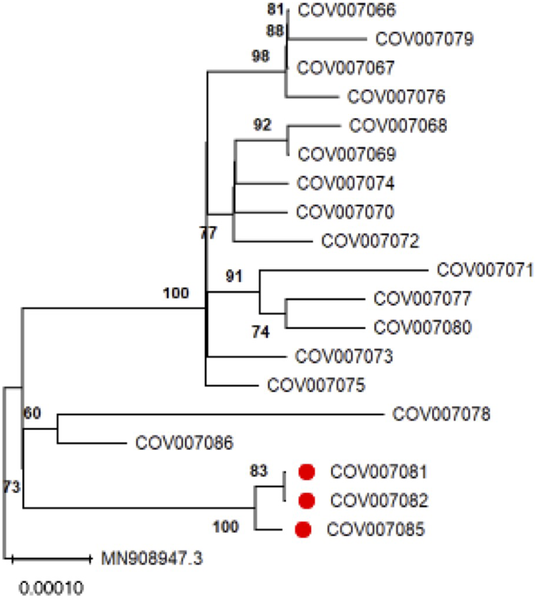

When the COVID-19 pandemic first swept across the globe, much attention was given to how the virus spreads in close contact and shared indoor spaces. But what if the very systems designed to ventilate our homes—like bathroom ducts—could inadvertently carry infectious aerosols between apartments? A surprising outbreak in a residential building in Santander, Spain, uncovered just such a hidden transmission route, prompting scientists to investigate how air moves through shared ventilation systems and what that means for indoor safety.

> **TL;DR**
> - An outbreak of COVID-19 in a Santander apartment building was traced to airborne virus traveling through shared vertical bathroom ventilation ducts connecting multiple floors.
> - Field measurements, airflow modeling, and genetic data support the conclusion that bathroom ventilation systems can facilitate vertical transmission of infectious aerosols, with practical recommendations to reduce this risk.

In the summer of 2020, during a period when COVID-19 cases in Santander, Spain, were nearly zero, an unusual cluster of 15 infections emerged in just four vertically stacked apartments within a seven-story residential building. Each apartment had a single interior bathroom without windows, ventilated through a shared vertical duct system. Unlike typical transmission scenarios involving close contact or shared common areas, these infections appeared to spread along the vertical line of apartments connected by the bathroom ventilation shaft. This pattern raised questions about whether the building’s ventilation design might have played a role in spreading the virus.

To unravel this mystery, an international team of engineers, epidemiologists, and public health researchers conducted a comprehensive investigation. They combined epidemiological data and genetic sequencing of virus samples from infected residents to confirm a common source. They also performed field measurements in the building’s bathrooms to monitor airflow direction, pressure differences, carbon dioxide levels, temperature, and humidity. Computational fluid dynamics (CFD) simulations and multi-zone airflow models were then used to visualize how aerosols might travel through the shared bathroom ducts under different conditions, including the operation of kitchen exhaust fans and window openings.

The study found that the vertical bathroom ventilation ducts, originally designed for natural exhaust via the chimney effect, could experience reverse airflow under certain conditions, causing contaminated air to flow back into bathrooms on other floors. Elevated carbon dioxide and humidity levels during these reverse flow episodes suggested that air—and potentially infectious aerosols—was moving between apartments. Genetic analysis showed that virus samples from infected residents were closely related, supporting direct transmission within the building. Notably, apartments where residents had installed exhaust fans with non-return flaps in their bathroom ducts did not report infections, highlighting the protective effect of preventing reverse airflow.

This investigation sheds light on a less commonly recognized pathway for airborne transmission of SARS-CoV-2 in multi-family residential buildings—shared bathroom ventilation systems. It underscores the importance of considering building airflow dynamics when assessing indoor infection risks, especially in older buildings with natural ventilation designs. The findings offer practical guidance for building managers and residents, such as installing forced air exhaust fans equipped with non-return valves to prevent contaminated air from traveling between apartments. These insights are valuable not only for managing COVID-19 but also for preparing for future respiratory disease outbreaks.

While the evidence strongly supports bathroom ventilation ducts as a transmission route in this outbreak, the study was limited to one building and a specific set of conditions. Access to other apartments for measurements was restricted, and the exact timing and behavior of residents during the outbreak remain partly unknown. Additionally, other transmission routes cannot be entirely ruled out, though they appear unlikely given the vertical clustering and negative surface and common area tests. Further research across diverse building types and ventilation systems is needed to generalize these findings.

## Figures

*Timeline showing confirmed COVID-19 cases in Santander from March 2020 to October 2021.*

*Top view of a Santander apartment floor showing four homes around patios and a vertical bathroom vent connecting to the roof in red.*

*Infections started on the 3rd floor of the Santander building and spread to other floors sharing a bathroom duct and patio area.*

*Phylogenetic tree showing COVID-19 virus samples from a Santander outbreak, local controls, and the original Wuhan strain for comparison.*

## Sources

- [Potential airborne transmission of SARS-COV-2 through bathroom ventilation ducts associated with an outbreak in a residential building in Santander, Spain, 2020](https://journals.plos.org/plosone/article?id=10.1371/journal.pone.0345041)
- DOI: [10.1371/journal.pone.0345041](https://doi.org/10.1371/journal.pone.0345041)
