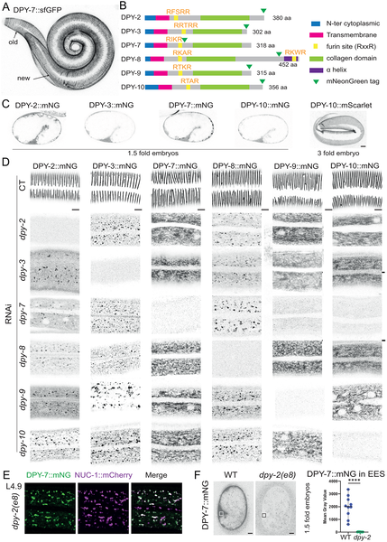
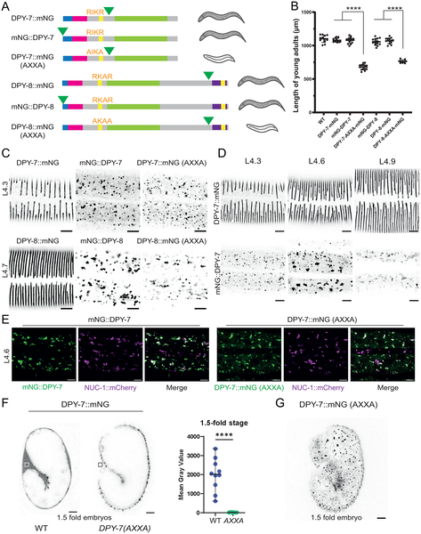
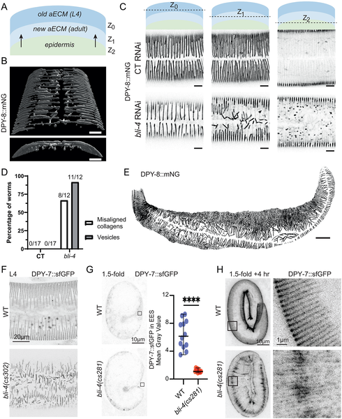
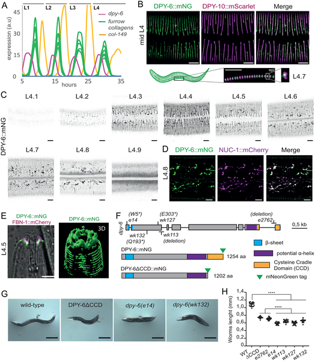

How does a tiny worm rebuild its skin with perfect, repeating patterns every time it molts? In the microscopic world of the nematode Caenorhabditis elegans, this remarkable feat happens repeatedly as the worm grows and sheds its outer layer. Scientists have uncovered that a transient protein named DPY-6 acts like a molecular mold, guiding the assembly of a complex, periodic extracellular matrix that forms the worm’s protective cuticle.

> **TL;DR**
> - DPY-6 is a transient pre-cuticle protein that acts as a scaffold to organize the periodic furrow pattern in the C. elegans cuticle during larval molts.
> - Furrow collagens require cleavage from their transmembrane domain for secretion and depend on DPY-6 to assemble into the correct repeating pattern critical for cuticle integrity and immune regulation.

Multicellular organisms rely on extracellular matrices (ECMs) — complex networks of proteins and molecules outside cells — to maintain tissue structure and function. The nematode C. elegans offers a powerful model to study ECM assembly, especially its apical ECM, the cuticle. This cuticle is a tough yet flexible outer layer that the worm sheds and rebuilds four times during its larval development. A key feature of the cuticle is a series of circumferential furrows, or ridges, arranged in precise, repeating patterns that contribute to the cuticle’s strength and help regulate the worm’s immune responses. Understanding how these patterns form and are maintained has been a longstanding question in developmental biology.

Researchers used advanced genetic engineering to tag six key furrow collagen proteins with fluorescent markers, allowing visualization of their location during development. They also created mutations to test the role of specific protein domains and enzymes involved in collagen processing. High-resolution confocal microscopy captured the dynamics of collagen secretion and assembly in live worms. RNA interference and CRISPR/Cas9 gene editing were employed to disrupt candidate proteins and cleavage sites, revealing their functional importance. These approaches enabled detailed tracking of how furrow collagens are secreted, cleaved, and patterned in relation to DPY-6 during the worm’s molts.

The study revealed that furrow collagens must be cleaved from their N-terminal transmembrane domain to be secreted properly into the cuticle. Without this cleavage, collagens accumulate inside epidermal cells and are targeted for degradation. The enzyme BLI-4 plays a partial role in this cleavage process. Importantly, the mucin-like protein DPY-6 acts as a transient scaffold present during molting but absent in mature cuticles. DPY-6’s C-terminal cysteine cradle domain is crucial for guiding the assembly of furrow collagens into their characteristic periodic pattern. While DPY-6 is not needed for the initial embryonic cuticle patterning, it is essential for replicating the furrow pattern in subsequent molts, ensuring structural integrity and proper immune regulation.

These findings uncover a novel mechanism by which a temporary extracellular matrix component templates the assembly of a complex, periodically structured matrix. DPY-6 serves as a molecular mold that directs the self-organization of furrow collagens, highlighting how transient scaffolds can orchestrate precise biological patterns. This advances our understanding of ECM assembly, a fundamental process relevant to tissue development, maintenance, and repair. Insights gained from this simple model organism could inform biomedical research on skin integrity, wound healing, and diseases involving ECM dysfunction.

While the study provides compelling evidence for DPY-6’s role in cuticle patterning in C. elegans, the exact molecular interactions and how DPY-6’s scaffold function is regulated remain to be fully elucidated. The partial role of BLI-4 suggests other proteases may contribute to collagen cleavage. Additionally, although C. elegans is a valuable model, extrapolation to ECM assembly in more complex organisms requires caution. Further research is needed to explore the broader applicability of these mechanisms and their potential relevance to human health.

## Figures

*Collagen proteins in worms work together to build and release furrows in their skin during growth and molting.*

*Cutting furrow collagens at a specific site is needed for their release and normal worm growth, shown by tagged protein images and size measurements.*

*The enzyme BLI-4 helps worms secrete collagen needed to build their new skin layer, shown by imaging and protein patterns in larvae.*

*DPY-6 protein cycles during molts, localizes to skin furrows, and appears between old and new cuticles in developing worms.*

## Sources

- [Pre-cuticle DPY-6 acts as a blueprint for aECM periodic organization in C. elegans](https://journals.plos.org/plosgenetics/article?id=10.1371/journal.pgen.1012168)
- DOI: [10.1371/journal.pgen.1012168](https://doi.org/10.1371/journal.pgen.1012168)
