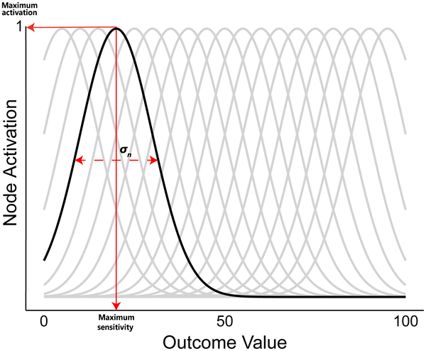
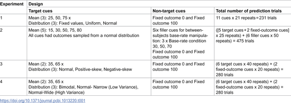
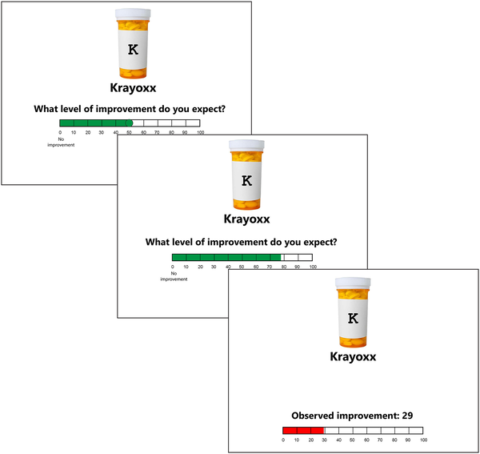

What if our brains don’t just learn the average outcome of an event, but actually encode the full range of possibilities? Imagine a doctor trying to predict how a patient will respond to a medicine—not just whether the patient recovers or not, but how much their symptoms improve. Traditional learning models have struggled to capture this kind of nuanced, continuous information. Recent research introduces a new model that better reflects how we learn from variable outcomes, offering fresh insights into human learning and decision-making.

> **TL;DR**
> - Traditional learning models simplify outcomes to binary events or averages, missing the variability inherent in many real-world experiences.
> - A new Distributed Model captures the full distribution of continuous outcomes, better matching human predictions across multiple experiments.

For decades, associative learning models have helped us understand how humans and animals learn about cause and effect by tracking the relationship between cues (like a medical treatment) and outcomes (such as recovery). These models typically treat outcomes as either present or absent, or at best, approximate the average outcome when results vary. However, real-world outcomes—like the severity of illness or environmental changes—often fluctuate along a continuum rather than fitting neatly into categories. This variability poses a challenge for traditional models, which lack the ability to represent the full range of possible outcomes and their frequencies. Understanding how people learn from such continuous data is crucial for improving predictions and decisions in everyday life.

The researchers developed a new approach called the Distributed Model, which extends classic prediction-error learning algorithms. Unlike traditional models that update a single estimate of the average outcome, this model uses a network of outcome nodes, each representing different magnitudes of the outcome. When an event occurs, outcome nodes are activated in a distributed manner depending on the magnitude experienced, allowing the model to learn not just the mean but the entire distribution of outcomes. The team tested this model against a simpler delta rule model across four experiments where participants predicted continuous outcomes—such as the degree of patient improvement after a medicine cue—and then observed the actual results. The model’s fit to human data was rigorously compared using statistical methods.

Across all experiments, the Distributed Model provided a significantly better fit to participants’ predictions than the simpler model that tracked only average outcomes. This suggests that human learners encode and use information about the full spectrum of possible outcomes, not just a single expected value. The findings imply that our brains preserve detailed information about variability in experiences, which helps us make more nuanced predictions in complex environments. For example, when deciding whether a treatment is effective, people appear to consider the range of possible improvements rather than just the average effect.

This work advances our understanding of causal inference and associative learning by demonstrating that a relatively simple modification to existing learning models can capture the continuous nature of real-world outcomes. It bridges a gap between mechanistic models of learning and the complexity of everyday experiences, with implications for fields ranging from medicine to environmental science. By better reflecting how people learn from variable outcomes, this model could inform the design of decision-support tools and educational approaches that align more closely with human cognition.

While the Distributed Model improves prediction of continuous outcomes, it remains a simplification of the complex processes underlying human learning. The experiments focused on controlled laboratory tasks with specific cues and outcomes, which may not capture all real-world complexities. Additionally, the model does not explicitly represent uncertainty or confidence, aspects that other Bayesian-inspired models address. Future research could explore integrating distributed representations with uncertainty tracking and test the model’s applicability in more naturalistic settings.

## Figures

*Diagram showing how outcome values activate specific nodes most strongly, with activation fading smoothly around them, using fixed and estimated settings.*

*Overview of each experiment's design, showing the number of conditions tested within participants.*

*Participants predicted patient improvement after seeing a medicine cue, then saw the actual health outcome in each trial.*

## Sources

- [Predicting continuous outcomes: Some new tests of associative approaches to contingency learning](https://journals.plos.org/ploscompbiol/article?id=10.1371/journal.pcbi.1013220)
- DOI: [10.1371/journal.pcbi.1013220](https://doi.org/10.1371/journal.pcbi.1013220)
