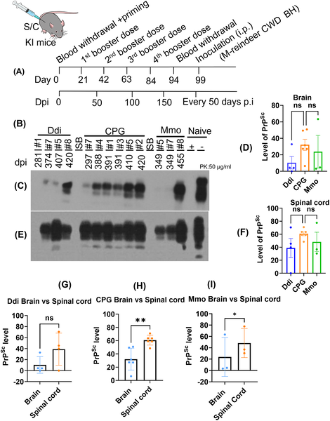
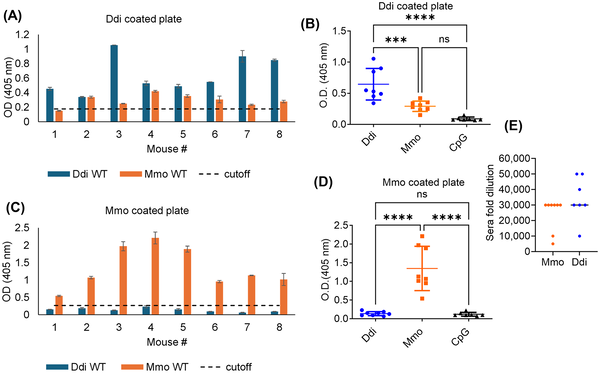
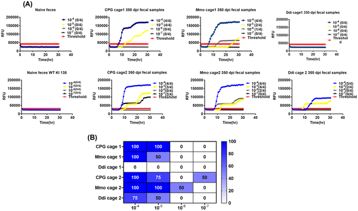
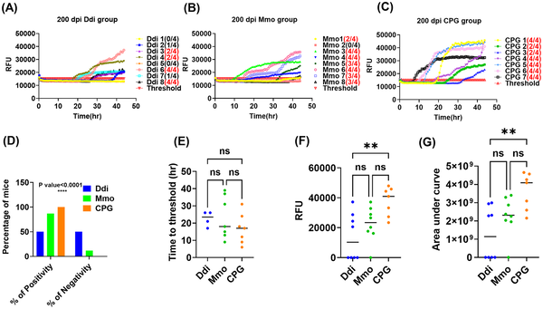

What if a vaccine could stop deadly prions from spreading through deer poop and pee? Chronic wasting disease (CWD) is a fatal and highly contagious illness affecting deer, elk, and other cervids across North America. It spreads not only through direct contact but also through infectious prions shed into the environment via urine and feces. Scientists have now demonstrated that vaccinating against CWD can reduce this prion shedding, potentially breaking the cycle of transmission in wildlife.

> **TL;DR**
> - Vaccination targeting the normal prion protein reduces or prevents the shedding of infectious prions in feces and urine in a mouse model of CWD.
> - This reduction in environmental prion contamination could help control the spread of CWD in wild and farmed cervid populations.

Chronic wasting disease is one of the most contagious prion diseases known, affecting wild and captive deer, elk, moose, and related species. It is caused by a misfolded form of a normal protein called the prion protein, which accumulates in the brain and other tissues, leading to fatal neurodegeneration. Unlike many infectious diseases, prion diseases do not trigger classical immune responses, making vaccine development challenging. Infected animals shed infectious prions in bodily fluids long before showing symptoms, contaminating the environment and facilitating transmission. Controlling CWD is difficult because prions persist in the environment for years, and no effective treatment or vaccine has been available—until now.

To explore whether vaccination could reduce prion shedding, researchers used a specialized mouse model genetically engineered to express the deer prion protein and mimic CWD infection and progression. They vaccinated groups of these “cervidized” mice with two different forms of the prion protein—either a dimeric deer prion protein (Ddi) or a monomeric mouse prion protein (Mmo)—combined with an immune-stimulating adjuvant. Control mice received the adjuvant alone. After vaccination, all mice were infected with CWD prions. Over time, researchers collected feces and urine samples and used highly sensitive techniques combining iron oxide magnetic extraction, protein misfolding cyclic amplification, and real-time quaking-induced conversion assays to detect and quantify infectious prions shed into the environment.

The vaccinated mice developed strong antibody responses against the prion proteins, overcoming the usual immune tolerance to this self-protein. Importantly, both Ddi and Mmo vaccinations delayed disease progression and reduced prion accumulation in brain and spinal cord tissues. Most notably, vaccinated mice shed fewer infectious prions in their feces and urine during the preclinical stages of disease—between 30% and 90% of the incubation period—compared to unvaccinated controls. Some vaccinated mice even showed no detectable prion shedding at all. This is the first study to demonstrate that vaccination can block or reduce prion shedding, a key factor in disease transmission.

Reducing prion shedding has two major implications. First, it could slow or prevent the contamination of the environment with infectious prions, which persist for years and are a major source of new infections. Second, by delaying disease progression and extending survival, vaccination may improve the health and stability of cervid populations. Together, these effects could break the cycle of CWD transmission in wild and farmed deer herds, benefiting ecosystems, hunting economies, and potentially reducing risks related to human exposure.

While these results are promising, they come from a mouse model engineered to mimic CWD in deer, and further studies are needed to confirm vaccine efficacy and safety in actual cervid populations. Prion diseases are notoriously difficult to manage, and the immune response to prion proteins is complex. Additionally, environmental and ecological factors influencing vaccine delivery and uptake in wild animals present practical challenges. Nonetheless, this study provides a critical proof of concept that vaccination can reduce prion shedding and offers a hopeful avenue for controlling this devastating disease.

## Figures

*This figure shows levels of disease-related proteins in brain and spinal cord of vaccinated and control mice after infection, highlighting differences between groups.*

*Mice vaccinated with Ddi or Mmo showed strong antibody responses compared to controls after four doses, measured by ELISA tests.*

*Graph shows how vaccination affects CWD prion activity in mouse feces over time, comparing vaccinated and control groups using sensitive tests.*

*Tests show prion seeding activity in fecal samples from vaccinated and control mice, with significant differences detected by statistical analysis.*

## Sources

- [Prion shedding is reduced by chronic wasting disease vaccination](https://journals.plos.org/plospathogens/article?id=10.1371/journal.ppat.1014166)
- DOI: [10.1371/journal.ppat.1014166](https://doi.org/10.1371/journal.ppat.1014166)
