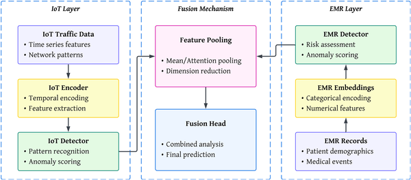

How can hospitals defend your private health data from cyberattacks without ever sharing it? As healthcare increasingly relies on connected devices and electronic medical records, the risk of cyber intrusions grows, threatening both patient privacy and safety. A new approach combining advanced AI techniques promises to detect threats across diverse healthcare data sources while preserving privacy and maintaining system resilience.

> **TL;DR**
> - A novel federated learning pipeline integrates multiple privacy and robustness techniques to detect cyberattacks in healthcare without exposing sensitive patient data.
> - By fusing data from IoT medical devices and electronic medical records, the system achieves high detection accuracy and resilience even under adversarial attacks and communication constraints.

Modern healthcare systems are undergoing a digital transformation, leveraging interconnected Internet of Things (IoT) devices and electronic medical records (EMRs) to improve patient care. However, this integration also creates new vulnerabilities. Cyberattacks targeting hospitals can compromise confidential data and even endanger patient safety. Traditional centralized AI methods for detecting such intrusions require pooling sensitive data, which is often prohibited by strict privacy regulations and raises concerns about single points of failure. This challenge calls for innovative solutions that enable collaborative learning across distributed data sources without sharing raw patient information.

The researchers developed a secure distributed machine learning pipeline tailored for healthcare cybersecurity. This pipeline combines federated learning—where local models train on-site and only share updates—with split learning, which partitions model training to keep sensitive EMR data local. To protect against malicious clients attempting to poison the system, robust aggregation techniques are employed. Privacy is further safeguarded using differential privacy, adding noise to updates, and secure aggregation, which ensures the central server only sees combined data, not individual contributions. The system also fuses multimodal data by aligning temporal patterns from IoT device traffic with clinical EMR features through specialized regularization and contrastive learning methods. Extensive preprocessing cleans and encodes heterogeneous data from public IoT and EMR datasets, preparing them for this complex training process.

Testing on representative datasets showed the pipeline achieves impressive detection accuracy—up to 95.3% when combining IoT and EMR data—with F1-scores reaching 0.932, outperforming existing deep learning baselines. The system demonstrated strong resilience: even when 30% of clients were malicious, accuracy gracefully degraded to 87.9%, and under severe communication constraints (90% update sparsification), it maintained 86.1% accuracy. Notably, detection latency was reduced compared to traditional methods, enabling faster response to threats. These results confirm that integrating federated and split learning with privacy and robustness mechanisms can effectively secure healthcare infrastructures against evolving cyber threats.

This work represents a significant step toward practical, privacy-compliant cybersecurity solutions for healthcare. By enabling collaborative anomaly detection across multiple data modalities without exposing sensitive patient information, the pipeline addresses critical regulatory and ethical concerns. Its robustness against adversarial attacks and communication limitations makes it suitable for real-world deployment in complex, distributed healthcare environments. As cyber threats continue to escalate, such privacy-preserving AI frameworks could become essential tools to protect patient safety and maintain trust in digital healthcare systems.

While promising, the approach relies on assumptions about client behavior and communication infrastructure that may vary in practice. The added complexity of multimodal fusion and privacy mechanisms can introduce computational overhead and require careful tuning. Additionally, the datasets used, though representative, may not capture all real-world variability and attack types. Future work is needed to validate performance in live hospital settings, explore scalability to larger networks, and continuously adapt to emerging cyber threats and evolving healthcare technologies.

## Figures

*Overview of the system showing IoT devices, data layers, and how information is combined to make final predictions.*

## Sources

- [Privacy-preserving multimodal federated learning pipeline for cyber-resilient healthcare systems](https://journals.plos.org/plosone/article?id=10.1371/journal.pone.0343669)
- DOI: [10.1371/journal.pone.0343669](https://doi.org/10.1371/journal.pone.0343669)
