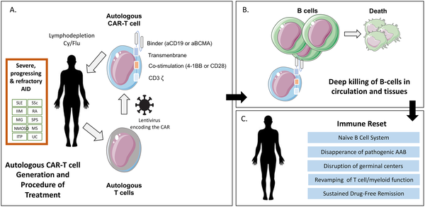

What if we could reprogram your immune system to stop attacking your own body? For millions living with autoimmune diseases—conditions where the immune system mistakenly targets healthy tissues—this idea has long been a hopeful dream. Now, a revolutionary therapy originally designed to fight cancer, called CAR-T cell therapy, is showing promise in resetting immune dysfunction and offering a potential path to lasting remission.

> **TL;DR**
> - CAR-T cell therapy uses genetically engineered immune cells to selectively eliminate problematic B cells driving autoimmune disease.
> - Early clinical experiences demonstrate deep immune system reset and sustained drug-free remission in some autoimmune patients.

Autoimmune diseases such as systemic lupus erythematosus, rheumatoid arthritis, and multiple sclerosis occur when the immune system mistakenly attacks the body’s own tissues. Traditional treatments often rely on broad immunosuppression, which can leave patients vulnerable to infections and other complications. Chimeric antigen receptor (CAR)-T cells are a type of “living drug” that combine the natural functions of immune T cells with engineered receptors that specifically target disease-causing cells. Initially developed for certain blood cancers, CAR-T cell therapy has recently been adapted to target B cells, a key player in many autoimmune diseases. This approach aims to deeply deplete the B cell population, including those responsible for autoimmunity, and thereby reset the immune system.

The process begins by collecting a patient’s own T cells, which are then genetically modified in the laboratory to express a chimeric antigen receptor (CAR) that recognizes a specific marker on B cells, such as CD19. These engineered CAR-T cells are expanded and infused back into the patient after a preparative regimen that reduces competing immune cells, allowing the CAR-T cells to proliferate and effectively eliminate B cells throughout the body. This deep depletion affects not only circulating B cells but also those residing in lymphoid tissues and affected organs. Over time, the immune system reconstitutes with a new, naïve B cell repertoire, which is believed to underlie the sustained remission observed in some patients.

Since the first successful use of CD19-targeted CAR-T cells in a patient with refractory systemic lupus erythematosus in 2021, the therapy has expanded to other autoimmune conditions including neuroinflammatory disorders and inflammatory bowel disease. Clinical studies have shown that CAR-T cell therapy can induce profound B cell depletion and an “immune reset,” leading to long-lasting remission without the need for ongoing immunosuppressive drugs. Notably, patients often experience reappearance of B cells with a naïve phenotype months after treatment, indicating a renewal of the immune system. Early evidence also suggests a favorable safety profile with manageable side effects compared to conventional therapies.

This emerging therapy represents a paradigm shift in autoimmune disease treatment. Unlike traditional drugs that suppress the immune system broadly, CAR-T cells offer a targeted approach to eliminate the root cause of autoimmunity—dysfunctional B cells—while allowing the immune system to rebuild itself. The potential for durable, drug-free remission could significantly improve quality of life and reduce long-term complications for patients. Furthermore, advances in CAR-T technology, including allogeneic “off-the-shelf” products and in vivo CAR-T cell generation, promise to make these therapies more accessible and scalable in the future.

Despite promising results, CAR-T cell therapy for autoimmune diseases is still in its early stages. Long-term safety data are limited, and questions remain about the optimal patient populations, dosing regimens, and management of potential side effects such as prolonged B cell aplasia or infections. Additionally, some autoimmune drivers like long-lived plasma cells are not targeted by CD19 CAR-T cells, prompting exploration of alternative targets like BCMA. The high cost and complexity of manufacturing CAR-T cells also pose challenges for widespread clinical use. Ongoing clinical trials and research will be critical to fully understand the benefits, risks, and best practices for this innovative treatment approach.

## Figures

*Autologous CAR-T cells are made from a patient's T cells, expanded, and reintroduced to reset the immune system and target B cells in autoimmune diseases.*

## Sources

- [Progress and promise of CAR-T cell treatment in autoimmune diseases](https://journals.plos.org/plosmedicine/article?id=10.1371/journal.pmed.1005179)
- DOI: [10.1371/journal.pmed.1005179](https://doi.org/10.1371/journal.pmed.1005179)
