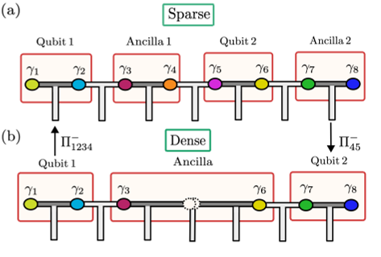
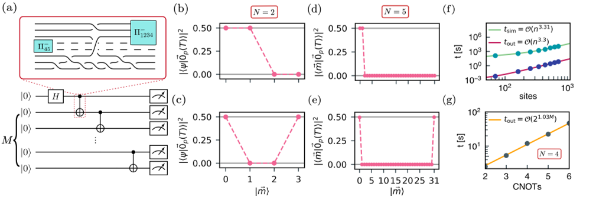
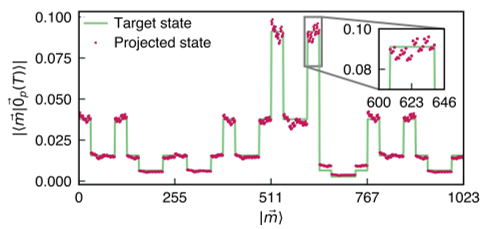
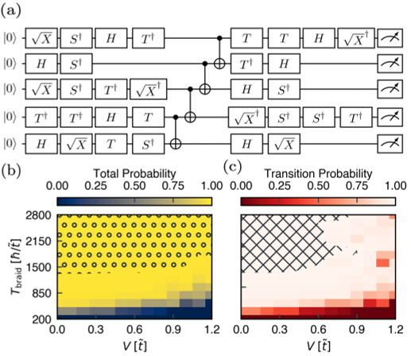

Quantum computing holds the promise of solving problems beyond the reach of classical computers, but building reliable and scalable quantum machines remains a formidable challenge. One promising approach, topological quantum computing, encodes information in exotic particles called non-Abelian anyons, manipulating them through braiding operations that are naturally resistant to errors. However, extending this approach beyond two qubits has faced a fundamental obstacle—braiding alone cannot implement all the necessary quantum gates for universal computation. Recent work by Hodge, Frey, and Rachel introduces a clever solution: combining braiding with projective measurements to enable scalable, fault-tolerant quantum computing with many qubits.

> **TL;DR**
> - Braiding of non-Abelian anyons provides inherently fault-tolerant quantum gates but cannot alone achieve universal quantum computation beyond two qubits.
> - Incorporating projective measurements to switch between different qubit encodings restores universality and enables high-fidelity, scalable quantum operations on systems of up to ten qubits.

*Note: this summary is based on a preprint — research shared ahead of formal peer review.*

Topological quantum computing leverages the unique properties of Majorana zero modes—exotic quasiparticles that emerge in certain superconducting materials—to encode quantum information nonlocally. This encoding protects the information from local noise, a major source of errors in quantum devices. Quantum gates are implemented by braiding these Majoranas around each other, effectively performing operations on the encoded qubits. While this method is robust and fault-tolerant, it faces a critical limitation: when scaling beyond two qubits, braiding alone cannot realize the full set of quantum gates needed for universal computation. This limitation arises due to constraints on how qubits are encoded and how their states can be manipulated within the topological framework.

The researchers addressed this challenge by combining two different qubit encodings—sparse and dense—each with complementary advantages. Sparse encoding assigns four Majoranas per qubit, allowing all single-qubit Clifford gates via braiding but no entanglement between qubits. Dense encoding uses fewer Majoranas per qubit and supports entangling gates but only allows a subset of single-qubit gates on certain qubits. By performing projective measurements, they dynamically switch between these encodings during computation. This switching enables the implementation of universal gate sets, including entangling operations like CNOT gates. The team simulated these processes using a time-dependent Pfaffian method to model the braiding dynamics and projective measurements on systems of up to ten qubits, incorporating realistic factors such as disorder and finite braiding times.

The simulations demonstrated the successful preparation of entangled states such as Bell states (two qubits) and GHZ states (five qubits), with gate fidelities exceeding 99%. They further executed random quantum circuits on five and ten qubits, achieving similarly high fidelities and showing robustness against moderate static disorder and varying braid durations. The fidelity remained above 99% across a broad range of conditions, underscoring the intrinsic fault tolerance of the topological architecture augmented with projective measurements. The study also analyzed the computational scaling of simulating these systems, highlighting both the feasibility and challenges of classical simulations of such quantum processes.

This work marks a significant conceptual and technical advance in topological quantum computing by overcoming a key scalability bottleneck. By integrating projective measurements to switch between qubit encodings, the researchers restored computational universality beyond two qubits while preserving the inherent fault tolerance of braiding operations. Achieving high-fidelity quantum gates on up to ten qubits in simulations brings topological quantum computing closer to practical realization. These insights provide a promising pathway toward building scalable, reliable quantum computers that harness the exotic physics of Majorana zero modes.

While the results are encouraging, they are based on numerical simulations of idealized models. Real-world implementation will face additional challenges such as precise control of Majorana modes, measurement fidelity, and environmental noise beyond static disorder. The classical simulation methods used here scale exponentially with the number of projective measurements, limiting direct simulation of larger systems. Nonetheless, the framework lays important groundwork for experimental efforts and further theoretical developments needed to realize scalable topological quantum computers.

## Figures

*Two ways to encode qubits on a T-junction: (a) sparse with separate ancillas, (b) dense sharing one ancilla qubit. — Figure from Themba Hodge et al., [CC BY 4.0](http://creativecommons.org/licenses/by/4.0/), caption edited.*

*This figure shows how quantum circuits create and measure entangled states in systems with 2 to 5 qubits, tracking their behavior and timing. — Figure from Themba Hodge et al., [CC BY 4.0](http://creativecommons.org/licenses/by/4.0/), caption edited.*

*Simulation shows how likely different outcomes are for a 10-qubit system evolving under specific conditions. — Figure from Themba Hodge et al., [CC BY 4.0](http://creativecommons.org/licenses/by/4.0/), caption edited.*

*Diagram and data showing how disorder affects the probability and fidelity of quantum state transitions over time in a random unitary circuit. — Figure from Themba Hodge et al., [CC BY 4.0](http://creativecommons.org/licenses/by/4.0/), caption edited.*

## Sources

- [Projective Measurements: Topological Quantum Computing with an Arbitrary Number of Qubits](https://arxiv.org/abs/2508.10107)
- DOI: [10.48550/arxiv.2508.10107](https://doi.org/10.48550/arxiv.2508.10107)

*This article reuses and adapts text and figures from the original research by Themba Hodge et al., available via APS Open Sci 1, 000074 (2026), under the [CC BY 4.0](http://creativecommons.org/licenses/by/4.0/) license.*
