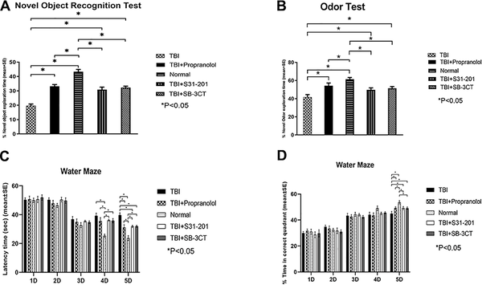
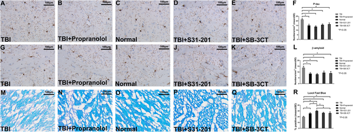
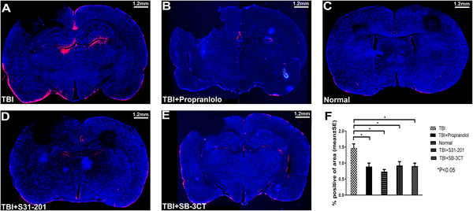
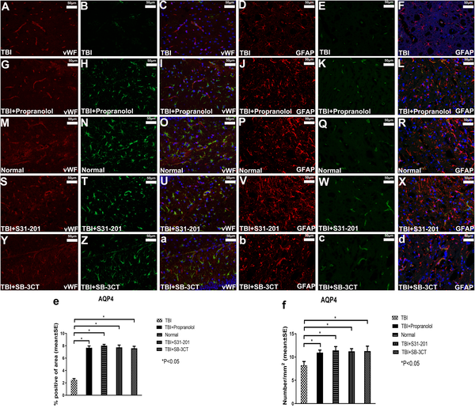

Could a medication widely used to treat heart conditions also help the brain recover after injury? Traumatic brain injury (TBI) often leads to lasting cognitive problems, and effective treatments remain elusive. Recent research suggests that propranolol, a common beta-blocker, might improve memory and brain repair by restoring the brain’s waste clearance system through a specific molecular pathway.

> **TL;DR**
> - Propranolol improves cognitive function and memory in rats after traumatic brain injury.
> - It helps restore the brain’s glymphatic system—a key waste clearance pathway—by modulating the STAT3/MMP2 signaling pathway.

Traumatic brain injury is a major health concern worldwide, often leaving survivors with cognitive impairments such as memory loss and difficulty concentrating. One reason for these cognitive problems is the buildup of harmful proteins like phosphorylated tau and amyloid-beta in the brain. The glymphatic system, a recently discovered brain waste clearance pathway, plays a crucial role in removing these toxic substances. However, this system can be disrupted after TBI, worsening brain damage. Propranolol, traditionally used to manage heart conditions by blocking beta-adrenergic receptors, has shown promise in improving neurological outcomes after TBI, but the mechanisms were not fully understood.

In this study, researchers used a rat model of traumatic brain injury induced by controlled cortical impact. They treated injured rats with propranolol, as well as two other drugs that inhibit molecules in the STAT3/MMP2 pathway, which is known to regulate brain inflammation and tissue remodeling. The rats underwent various cognitive tests assessing short-term, long-term, and spatial memory. The team also examined brain tissue for markers of protein buildup, white matter integrity, and glymphatic system function. Additionally, they studied cultured astrocytes—star-shaped brain cells critical for glymphatic function—to investigate how propranolol affects molecular signaling and protein expression.

The results showed that propranolol significantly improved cognitive performance in injured rats across multiple tests, though it did not fully restore normal function. The drug reduced the accumulation of harmful proteins phosphorylated tau and amyloid-beta in the brain and helped preserve white matter integrity. Importantly, propranolol restored the function of the glymphatic system, allowing the brain to clear metabolic waste more effectively. At the molecular level, propranolol decreased the activity of phosphorylated STAT3 and MMP2—key players in inflammation and tissue remodeling—and increased expression of aquaporin 4 (AQP4), a water channel protein essential for glymphatic clearance. Similar effects were observed when inhibiting STAT3 and MMP2 directly, supporting the role of this pathway in brain recovery after TBI.

This study highlights a promising therapeutic approach for improving cognitive outcomes after traumatic brain injury by targeting the brain’s waste clearance system. By repurposing propranolol, a well-known and widely available drug, researchers have identified a potential strategy to enhance glymphatic function and reduce harmful protein buildup that contributes to cognitive decline. Understanding the STAT3/MMP2 pathway’s role in regulating aquaporin 4 and glymphatic recovery opens new avenues for developing treatments to support brain repair after injury.

While these findings are encouraging, it is important to note that the research was conducted in animal models and cultured cells. Human brains are more complex, and clinical trials are necessary to determine whether propranolol can safely and effectively improve cognitive function after TBI in people. Additionally, propranolol did not fully restore normal brain function in rats, indicating that combination therapies or additional interventions may be needed. Further studies are needed to explore long-term effects, optimal dosing, and potential side effects before this approach can be translated into clinical practice.

## Figures

*Treatments improved memory and learning in injured rats but did not fully restore normal brain function.*

*Three drugs reduced harmful brain protein buildup and improved myelin in injured rats, nearing normal levels but not fully restoring them.*

*Three treatments fully restored waste clearance in injured rat brains, matching normal brain function with no significant differences.*

*Treatments restored normal levels of AQP4 protein around blood vessels and in brain cells in injured rat brains.*

## Sources

- [Propranolol improves cognitive function and glymphatic system recovery through STAT3/MMP2 pathway after TBI](https://journals.plos.org/plosone/article?id=10.1371/journal.pone.0353852)
- DOI: [10.1371/journal.pone.0353852](https://doi.org/10.1371/journal.pone.0353852)
