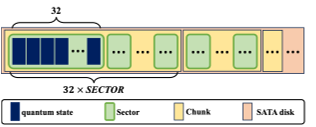
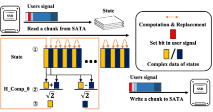

Quantum computing promises to revolutionize problem-solving by harnessing the strange behaviors of quantum bits, or qubits. But simulating how these qubits behave in large quantum circuits is notoriously difficult—requiring enormous amounts of memory and computational power, often only available on supercomputers. What if there was a way to simulate circuits with over 40 qubits using more accessible hardware? Enter Qu-Trefoil, a novel system that combines flexible FPGA chips with vast SATA disk storage to break new ground in quantum circuit simulation.

> **TL;DR**
> - Qu-Trefoil uses a multi-FPGA platform connected to dozens of SATA disks to simulate quantum circuits with more than 43 qubits, surpassing typical memory limits.
> - This system offers researchers a more affordable and flexible alternative to supercomputer-based quantum simulators, advancing quantum algorithm development and testing.

*Note: this summary is based on a preprint — research shared ahead of formal peer review.*

Quantum computers operate on qubits that can exist in multiple states simultaneously, enabling powerful parallel computations. However, current quantum hardware faces challenges such as noise, limited qubit connectivity, and scalability issues. As a result, simulating quantum circuits on classical computers remains a vital tool for researchers developing and debugging quantum algorithms. The most accurate simulation method, state-vector simulation, explicitly tracks the quantum state but demands memory that grows exponentially with the number of qubits — roughly 2^(n+4) bytes for n qubits. This means simulating circuits with more than 40 qubits typically requires supercomputers with massive memory resources, limiting accessibility for many researchers.

Qu-Trefoil tackles this challenge by leveraging Trefoil, a multi-FPGA system designed to connect directly to multiple storage subsystems, each equipped with 32 SATA disks. This architecture provides a scalable and cost-effective way to access over 128 terabytes of storage needed to hold the quantum state vectors for circuits exceeding 40 qubits. The system integrates a suite of universal quantum gates implemented using high-level synthesis (HLS) and hardware description languages (HDL) optimized for FPGA operation. By carefully balancing FPGA resource use and employing burst-mode data transfers to maximize SATA disk throughput, Qu-Trefoil efficiently performs the matrix-vector multiplications fundamental to quantum gate operations. The system is controlled via a Python-based interface on a Raspberry Pi, allowing users to configure simulations and retrieve results seamlessly.

In extensive evaluations, Qu-Trefoil successfully simulated quantum circuits with over 43 qubits, requiring more than 128 terabytes of memory, completing simulations in roughly 3.7 to 13 hours on a single storage subsystem with one FPGA. This is a significant achievement, as it surpasses the qubit scale typically feasible only on supercomputers. The system demonstrated robustness across various quantum gates, chunk sizes, and SATA disk generations, confirming its flexibility and efficiency. Performance analysis also showed that pipelining reading and computation steps helped speed up simulations, and that the design could extend to multiple storage subsystems for even larger simulations.

Qu-Trefoil represents a meaningful advance in quantum circuit simulation technology by making large-scale simulations more accessible and affordable. Unlike previous approaches reliant on costly supercomputers or GPUs with limited memory, this FPGA and SATA disk-based system offers researchers a practical alternative to explore quantum algorithms at scales relevant to near-term quantum devices. This accessibility could accelerate quantum algorithm development, testing, and education, helping bridge the gap between theoretical quantum computing and experimental hardware capabilities.

While Qu-Trefoil pushes the boundaries of simulation scale using innovative hardware design, it still faces inherent limitations of state-vector simulation methods, including exponential memory growth with qubit number. The simulation times, though reasonable for research purposes, remain significant, and the system’s performance depends heavily on SATA disk speed and FPGA resource constraints. Additionally, as a highly technical platform, it may appeal primarily to researchers and institutions with specific expertise and interest in quantum computing simulation hardware rather than a broad public audience.

## Figures

*Illustration of how quantum states are assigned in SATA disk drives. — Figure from Kaijie Wei et al., [CC BY 4.0](http://creativecommons.org/licenses/by/4.0/), caption edited.*

*Figure 6 shows how reading and computing steps are done in a pipeline to speed up the process. — Figure from Kaijie Wei et al., [CC BY 4.0](http://creativecommons.org/licenses/by/4.0/), caption edited.*

## Sources

- [Qu-Trefoil: Large-Scale Quantum Circuit Simulator Working on FPGA With SATA Storages](https://arxiv.org/abs/2608.14285)
- DOI: [10.1109/tc.2024.3521546](https://doi.org/10.1109/tc.2024.3521546)

*This article reuses and adapts text and figures from the original research by Kaijie Wei et al., available via IEEE Transactions on Computers, vol. 74, no. 4, pp. 1306-1321, April 2025, under the [CC BY 4.0](http://creativecommons.org/licenses/by/4.0/) license.*
