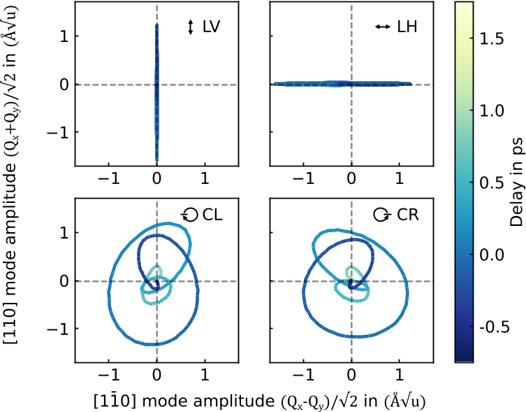
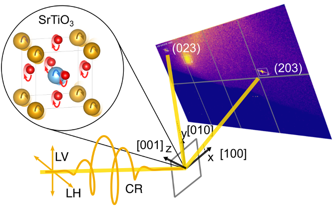
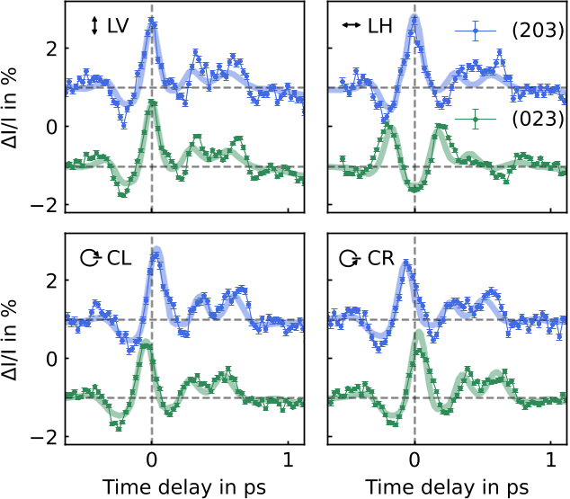

What if you could spin atoms with light to create magnetism? Recent advances show that intense terahertz (THz) pulses can set ions inside crystals into a tiny circular dance, generating angular momentum and internal magnetic fields. But how can we actually see and measure these ultrafast atomic whirlwinds? A new study uses femtosecond x-ray diffraction to directly observe and quantify the circular motions of ions in a quantum material, revealing the microscopic origins of phonon-driven magnetism.

> **TL;DR**
> - Ultrafast x-ray diffraction captures time-resolved circular ionic motions (circular phonons) in SrTiO3 excited by circularly polarized THz pulses.
> - Oxygen ions, despite their smaller mass, contribute about 90% of the phonon angular momentum, explaining how these motions induce transient magnetic fields.

*Note: this summary is based on a preprint — research shared ahead of formal peer review.*

The connection between angular momentum and magnetism has fascinated physicists for over a century, dating back to the Einstein-de Haas effect, which demonstrated how magnetization is linked to the mechanical rotation of a material. In recent years, ultrafast laser techniques have reignited interest in how angular momentum can be transferred between electrons, spins, and the crystal lattice on incredibly short timescales. A theoretical concept called magnetophononics proposes that circular ionic motions—phonons moving in loops—can carry angular momentum and induce magnetism. While experiments have hinted at strong magnetic fields generated by terahertz excitation in materials like SrTiO3, the precise atomic motions and their angular momentum had remained elusive until now.

To probe these ultrafast ionic motions, the researchers used intense, single-cycle terahertz pulses with controlled polarization to excite a thin film of SrTiO3, a quantum paraelectric material known for its soft polar phonon modes. By converting the THz pulses into circularly polarized light, they induced circular trajectories of ions within the crystal lattice. They then employed femtosecond x-ray diffraction at the SwissFEL free-electron laser to record changes in diffraction patterns from specific crystal planes, which are sensitive to atomic displacements along orthogonal directions. This simultaneous measurement allowed reconstruction of the full two-dimensional ionic trajectories with sub-picometer precision and femtosecond time resolution.

The data revealed that the oxygen ions, despite being lighter than the titanium and strontium ions, dominate the phonon angular momentum—contributing about 90%—due to their larger number and the radius of their circular motion. The ions rotate coherently in the same circular direction but with opposite phases for positively and negatively charged ions, breaking time-reversal symmetry and generating a net magnetic moment. The angular momentum peaks shortly after excitation and decays within a picosecond as it transfers to other lattice vibrations. These observations provide the first quantitative measurement of phonon angular momentum in solids and confirm that circular ionic motions can induce transient magnetic fields.

This work establishes a powerful experimental approach to directly visualize and quantify angular momentum carried by phonons in quantum materials. Understanding and controlling these circular ionic motions open new pathways for manipulating magnetic properties with light on ultrafast timescales. Such control could impact the development of novel devices exploiting topological phonon transport and phonon-driven magnetism, potentially advancing quantum technologies and ultrafast magnetic switching. Moreover, the methodology can be applied broadly to study angular momentum transfer in other materials, deepening our grasp of lattice dynamics and their coupling to electronic and magnetic phenomena.

While the study provides compelling quantitative insights, the observed effects occur at ultrafast timescales and under intense terahertz excitation conditions that may be challenging to implement in practical devices. The precise enhancement of the internal THz field due to reflections and interfaces introduces some uncertainty in the effective charge values used to model atomic displacements. Additionally, the transfer of angular momentum to other phonon modes and its ultimate fate in the lattice require further investigation. The field remains complex, and interpreting phonon-driven magnetism demands careful theoretical and experimental validation.

## Figures

*Phonon vibrations in two directions change over time when hit by THz light with different polarizations from -0.5 to 1.75 picoseconds. — Figure from Roman Mankowsky et al., [CC BY 4.0](http://creativecommons.org/licenses/by/4.0/), caption edited.*

*THz pulses with different polarizations excite a thin film, causing atomic movements that change X-ray diffraction patterns measured simultaneously. — Figure from Roman Mankowsky et al., [CC BY 4.0](http://creativecommons.org/licenses/by/4.0/), caption edited.*

*Changes in light diffraction vary with THz wave polarization, matching simulations of atomic movements under different polarizations. — Figure from Roman Mankowsky et al., [CC BY 4.0](http://creativecommons.org/licenses/by/4.0/), caption edited.*

## Sources

- [Quantifying angular momentum of coherently driven circular phonons](https://arxiv.org/abs/2607.01841)
- DOI: [10.48550/arxiv.2607.01841](https://doi.org/10.48550/arxiv.2607.01841)

*This article reuses and adapts text and figures from the original research by Roman Mankowsky et al., available via arXiv Materials Science, under the [CC BY 4.0](http://creativecommons.org/licenses/by/4.0/) license.*
