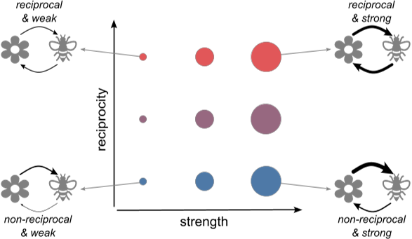
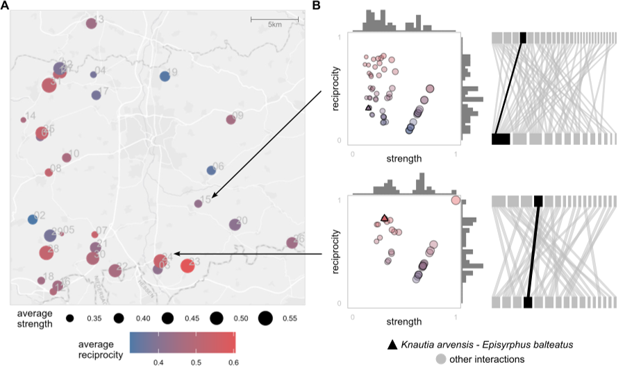
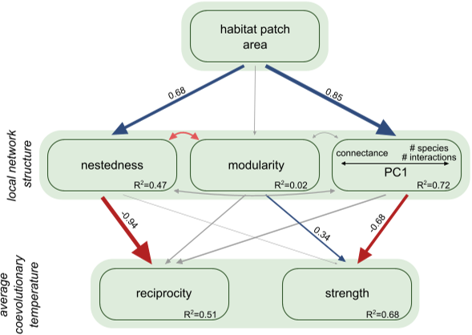
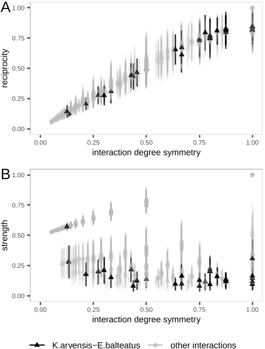

Evolution is not a uniform tapestry stretched across the Earth, but a patchwork—woven from countless threads of life, each one shaped by its neighbors and its place. The intricate dance between plant and pollinator is not choreographed on a single stage, but moves to many local tunes, influenced by the geometry of the land and the connections within a community.

*Figure 1 shows coevolution between plants and pollinators, with arrow thickness and color indicating reciprocity and circle size representing interaction str...*

> **TL;DR**  
> - Coevolutionary 'temperature' continuously varies across fragmented habitats, not just as hot or cold spots.  
> - Small, tightly connected patches host evolutionary hotspots; large, loose ones act as coldspots.

*Figure 2 shows maps of 32 grassland sites with measures of interaction reciprocity and strength (A) and detailed interaction networks for two sites between p...*

The idea that evolution is shaped by geography is not new, but the Geographic Mosaic Theory of Coevolution (GMTC) brings particular clarity. It suggests that wherever species come together, their fates can become entwined—not at some constant rate, but with shifting intensity, depending on where they are. Evolutionary 'hotspots'—places of strong back-and-forth adaptation—exist alongside 'coldspots,' where such feedbacks are weak or absent. Yet, until now, these have been treated as black-and-white categories.

*Figure 3 shows how patch area affects local network structure and coevolution, with arrows indicating the strength and direction of relationships from the st...*

This study invites us to see the world in gradients. The researchers introduce the concept of a 'coevolutionary temperature,' a scale that captures not just whether coevolution is happening, but how intensely and how fairly. Using two measures—reciprocity (how equally two species influence each other) and strength (the intensity of their evolutionary pull)—they color in the continuum from coldspot to hotspot.

*Figure 4 shows how interaction symmetry relates to coevolutionary reciprocity (A) and strength (B) for different species pairs in grassland fragments.*

To make this more than theory, the team set their sights on the real world: fragmentary grasslands in Germany, each patch its own little laboratory of plant and pollinator connections. Across 32 habitat patches, ranging from tiny meadows to broad fields, each was mapped as a web of who visits whom. With a mathematical model, the researchers played out generations of evolutionary change, letting pollinators and flowers adapt their traits both to each other and to the place they lived.

The results are as striking as a heat map from space. Small habitat fragments, where only a few species persist and form tightly-knit webs, burned bright as coevolutionary hotspots: here, evolutionary feedbacks are strong and reciprocal, each party shaping the other's evolution. Larger patches, with more species but looser ties—each plant or pollinator interacting with a different, often unshared set of partners—were colder: the dance is less mutual, adaptation less of a twosome. Intriguingly, even within a community, the intensity of coevolution for a given plant-pollinator pair depended on how similar their social circles were; species that each had many (or few) partners tended to engage more equally.

Why should this matter? As human activity continues to fragment natural habitats, these findings hint that we may be quietly rearranging the engines of biodiversity itself. In small, isolated places, the evolutionary bonds between species could become more intense—potentially leading to rapid local adaptation, but also making those communities more fragile. In sprawling, species-rich patches, the diversity of connections might buffer populations against change, but dilute the tight feedback loops that drive coevolution.

The picture is nuanced, and important questions remain. The model assumes certain things about how traits actually evolve and how species interact—real ecosystems may behave differently. The study also focused on mutualistic relationships (like pollination); antagonistic pairs, such as predator and prey or parasite and host, might follow different patterns. Yet, by revealing the geography of coevolution as a temperature map, this work gives us a new lens to see—and perhaps conserve—the evolutionary pulse of life.

## Sources
- [https://doi.org/10.1101/2025.11.27.691007](https://doi.org/10.1101/2025.11.27.691007)
- [doi:10.1101/2025.11.27.691007](https://doi.org/10.1101/2025.11.27.691007)

License: cc_by
Citation: Gawecka, K. A., Pedraza, F., Andreazzi, C. S., Bascompte, J. (2025) Quantifying the geographic mosaic of coevolutionary temperature: from coldspots to hotspots. bioRxiv. 10.1101/2025.11.27.691007
This post summarizes scientific research. All interpretations are my own. Please refer to the original paper for full methods and context.
