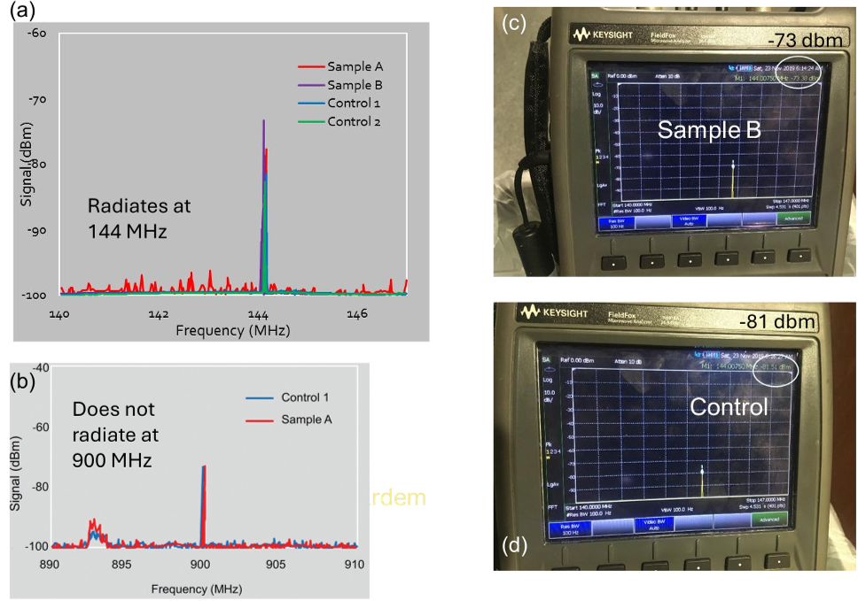
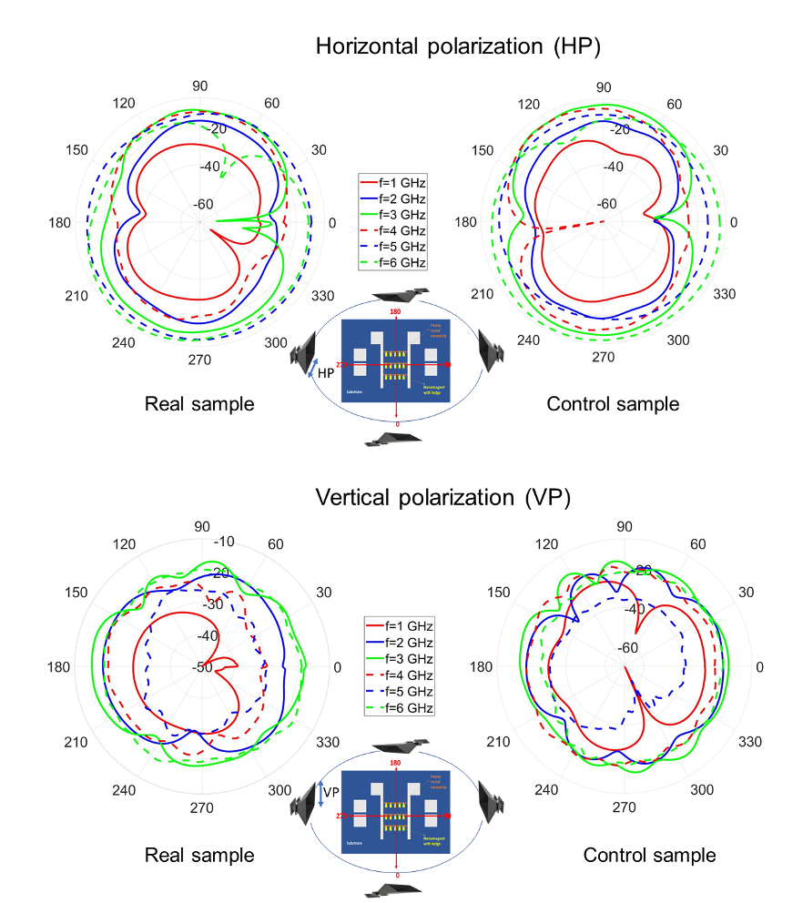

What if your phone’s antenna could be smaller than the wavelength it uses to send signals? Traditional antenna design has long been bound by classical physics, which dictates that shrinking antennas below a certain size drastically reduces their efficiency. But recent advances in quantum-enabled spintronic antennas are challenging this fundamental limit, promising ultra-compact antennas that not only radiate efficiently but can also steer beams individually—capabilities previously thought impossible without large antenna arrays.

> **TL;DR**
> - Quantum-enabled spintronic antennas use nanoscale magnetic elements coupled with acoustic waves to radiate electromagnetic signals efficiently, even when much smaller than the signal wavelength.
> - These antennas can achieve beam steering with a single tiny element and offer potential for secure, stealthy wireless communication in embedded and medical devices.

*Note: this summary is based on a preprint — research shared ahead of formal peer review.*

For decades, antenna miniaturization has been constrained by what’s known as the Harrington limit, a classical physics rule stating that antennas much smaller than the wavelength of the signals they emit become extremely inefficient. This happens because classical antennas rely on fluctuating electric dipoles, which simply cannot form effectively in sub-wavelength structures. Attempts to overcome this limit have included magneto-elastic antennas, which use magnetostrictive materials coupled with acoustic waves to generate electromagnetic radiation. However, bulk magnet-based designs suffered from energy losses that limited their efficiency gains.

The breakthrough came by replacing bulk magnets with two-dimensional arrays of nanoscale magnets—nanomagnets—deposited on piezoelectric substrates. When a surface acoustic wave (SAW) propagates through the piezoelectric material, it induces periodic strain that causes the magnetization in these nanomagnets to precess via the inverse magnetostriction effect. This magnetization oscillation radiates electromagnetic waves. By carefully engineering the size, shape, and arrangement of the nanomagnets, researchers created artificial multiferroic magnonic crystals that support hybrid phonon-magnon-photon coupling. This tripartite interaction enables efficient energy transfer from acoustic waves to spin waves and then to electromagnetic radiation, dramatically improving radiation efficiency even at sub-wavelength scales.

Experiments demonstrated that nanomagnet arrays could radiate electromagnetic waves at frequencies like 144 MHz with efficiencies exceeding classical limits by over five orders of magnitude. Notably, radiation was detectable at lower frequencies but diminished at higher frequencies (e.g., 900 MHz), likely due to limitations in magnetization dynamics at rapid strain variations. Further studies revealed that at certain resonant frequencies—determined by the intrinsic hybrid modes of the nanomagnet arrays—radiation efficiency peaked significantly, reaching gigahertz frequencies where beam steering with a single antenna element became feasible. These resonances arise from the efficient coupling between phonons, magnons, and photons, enabling new antenna functionalities.

This quantum-enabled approach to antenna design breaks a fundamental barrier in wireless communication technology. It paves the way for ultra-miniaturized antennas suitable for embedded applications like medical implants, RFID, and secure communication devices where size, efficiency, and stealth are critical. The ability to steer beams with a single tiny antenna element could simplify antenna arrays and reduce device complexity. Additionally, the piezoelectric substrate’s dual role in energy harvesting hints at self-powered wireless implants, potentially eliminating battery replacement surgeries. Overall, these advances could revolutionize how wireless signals are transmitted and controlled in compact environments.

While the results are promising, much of the work remains at an early experimental and theoretical stage. The quantum and spintronic mechanisms involved are complex and require further validation and optimization before practical deployment. Efficiency at higher frequencies still faces challenges, and scaling these technologies for mass production will demand advances in nanofabrication and materials engineering. Nonetheless, the foundational physics demonstrated here offers a compelling new direction for antenna technology beyond classical constraints.

## Figures

*Radiation spectra show nanomagnets emit more at 144 MHz than controls, but no clear difference at 900 MHz, indicating weaker radiation at higher frequency. — Figure from Supriyo Bandyopadhyay, [CC BY 4.0](http://creativecommons.org/licenses/by/4.0/), caption edited.*

*Radiation patterns of nanomagnets at various frequencies show differences between real and control samples in horizontal and vertical polarizations. — Figure from Supriyo Bandyopadhyay, [CC BY 4.0](http://creativecommons.org/licenses/by/4.0/), caption edited.*

## Sources

- [Quantum-Enabled Spintronic \"Small\" Antennas](https://arxiv.org/abs/2607.18469)
- DOI: [10.48550/arxiv.2607.18469](https://doi.org/10.48550/arxiv.2607.18469)

*This article reuses and adapts text and figures from the original research by Supriyo Bandyopadhyay, available via arXiv Quantum Physics, under the [CC BY 4.0](http://creativecommons.org/licenses/by/4.0/) license.*
