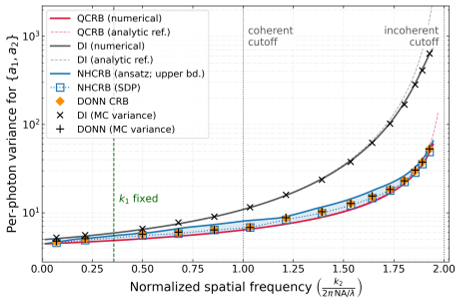
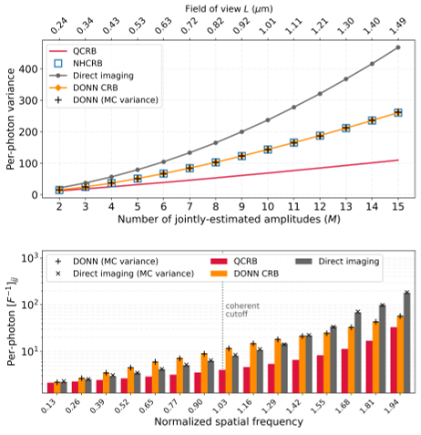
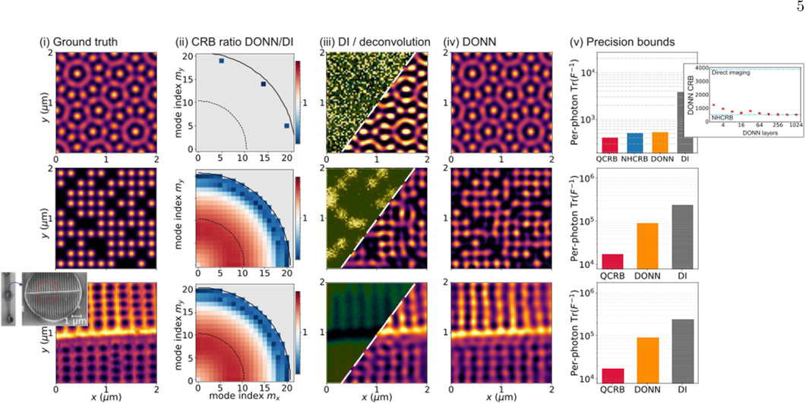

Imagine a camera that doesn’t just capture light but harnesses the subtle rules of quantum physics to see details no traditional camera can. Now, imagine this camera uses a kind of neural network — not made of silicon chips, but built from layers of carefully shaped lenses and optical elements — to decode the faintest features of an object with unprecedented precision. This is the promise of a new imaging method that pushes the boundaries of what’s possible, reaching the ultimate quantum limits of resolution and precision.

> **TL;DR**
> - The researchers formulated general imaging as a quantum multiparameter estimation problem, identifying fundamental precision limits dictated by quantum mechanics.
> - They designed and trained diffractive optical neural networks (DONNs) that perform measurements saturating these quantum limits, enabling superresolution image reconstructions beyond classical methods.

*Note: this summary is based on a preprint — research shared ahead of formal peer review.*

Traditional optical imaging is limited by diffraction — a fundamental blurring effect caused by the wave nature of light — and by shot noise arising from the quantum nature of photons. These limitations restrict how finely we can resolve details, whether in microscopy or telescopy. While quantum physics sets ultimate bounds on measurement precision, realizing these limits in practice is challenging, especially when estimating many parameters simultaneously, as in imaging complex objects. Previous advances have demonstrated quantum-enhanced estimation for simple cases like measuring the distance between two point sources, but extending this to full images remained an open problem.

The authors approached imaging as estimating the amplitudes of spatial-frequency components that describe an object’s intensity pattern within a limited bandwidth. They modeled the collected light as a quantum state encoding these amplitudes and computed the best achievable precision limits for single-photon measurements using advanced mathematical tools called semidefinite programs. To physically realize measurements that reach these limits, they designed diffractive optical neural networks — stacks of phase-modulating optical layers interleaved with Fourier transforms — that transform incoming light before photon counting. By training these DONNs directly to maximize the information extracted about the spatial frequencies, the network learns an optimal measurement basis without requiring separate mode sorting steps.

The study showed that their DONN-based measurement saturates the Nagaoka-Hayashi Cramér-Rao bound, the tightest known precision limit for single-copy quantum measurements, across a range of imaging scenarios. In simple cases estimating one or two spatial frequencies, the DONN matched the ultimate quantum precision, outperforming direct imaging by requiring fewer photons for the same accuracy. When estimating many spatial frequencies simultaneously, the DONN continued to reach the quantum limit, whereas classical direct imaging fell short. The authors demonstrated these advantages with simulations reconstructing complex two-dimensional objects, including a biological sample with features near the diffraction limit, where the DONN recovered fine details that direct imaging blurred out.

This work opens a scalable pathway to quantum-limited superresolution imaging using practical, passive optical devices combined with photon counting. By integrating quantum estimation theory with diffractive optical neural networks, it offers a new paradigm for designing imaging systems that extract maximal information from light. Such technology could significantly enhance high-resolution microscopy, telescopy, and remote sensing, enabling clearer views of microscopic structures or distant celestial objects beyond classical constraints.

It is important to note that these results are theoretical and based on numerical simulations. The proposed diffractive optical neural networks have not yet been experimentally realized or tested in real-world imaging systems. Practical challenges such as fabrication imperfections, photon losses, and noise sources beyond ideal photon counting may affect performance. Further experimental work is needed to validate and refine these concepts before they can be deployed in practical imaging applications.

## Figures

*Graph shows how measuring two wave amplitudes varies with frequency, with models matching precision limits and a 10-layer DONN achieving optimal accuracy. — Figure from Aakash Warke et al., [CC BY 4.0](http://creativecommons.org/licenses/by/4.0/), caption edited.*

*Figure shows how a deep neural network improves precision in estimating multiple signal amplitudes, especially at higher frequencies, outperforming traditional methods. — Figure from Aakash Warke et al., [CC BY 4.0](http://creativecommons.org/licenses/by/4.0/), caption edited.*

*Images show detailed reconstructions of tiny 2D objects, highlighting how DONN improves clarity and precision over traditional methods. — Figure from Aakash Warke et al., [CC BY 4.0](http://creativecommons.org/licenses/by/4.0/), caption edited.*

## Sources

- [Quantum-limited imaging using diffractive optical neural networks](https://arxiv.org/abs/2608.12300)
- DOI: [10.48550/arxiv.2608.12300](https://doi.org/10.48550/arxiv.2608.12300)

*This article reuses and adapts text and figures from the original research by Aakash Warke et al., available via arXiv Quantum Physics, under the [CC BY 4.0](http://creativecommons.org/licenses/by/4.0/) license.*
