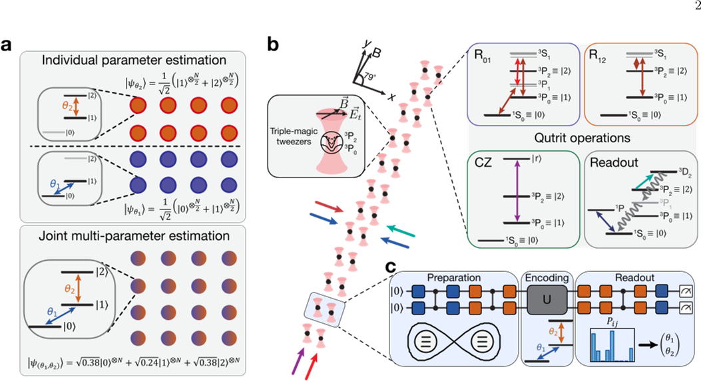
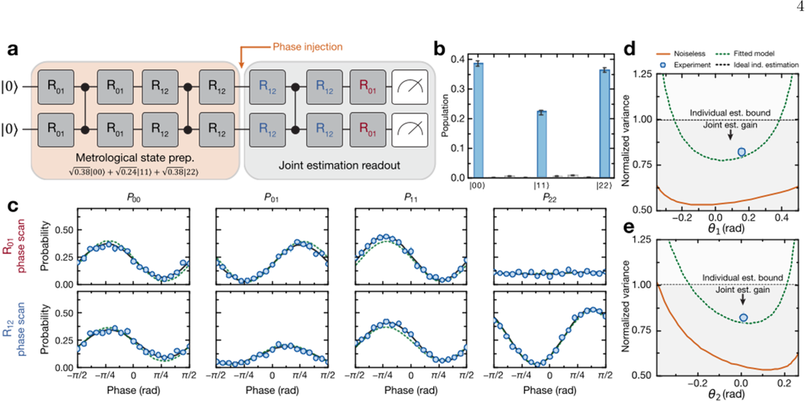

Atomic clocks are the gold standard for measuring time with extraordinary precision, underpinning technologies from GPS navigation to tests of fundamental physics. Now, scientists have taken a significant step forward by entangling three-level quantum systems—called qutrits—in an optical clock platform. This advance enables simultaneous measurement of multiple parameters with greater accuracy than ever before, pushing the boundaries of quantum-enhanced timekeeping.

> **TL;DR**
> - The team experimentally generated genuine entanglement between pairs of three-level quantum systems (qutrits) encoded in strontium atoms trapped by optical tweezers.
> - Using this high-dimensional entanglement, they jointly estimated two optical clock transition phases simultaneously with precision surpassing the ideal limit achievable by separate two-level qubit measurements.

*Note: this summary is based on a preprint — research shared ahead of formal peer review.*

Quantum metrology exploits the strange correlations of entanglement to improve measurement precision beyond classical limits. Traditionally, these protocols have used qubits—quantum bits with two energy levels—to estimate a single parameter at a time. However, atoms naturally possess multiple internal energy levels, and encoding quantum information in these higher-dimensional systems, or 'qudits,' opens new possibilities. In particular, qutrits, which have three levels, can enable the simultaneous estimation of multiple parameters within a single quantum probe, a capability with promising applications in atomic clocks and precision sensing. Until now, generating genuine multi-level entanglement and using it for joint multi-parameter estimation in neutral-atom optical clocks had remained an experimental challenge.

The researchers used neutral strontium-88 atoms trapped in specially engineered optical tweezers that satisfy 'triple-magic' trapping conditions, preserving coherence among three key energy levels: the ground state and two fine-structure clock states. They implemented precise quantum control using Raman and multi-photon transitions to perform arbitrary rotations between these levels, enabling full qutrit manipulation. A controlled-Z entangling gate was realized via excitation to a Rydberg state, producing maximally entangled two-qutrit states with high fidelity (around 85%). State-resolved detection protocols allowed them to measure populations in all three levels with minimal loss. Building on this control, they designed and implemented an optimal probe state and a noise-robust readout circuit to jointly estimate two injected phase parameters corresponding to the two optical clock transitions.

The experiment successfully generated genuine two-qutrit entanglement, verified through population measurements and parity oscillations, certifying high-dimensional entanglement beyond qubit capabilities. Using the entangled qutrit pairs, the team performed joint estimation of two phases simultaneously and observed a combined variance in the estimates lower than the theoretical limit achievable by perfect individual qubit-based measurements. This result demonstrates a clear quantum advantage in multi-parameter sensing. The researchers also modeled the effects of experimental imperfections and showed that the advantage should persist even as the system scales to larger atom numbers under realistic noise conditions.

This work represents the first experimental demonstration of genuine qutrit entanglement and joint multi-parameter estimation in an optical clock platform, marking a milestone in quantum metrology. By moving beyond two-level qubit systems to multi-level qutrits, the study opens new avenues for enhancing the precision and robustness of atomic clocks, which are critical for navigation, communication, and fundamental tests of physics. Moreover, the techniques developed here lay foundational building blocks for quantum information processing with high-dimensional states encoded in neutral atoms, with potential implications for quantum computing and error correction.

While the results are promising, the current demonstration is limited to pairs of qutrits and joint estimation of two commuting parameters with zero dark time (no free evolution period). Coherence times are constrained by technical factors such as polarization gradients in the optical traps, which induce differential light shifts. Extending these methods to larger atomic arrays, longer sensing durations, and non-commuting parameter estimation will require further improvements in control fidelity and trap uniformity. Additionally, the demonstrated quantum advantage, though clear, does not yet reach the ultimate theoretical bound due to experimental imperfections. Future work will need to address these challenges to fully realize the potential of multi-level quantum metrology in practical atomic clocks.

## Figures

*We use special three-level atoms entangled in pairs to measure two parameters at once with high precision in an optical clock setup. — Figure from Ohad Lib et al., [CC BY 4.0](http://creativecommons.org/licenses/by/4.0/), caption edited.*

*A quantum circuit estimates two phases simultaneously, showing improved accuracy and matching theoretical models despite noise and decoherence. — Figure from Ohad Lib et al., [CC BY 4.0](http://creativecommons.org/licenses/by/4.0/), caption edited.*

## Sources

- [Qutrit entanglement and joint multi-parameter estimation in an optical clock platform](https://arxiv.org/abs/2608.05426)
- DOI: [10.48550/arxiv.2608.05426](https://doi.org/10.48550/arxiv.2608.05426)

*This article reuses and adapts text and figures from the original research by Ohad Lib et al., available via arXiv Quantum Physics, under the [CC BY 4.0](http://creativecommons.org/licenses/by/4.0/) license.*
