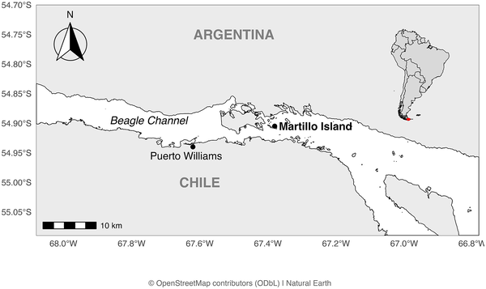
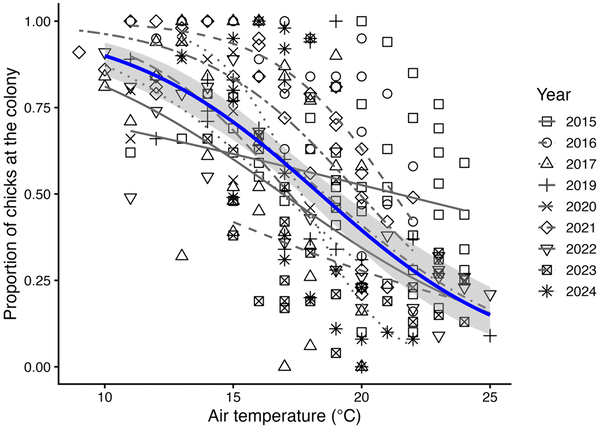
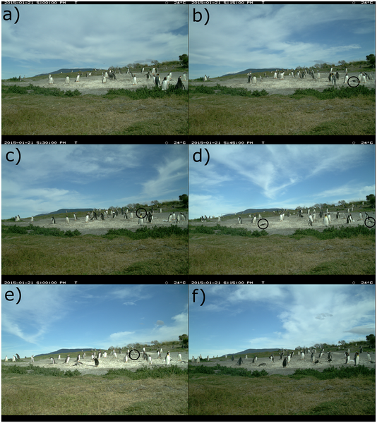
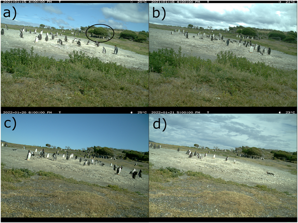

Heat waves are generally bad news for wildlife, especially for cold-adapted species like penguins. But a new long-term study from Martillo Island in Argentina reveals a surprising twist: Gentoo penguins are changing the timing of their breeding to dodge the worst of the heat. By starting their breeding season earlier each year, these penguins reduce the time their vulnerable chicks spend exposed to potentially lethal high temperatures. This rare example of a climate change ‘win’ offers valuable insight into how animals might adapt their behavior to survive in a warming world.

> **TL;DR**
> - Gentoo penguins at Martillo Island are advancing their breeding season by about two days per year.
> - This shift reduces the exposure of chicks to dangerous heat waves, lowering heat-related mortality risks.

Climate change is reshaping ecosystems worldwide, often with harmful effects on wildlife. Species adapted to cold environments, such as penguins, face particular challenges as rising temperatures and more frequent heat waves push them beyond their tolerance limits. At the northern edge of their distribution, Gentoo penguins experience these stresses acutely. Understanding how they respond to heat events is crucial for predicting their future survival. While many species struggle to cope, some can adjust the timing of key life events—like breeding—to better match changing conditions. This study explores how Gentoo penguins at Martillo Island are doing just that.

Researchers monitored a colony of Gentoo penguins on Martillo Island, Argentina, from 2013 to 2024 using a time-lapse camera positioned to capture the entire colony. The camera took hourly photos during daylight hours throughout the breeding season, allowing scientists to track nest activity, chick presence, and behavior over 11 years. Temperature data were extracted from the images and validated against nearby weather stations. The team recorded breeding phenology, chick survival, and behavioral responses to heat, including panting and seeking shade. They analyzed trends in breeding timing and correlated these with exposure to high temperatures (≥20°C), focusing on the vulnerable post-guard chick stage.

The study documented a severe heat event in January 2015, when temperatures reached 24°C, resulting in the rapid death of five chicks within 45 minutes. Following this, researchers observed a behavioral shift: chicks increasingly left the colony area during hot periods, often resting in shaded bushes to avoid overheating. Over the 11 years, the penguins advanced their breeding season by approximately two days per year, causing the post-guard period—when chicks are most vulnerable—to end earlier. This shift significantly reduced the number of days and hours chicks were exposed to temperatures above 20°C, effectively helping them avoid the deadliest heat waves. The colony also grew steadily during this time, indicating that this phenological change did not negatively impact overall breeding success.

This work highlights a rare example where climate change triggers a behavioral adaptation that benefits a species rather than harms it. By advancing their breeding schedule, Gentoo penguins at Martillo Island are mitigating the risk of heat-related chick mortality, a critical insight for conservation strategies. Such phenological shifts may be a key mechanism by which some species survive in rapidly changing environments. Understanding these adaptations improves ecological forecasting and informs efforts to protect vulnerable populations at the edges of their ranges, where climate impacts are often most severe.

While the observed shift in breeding timing currently helps reduce heat exposure, future climate scenarios predict more frequent and intense heat waves that could exceed the penguins’ capacity to adapt. The study is based on a single colony at the northern edge of the Gentoo penguin’s range, so results may not generalize across all populations. Additionally, the exact physiological mechanisms behind heat avoidance and the long-term impacts on penguin health and reproduction require further research. Continued monitoring will be essential to assess how these penguins cope as climate change progresses.

## Figures

*Map showing Martillo Island in Argentina's Beagle Channel and nearby Puerto Williams in Chile, with a zoomed-out view of the region.*

*Shows how the share of chicks at the colony changes with temperature above 18°C, tracked yearly with a trend line and confidence range.*

*Time-lapse photos show the gradual death of chicks on Jan 21, 2015, with five dead by 6 PM and all chicks panting in 24°C heat.*

*Time-lapse photos show chicks resting under bushes on hot days (≥20°C) during 2021 and 2022 seasons.*

## Sources

- [Rare upside of climate-induced phenological changes: Gentoo penguins (Pygoscelis papua) avoid heat events at Martillo Isl., Tierra del Fuego, Argentina](https://journals.plos.org/plosone/article?id=10.1371/journal.pone.0347877)
- DOI: [10.1371/journal.pone.0347877](https://doi.org/10.1371/journal.pone.0347877)
