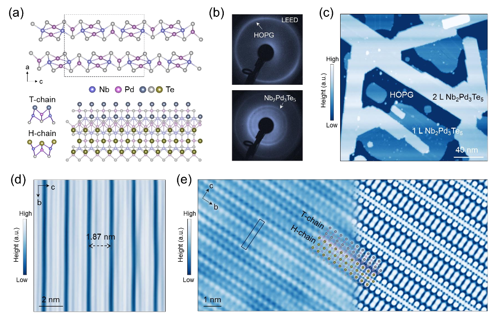
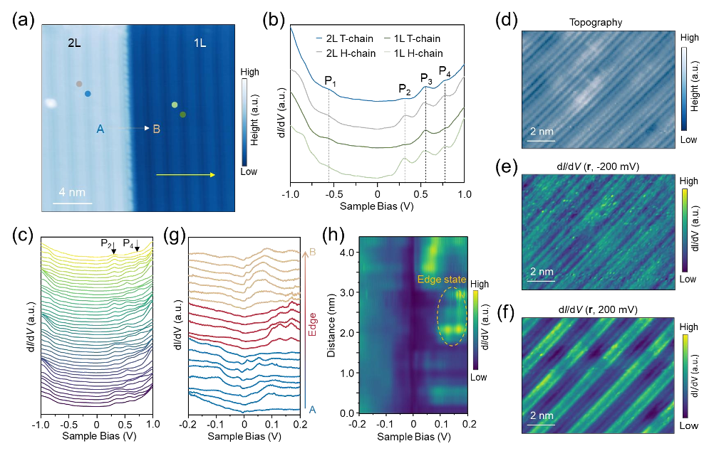
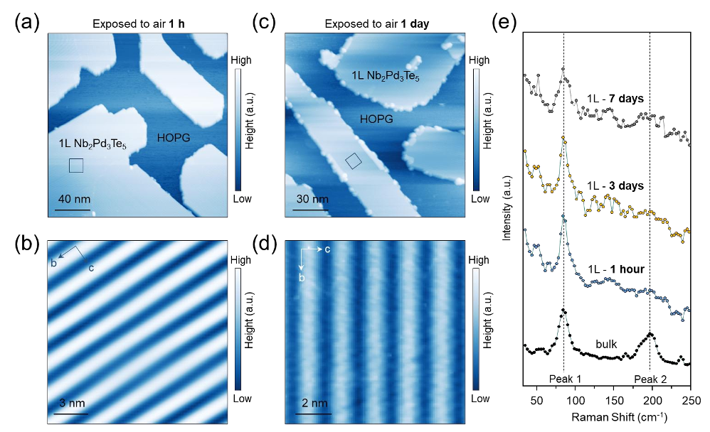

Superconductors—materials that conduct electricity without resistance—have fascinated scientists for decades. When these materials are thinned down to just a few atomic layers, they often reveal surprising new behaviors. Recently, a team of researchers created a novel two-dimensional superconductor, Nb2Pd3Te5, that not only remains stable when exposed to air but also shows an unusual pattern where the electron pairs responsible for superconductivity arrange themselves in quasi-one-dimensional waves. This discovery offers a fresh platform to explore exotic quantum phenomena and could inspire new superconducting technologies.

> **TL;DR**
> - Atomically thin Nb2Pd3Te5 was synthesized as a two-dimensional superconductor that remains stable in air.
> - The superconducting state exhibits a rare quasi-one-dimensional modulation in the density of electron pairs, linked to the material’s unique crystal structure.

*Note: this summary is based on a preprint — research shared ahead of formal peer review.*

Two-dimensional superconductors are promising materials for studying quantum physics because their reduced thickness enhances effects that are hidden in bulk materials. Many 2D superconductors, however, are sensitive to air and degrade quickly, limiting practical use. Additionally, introducing one-dimensional structural features into 2D superconductors can create strong directional electronic behaviors, potentially enabling new types of superconducting states and device functionalities. Until now, such quasi-one-dimensional features in atomically thin superconductors have been difficult to realize, especially in materials that remain stable under ambient conditions.

The researchers grew monolayer and bilayer Nb2Pd3Te5 films on highly oriented pyrolytic graphite substrates using van-der-Waals epitaxy, a method that allows precise control over atomic layering. They characterized the crystal structure and electronic properties using ultralow-temperature scanning tunneling microscopy and spectroscopy (STM/STS), which can image surfaces and measure electronic states at temperatures near absolute zero. This approach revealed the material’s quasi-one-dimensional atomic chains and allowed direct observation of superconductivity and its spatial variations at temperatures below 0.6 kelvin.

The Nb2Pd3Te5 films display a distinctive striped pattern corresponding to quasi-one-dimensional chains within the two-dimensional crystal lattice. Electronic measurements showed that the superconducting gap—the energy range where electron pairs form—varies periodically along these chains, indicating a modulation of the superconducting pair density in one dimension. This modulation aligns with the underlying crystal structure’s alternating chain motifs. Remarkably, the superconducting state is robust and uniform across the sample, and the material remains structurally intact after prolonged exposure to air, a rare property for such thin superconductors. The superconducting transition temperature in these thin films is around 0.6 kelvin, lower than in bulk samples, likely due to reduced dimensionality effects.

This work introduces Nb2Pd3Te5 as a new air-stable two-dimensional superconductor with intrinsic quasi-one-dimensional electronic anisotropy and spatially modulated superconductivity. The ability to synthesize atomically thin layers that maintain their properties in air is crucial for integrating these materials into practical devices. The observed pair density modulation enriches the landscape of low-dimensional superconductivity and provides a platform to study anisotropic quantum states. Such materials could underpin future quantum technologies, including anisotropic superconducting circuits and devices that exploit directional superconducting transport.

While the discovery of air-stable 2D Nb2Pd3Te5 with quasi-1D pair density modulation is promising, the superconducting transition temperature is very low (~0.6 K), which limits immediate practical applications. Further research is needed to understand the mechanisms behind the pair density modulation and to explore ways to raise the critical temperature. Additionally, the complex quantum phenomena involved require sophisticated experimental setups, which may slow broader adoption. Nonetheless, this material provides a valuable testbed for fundamental studies and future device engineering.

## Figures

*We grew ultra-thin Nb2Pd3Te5 layers on graphite, revealing unique atomic chains and clear crystal patterns using advanced microscopy. — Figure from Jiayi Wang et al., [CC BY 4.0](http://creativecommons.org/licenses/by/4.0/), caption edited.*

*Microscope images reveal one-dimensional electronic patterns and edge states in Nb2Pd3Te5 layers at very low temperatures. — Figure from Jiayi Wang et al., [CC BY 4.0](http://creativecommons.org/licenses/by/4.0/), caption edited.*

*Monolayer Nb2Pd3Te5 remains clean and stable after 1 hour exposure to normal air, shown by detailed surface imaging. — Figure from Jiayi Wang et al., [CC BY 4.0](http://creativecommons.org/licenses/by/4.0/), caption edited.*

## Sources

- [Realization of Air-Stable Two-Dimensional Superconductor Nb2Pd3Te5 With Quasi-One-Dimensional Pair Density Modulation](https://arxiv.org/abs/2608.25331)
- DOI: [10.1002/adma.74711](https://doi.org/10.1002/adma.74711)

*This article reuses and adapts text and figures from the original research by Jiayi Wang et al., available via Advanced Materials, e74711 (2026), under the [CC BY 4.0](http://creativecommons.org/licenses/by/4.0/) license.*
