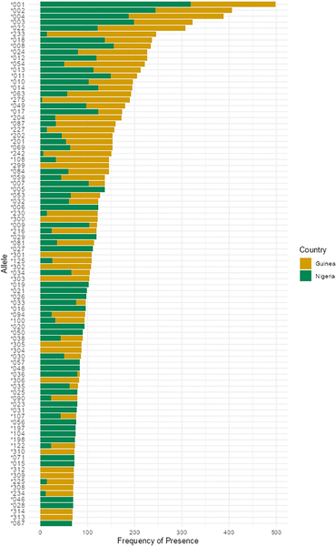
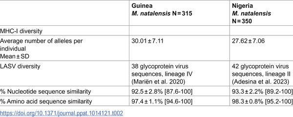
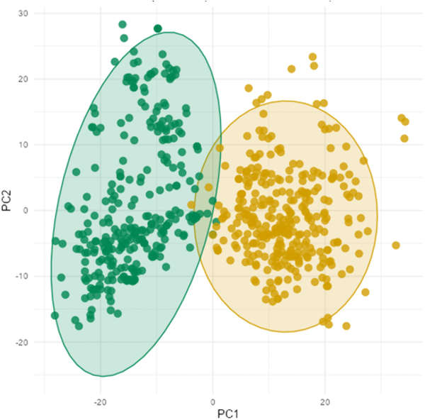

In the forests and villages of West Africa, a tiny rodent known as the Natal multimammate mouse (Mastomys natalensis) quietly carries a deadly passenger: the Lassa virus. This virus causes thousands of human deaths annually, yet the mice themselves often survive infection. How do these rodents manage this feat? Recent research uncovers that their immune systems have evolved in tune with the specific strains of Lassa virus found in their regions, revealing a fascinating genetic arms race and clues that could help us better manage this disease.

> **TL;DR**
> - Mastomys natalensis populations in Guinea and Nigeria show distinct immune gene (MHC-I) profiles shaped by the local Lassa virus lineages they carry.
> - Specific MHC-I alleles are linked to either resistance or susceptibility to Lassa virus infection, but these associations differ between regions, highlighting local adaptation.

Lassa virus is a zoonotic pathogen endemic to West Africa that infects nearly a million people annually and causes thousands of deaths. Its primary natural reservoir is the Natal multimammate mouse, Mastomys natalensis, which is widespread across sub-Saharan Africa. However, the virus itself exists as multiple genetically distinct lineages that are geographically localized. In particular, lineage II predominates in southwestern Nigeria, while lineage IV is found in Guinea. Understanding how the rodent hosts’ immune systems interact with these diverse viral lineages is critical for grasping the evolutionary dynamics of infection and for informing public health strategies.

Researchers collected and analyzed samples from 739 Mastomys natalensis rodents across multiple locations in Guinea and Nigeria, regions endemic for different Lassa virus lineages. They sequenced the Major Histocompatibility Complex Class I (MHC-I) genes, which play a key role in immune recognition of viruses. Infection status was determined using PCR to detect active virus and antibody tests to identify past infections. The team compared the diversity and distribution of MHC-I alleles between the two rodent populations and examined how specific alleles correlated with infection susceptibility or resistance.

The study found that the MHC-I gene profiles of rodents from Guinea and Nigeria were distinct, reflecting adaptation to their local viral environments. Some alleles, such as ManaMHC-I*017, showed opposite associations with infection depending on the region—conferring resistance in Guinea but susceptibility in Nigeria. Another allele, ManaMHC-I*069, was linked to resistance in Guinea but had little effect in Nigeria. Additionally, rodents from Guinea had a higher average number of MHC-I alleles, consistent with the greater genetic diversity of Lassa virus lineage IV there. These patterns suggest that the immune gene repertoire of Mastomys natalensis has evolved in response to the specific Lassa virus strains they encounter.

This research provides a rare, well-characterized example of local genetic adaptation driven by pathogen pressure in a natural reservoir host. By linking rodent immune gene diversity to regional Lassa virus lineages, the findings enhance our understanding of host-pathogen coevolution. Such insights are valuable for improving zoonotic risk mapping and could inform the design of vaccines targeting the virus in its natural reservoir, potentially reducing spillover to humans. Ultimately, this work underscores the importance of considering local ecological and genetic contexts in managing infectious diseases.

While the study robustly associates MHC-I allele variation with infection outcomes, the mechanisms by which specific alleles confer resistance or susceptibility remain to be elucidated. The complex interplay of multiple immune genes and environmental factors also influences infection dynamics. Furthermore, the research focused on two regions and two virus lineages, so additional studies across other areas and lineages would be needed to generalize these findings. Lastly, translating rodent immunogenetic insights into human disease control strategies will require further interdisciplinary work.

## Figures

*Common MHC-I gene types in M. natalensis mice from Guinea (yellow) and Nigeria (green) with over 10% frequency.*

*Comparison of LASV virus diversity and immune gene variety between Guinea and Nigeria.*

*Analysis shows genetic differences in immune genes of M. natalensis mice from Nigeria and Guinea, linked to different LASV virus types.*

## Sources

- [Regional Lassa virus lineages select for divergent MHC-I repertoires in Mastomys natalensis rodents](https://journals.plos.org/plospathogens/article?id=10.1371/journal.ppat.1014121)
- DOI: [10.1371/journal.ppat.1014121](https://doi.org/10.1371/journal.ppat.1014121)
