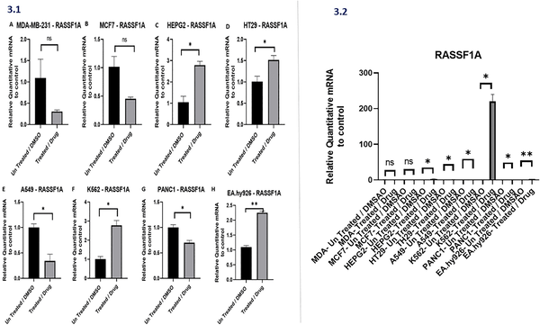

What if a common anti-parasitic medication could help fight aggressive cancers? Recent research is shedding light on how mebendazole, a drug traditionally used to treat parasitic worm infections, might be repurposed to disrupt cancer progression by targeting multiple gene networks involved in tumor growth and invasion. This approach could open doors to affordable and effective cancer treatments across a variety of tumor types.

> **TL;DR**
> - Mebendazole modulates critical cancer-related genes, suppressing oncogenes like ENOX2 and MMP2 while activating tumor suppressors such as RASSF1A and WFDC10A in diverse cancer cell lines.
> - These gene expression changes suggest mebendazole’s potential to reduce cancer invasiveness and metastasis, highlighting its promise as a low-cost, multi-targeted anticancer agent.

Cancer progression is a complex process involving a delicate balance between oncogenes that promote tumor growth and tumor suppressor genes that inhibit it. Two proteins, ENOX2 and MMP2, are known to drive cancer invasion and metastasis by promoting cell proliferation and breaking down the extracellular matrix, respectively. Meanwhile, tumor suppressors like RASSF1A, WFDC10A, and METTL7A play crucial roles in regulating cell cycle, apoptosis, and immune responses. Understanding how these genes interact and can be modulated offers a promising avenue for cancer therapy. Mebendazole, an established anti-parasitic drug, has shown anticancer effects in previous studies, but its influence on these specific gene networks across multiple cancer types had not been fully explored until now.

Researchers studied eight human cell lines representing a range of cancers—including breast, colorectal, pancreatic, lung, liver, and leukemia—as well as endothelial cells as a non-cancer control. Using quantitative real-time PCR and Western blotting, they measured baseline gene and protein expression levels of ENOX2, MMP2, RASSF1A, WFDC10A, and METTL7A. They then treated these cells with a low concentration of mebendazole (0.7 µM) and assessed changes in gene expression. This in vitro approach allowed the team to observe how mebendazole affected oncogenic and tumor suppressor pathways in different cellular contexts.

The study revealed that aggressive cancer cells, such as triple-negative breast cancer (MDA-MB-231) and pancreatic cancer (PANC1), exhibited high baseline levels of ENOX2 and MMP2, proteins associated with tumor invasiveness. Upon treatment with mebendazole, ENOX2 expression significantly decreased in liver cancer (HEPG2) and leukemia (K562) cells, while MMP2 levels dropped in breast cancer lines (MDA-MB-231 and MCF7). Concurrently, tumor suppressor genes responded differently depending on the cell type: RASSF1A expression surged over 200-fold in endothelial cells and increased in liver and colorectal cancer cells; WFDC10A was strongly induced in aggressive breast cancer cells; and METTL7A showed variable regulation, with notable enrichment in endothelial cells. These results suggest that mebendazole can selectively reprogram cancer-related gene networks, potentially impairing tumor growth and spread.

This research highlights mebendazole’s ability to simultaneously target multiple molecular pathways that drive cancer progression, emphasizing its potential as a cost-effective anticancer therapy. By downregulating oncogenes linked to invasion and metastasis and upregulating tumor suppressors, mebendazole may help reprogram cancer cells toward less aggressive behavior. Moreover, the study underscores the value of developing multi-gene biomarkers to improve diagnosis and tailor treatment strategies for aggressive malignancies. Given mebendazole’s established safety profile and affordability, these findings could accelerate its clinical evaluation as a repurposed cancer drug, especially in resource-limited settings.

While the findings are promising, it’s important to note that this study was conducted entirely in cell culture models. The complex interactions within living organisms, including immune responses and drug metabolism, were not addressed here. Therefore, further research involving animal models and clinical trials is necessary to confirm mebendazole’s efficacy and safety as a cancer treatment. Additionally, the gene expression changes observed varied by cancer type, indicating that mebendazole’s effects may not be uniform across all tumors. As with any repurposed drug, understanding optimal dosing, potential side effects, and combination strategies will be crucial before clinical application.

## Figures

*Drug treatments change RASSF1A gene activity in various cancer cell types compared to untreated cells, showing significant differences in some cases.*

## Sources

- [Repurposing mebendazole to reprogram oncogenic and tumor-suppressor networks: Multi-cancer insights from ENOX2, MMP2, RASSF1A, WFDC10A and METTL7A](https://journals.plos.org/plosone/article?id=10.1371/journal.pone.0345701)
- DOI: [10.1371/journal.pone.0345701](https://doi.org/10.1371/journal.pone.0345701)
