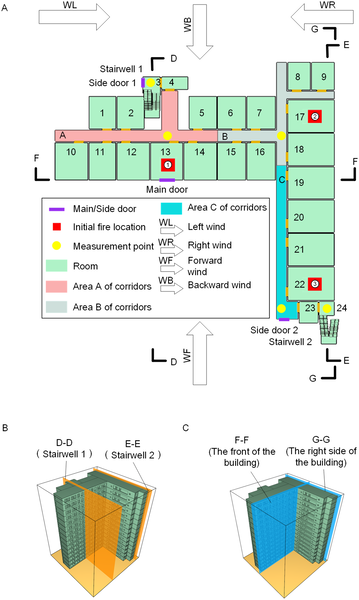

Have you ever wondered how smoke twists and spreads through the complex corners of an L-shaped building during a fire? Small changes in where a fire starts or the direction of the wind can dramatically alter escape routes, making evacuation planning a challenging puzzle. Thanks to advanced fire simulation software, researchers are now able to visualize these dynamic fire and smoke behaviors in three dimensions, helping firefighters and rescue teams design smarter, safer evacuation strategies.

> **TL;DR**
> - This study uses Fire Dynamics Simulator (FDS) to model fire and smoke spread in a 15-story L-shaped building, analyzing how fire location, floor height, and wind direction combine to influence evacuation safety.
> - Results show that the building’s shape causes asymmetric smoke diffusion, and even minor changes in conditions can significantly affect escape routes, highlighting the need for real-time, dynamic evacuation planning.

Urban buildings are becoming taller and more complex, with shapes like L-shaped layouts common in modern architecture. These designs create unique airflow patterns that influence how fires and smoke spread indoors and outdoors. Traditional fire simulations often focus on single factors, such as corridor layout or fire location, but they rarely consider how multiple variables interact simultaneously. This gap makes it difficult to predict fire behavior accurately and to plan effective evacuations, especially in three-dimensional spaces where smoke movement can be unpredictable.

To tackle this challenge, researchers constructed a detailed fire simulation model of a 15-story L-shaped building using Fire Dynamics Simulator (FDS), a widely accepted tool developed by the National Institute of Standards and Technology (NIST). They created a database of fire scenarios by varying key parameters: the initial fire location (near stairwells or building corners), the floor where the fire starts (low, middle, or high floors), and the direction of wind outside the building. The model included realistic building features, such as room layouts, stairwells, corridors, and window states (closed or open). The simulations tracked critical safety parameters like smoke layer height, temperature, visibility, and carbon monoxide levels at multiple points along escape routes and exterior walls over a 10-minute rescue window.

The simulations revealed that the L-shaped building’s geometry causes smoke to spread unevenly, creating asymmetric diffusion patterns that can trap occupants in certain areas. Fire spread was not determined by any single factor but by the combined effects of fire location, floor height, and wind direction. For example, a fire near a stairwell could block a primary escape route, while wind direction influenced whether smoke was pushed inside or vented outside. Visibility along evacuation routes often dropped below safe levels within minutes, especially when windows broke and allowed smoke to move rapidly. These dynamics mean that small changes in fire or environmental conditions can drastically alter which escape paths remain safe, underscoring the importance of generating real-time, adaptive evacuation routes during emergencies.

This research provides valuable scientific support for designing advanced human-machine collaborative rescue systems that can dynamically guide occupants to safety based on evolving fire conditions. By systematically analyzing multi-factor interactions in a realistic building shape, the study offers a foundation for improving fire risk assessments and emergency response planning. The findings highlight the critical need for integrating real-time fire data and dynamic pathfinding into evacuation protocols, potentially increasing rescue success rates and saving lives in complex building environments.

While the study uses validated simulation methods and experimental data, it focuses specifically on a typical 15-story L-shaped building and certain fire scenarios, which may limit generalizability to other building types or fire conditions. The simulations assume fixed fire heat release rates and standardized material properties, which might differ in real fires. Additionally, actual human behavior during evacuations can be unpredictable and was not directly modeled. Future work could extend these models to other building geometries, incorporate variable fire growth, and integrate occupant movement dynamics for more comprehensive emergency planning.

## Figures

*Diagram showing the layout and sections of an L-shaped building used in a fire simulation study.*

## Sources

- [Research on fire scenario analysis and emergency response strategies for L-shaped buildings using FDS](https://journals.plos.org/plosone/article?id=10.1371/journal.pone.0346927)
- DOI: [10.1371/journal.pone.0346927](https://doi.org/10.1371/journal.pone.0346927)
