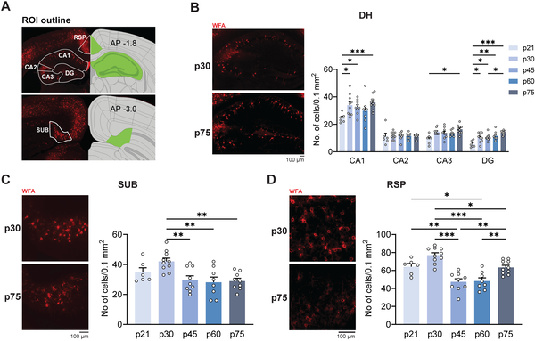
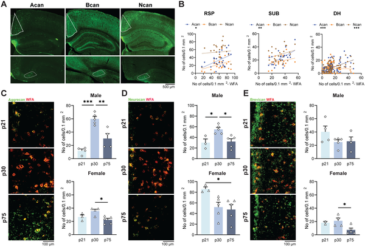

Did you know that your brain’s memory circuits don’t just steadily mature during adolescence, but actually go through a phase of temporary instability? Recent research shows that in late adolescence, key brain regions involved in memory undergo cellular and molecular changes that can cause memory lapses — a finding that challenges the long-held belief that memory circuits are fully mature by early adolescence.

> **TL;DR**
> - During late adolescence, the retrosplenial cortex—a brain area critical for contextual memory—experiences a significant reduction in specialized structures called perineuronal nets (PNNs) and in the activity of certain inhibitory neurons.
> - These changes coincide with temporary impairments in expressing memories formed earlier in adolescence, but memory function recovers later as PNNs rebuild, suggesting a natural, dynamic remodeling process.

Our ability to remember past events relies on complex networks in the brain, including the hippocampus and connected cortical areas like the retrosplenial cortex (RSP). While it’s been thought that these memory circuits mature by early adolescence, mounting evidence points to ongoing brain changes throughout adolescence. The RSP is particularly important because it helps integrate and express contextual memories—those memories tied to the environment or situation in which something happened. Understanding how the RSP develops during adolescence could reveal why teenagers sometimes experience memory instability and why this period is also vulnerable to mental health challenges.

In this study, researchers examined mice at different adolescent stages, focusing on the RSP and its connections to the hippocampus and subiculum. They used molecular labeling techniques to track perineuronal nets (PNNs)—specialized extracellular matrix structures that stabilize neuronal circuits—around parvalbumin (PV) interneurons, which regulate brain activity. They also tested memory by training mice in contextual fear conditioning, a task where mice learn to associate a specific environment with a mild footshock, then measured their freezing behavior as an indicator of memory. Additionally, the team manipulated molecular signals like transforming growth factor beta (Tgfβ2) to explore mechanisms controlling PNN levels.

The researchers found that while PNN densities in the hippocampus steadily increased during adolescence, the RSP and subiculum showed a surprising decrease in PNN density and PV interneuron expression during late adolescence (around postnatal days 60-75 in mice). This loss of PNNs was accompanied by impaired expression of contextual memories formed earlier in adolescence. Importantly, stabilizing PNNs pharmacologically alleviated these memory deficits, and memory performance naturally recovered as PNNs rebuilt later in adulthood. Molecular analyses revealed decreases in key PNN components, such as aggrecan and neurocan, and reduced Tgfβ expression in the RSP. Infusing Tgfβ2 into the RSP counteracted PNN loss, implicating Tgfβ signaling in PNN maintenance during this period.

These findings reveal a previously unappreciated phase of dynamic remodeling in the adolescent brain’s memory circuits, specifically in the retrosplenial cortex. Rather than a simple linear maturation, memory circuits undergo a transient period of instability linked to changes in extracellular matrix structures and inhibitory neurons. This natural remodeling may underlie the memory lapses sometimes observed in teenagers and could contribute to the heightened vulnerability to mental health disorders that often emerge during late adolescence. Understanding these processes opens new avenues for exploring how adolescent brain development shapes cognition and emotional health.

While this study provides compelling evidence of late adolescent remodeling in mice, translating these findings directly to human brain development requires caution. The exact timing and impact of PNN changes in humans remain to be established. Additionally, the study focuses on specific molecular and cellular mechanisms in one brain region, and memory involves widespread networks. Further research is needed to explore how these dynamics interact with genetic and environmental factors, and how they might influence individual differences in adolescent cognitive and emotional outcomes.

## Figures

*PNN levels change differently in brain areas during adolescence, increasing in DH but decreasing in SUB and RSP regions.*

*Levels of brain proteins aggrecan and neurocan change during adolescence, decreasing notably in specific brain regions for both males and females.*

## Sources

- [Retrosplenial cortical reorganization during late adolescence introduces instability of contextual memory circuits](https://journals.plos.org/plosbiology/article?id=10.1371/journal.pbio.3003908)
- DOI: [10.1371/journal.pbio.3003908](https://doi.org/10.1371/journal.pbio.3003908)
