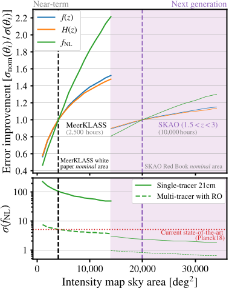
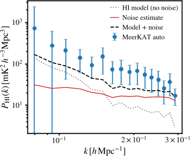
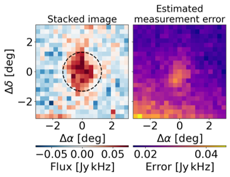
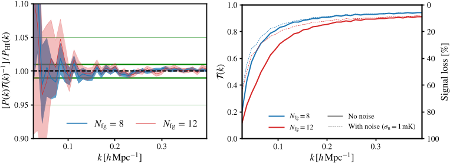

Astronomers are always striving to chart the cosmic web—the intricate network of matter spread across the universe. Now, a powerful new approach, 21cm intensity mapping, is opening fresh eyes on our vast cosmos, and the MeerKLASS survey with the MeerKAT telescope is at the forefront.

> **TL;DR:**
>  * MeerKLASS is successfully mapping large-scale cosmic structure using 21cm radio waves.
>  * Robust methods now reliably extract cosmological signals from challenging, noisy data.

*Fig. 8 shows how changing sky area impacts measurement accuracy for fNL in a fixed observing time, with error sizes in the bottom panel.*

Traditional galaxy surveys painstakingly catalog each luminous dot—galaxies—across the sky. But what if we could scan the cosmos not for individual galaxies, but for the faint hum of neutral hydrogen gas (HI) that traces the distribution of dark matter itself? That’s the promise of 21cm intensity mapping. Instead of cataloging galaxies one by one, astronomers measure the integrated emission at the 21cm wavelength, produced by HI gas, across huge swaths of the sky. This method has the potential to map matter fluctuations throughout cosmic history, painting a much more efficient picture of structure on immense scales.

Until very recently, these ambitious maps were little more than proof-of-concept efforts, using limited time on single-dish telescopes, like the Green Bank and Parkes. The MeerKAT array in South Africa, however, is changing the game. Designed as a precursor to the mighty Square Kilometre Array (SKAO), its 64 dishes can work in an unusual mode: each operating as an individual radio telescope ("single-dish" or auto-correlation mode) to capture the vast, diffuse 21cm glow. This is not what the array was originally meant for, so getting unbiased, robust maps required a suite of fresh techniques.

*Fig. 5 shows the Hi auto-power spectrum from MeerKLASS data, with lines for thermal noise, predicted Hi signal, and their combined model.*

The MeerKLASS team tackled daunting challenges: calibrating the raw data, cleaning away powerful foregrounds (like our galaxy’s own radio emission), and handling radio frequency interference from human activity. They deployed innovative statistical methods—like blind component separation and principal component analysis—to peel away these contaminating signals. To keep the cosmological signal intact, they quantified and corrected for any loss incurred during cleaning by simulating how much HI would be removed along with the foregrounds. Another breakthrough involved regridding the sky maps: transforming them from spherical to flat, Cartesian volumes, making the subtle ripples of cosmological structure accessible for powerful Fourier analysis.

With all this in place, MeerKLASS has achieved a major milestone: clear detections of large-scale HI clustering by cross-correlating its intensity maps with galaxy surveys like WiggleZ and GAMA. This is a crucial step—cross-checking two kinds of data boosts confidence the faint cosmological fluctuations are real, not artifacts of noise or instrument quirks.

*Fig. 6 Stacked emission line signal from MeerKLASS Hi maps at GAMA galaxy locations (left) and the 1σ measurement error (right).*

Why does this matter to the rest of us? Understanding the distribution of matter at different cosmic epochs is central to unraveling how the universe evolved—from the primordial Big Bang to the graceful sweep of galaxies seen today. Tools like MeerKLASS and, eventually, the full SKAO, could reveal the fingerprints of dark energy, the mysterious force accelerating cosmic expansion. In principle, precise large-scale 21cm maps might help constrain fundamental physics or provide new tests for cosmological models.

Yet, caveats remain. Separating the cosmological HI signal from overwhelming radio foregrounds is a subtle art, not an exact science—and as maps grow larger, new systematics may loom. The survey is still developing, with much wider coverage and deeper data on the horizon. As the team notes, their analysis tools, now shared publicly, will be key for future progress. Will the next generation of surveys deliver transformative insights, or reveal fresh hurdles?

*Fig. 1 (left) shows the accuracy of cleaned power spectra compared to foreground-free data using two cleaning levels. (right) shows transfer function shapes...*

One thing is clear: with ingenious methodology and a sharp eye for lurking biases, MeerKLASS is bringing us unprecedented views of the universe’s hidden structure—and perhaps, soon, clues to its most enduring mysteries.

## Sources
- [http://arxiv.org/abs/2510.27549v1](http://arxiv.org/abs/2510.27549v1)
- [10.48550/arXiv.2510.27549](https://doi.org/10.48550/arXiv.2510.27549)
