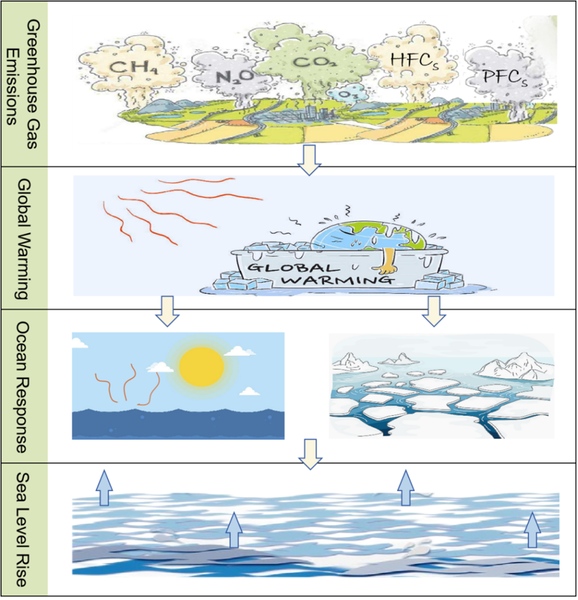
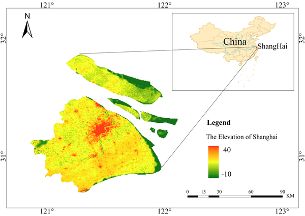

Sea level rise is a defining challenge of our warming planet, threatening coastal communities worldwide. But this rise is not uniform—some regions and cities face far greater risks due to a complex interplay of climate-driven ocean changes and local land movements. Recent research shines a light on these spatial and temporal variations, revealing surprising hotspots along China’s coast and the megacity of Shanghai, where rising tides meet sinking land to intensify flood hazards.

> **TL;DR**
> - Global sea levels are rising due to thermal expansion and melting ice, but regional factors like ocean currents and river discharge cause faster increases in China’s coastal waters.
> - In Shanghai, land subsidence combined with local hydrodynamics exacerbates relative sea level rise, creating distinct patterns of flood risk that require targeted adaptation.

Sea level rise (SLR) is one of the clearest and most impactful consequences of climate change. Since 1900, the global average sea level has risen about 20 centimeters, with the pace accelerating in recent decades. This rise results mainly from two processes: the expansion of seawater as it warms and the melting of glaciers and polar ice sheets. However, the story doesn’t end there. Local factors such as land sinking (subsidence), changing ocean currents, and freshwater inputs from rivers can amplify or moderate sea level changes in specific regions. Understanding these spatial and temporal variations is crucial for protecting vulnerable coastal ecosystems and urban centers, especially in densely populated and low-lying areas like the Yangtze River Delta and Shanghai.

To unravel the complex patterns of sea level rise, researchers combined multiple data sources and statistical methods across three scales: global oceans, China’s coastal waters, and Shanghai municipality. They used sea level projections from the Intergovernmental Panel on Climate Change’s Sixth Assessment Report (IPCC AR6) and NASA’s sea level projection tool, focusing on the intermediate emissions scenario SSP2–4.5. To analyze trends robustly, they applied the Theil-Sen Median Estimator and Mann-Kendall test, which are resistant to outliers and capture long-term changes. Spatial clustering techniques (Getis-Ord Gi*) helped identify hotspots where sea level rise is significantly higher. This multiscale, data-driven approach allowed the team to integrate global climate drivers with regional ocean dynamics and local land subsidence effects, especially in Shanghai, where groundwater extraction and urban development have caused notable land sinking.

The study confirmed a clear, statistically significant upward trend in global sea levels driven by ocean warming and ice melt. However, in China’s coastal waters—particularly the South China Sea and East China Sea—sea levels are rising faster than the global average. This acceleration is linked to monsoon circulation patterns, the Kuroshio Current’s dynamics, and large freshwater discharges from major rivers like the Yangtze and Yellow Rivers. At the urban scale, Shanghai experiences even more pronounced relative sea level rise due to ongoing land subsidence and complex local hydrodynamics. The researchers identified distinct spatial and temporal clusters of elevated sea levels within the city’s coastal zone, highlighting areas at heightened risk of flooding. These findings underscore how global climate processes combine with regional and local factors to create a mosaic of sea level rise impacts.

By providing a detailed, multiscale picture of sea level rise, this research offers valuable insights for climate adaptation planning. Coastal megacities like Shanghai face compounded risks from rising seas and sinking land, which can overwhelm existing flood defenses and infrastructure. Understanding where and when sea levels are rising fastest enables policymakers and urban planners to prioritize investments in targeted infrastructure reinforcement, land-use adjustments, and early warning systems. This evidence-based approach supports anticipatory governance, helping communities prepare for and mitigate the impacts of sea level rise before disasters strike. Moreover, the study’s methodology can be applied to other vulnerable delta cities worldwide, contributing to global efforts to manage climate risks effectively.

While the study integrates robust global and regional climate projections with local data, some limitations remain. The primary datasets used do not fully incorporate localized human activities such as groundwater extraction or urban construction-induced subsidence, which can vary over time and space. Additionally, the resolution of global climate models limits the granularity of projections at city scales. Future research incorporating more detailed local measurements and dynamic modeling of human-induced land changes will further refine risk assessments. Nonetheless, the current findings provide a strong foundation for understanding and addressing the complex drivers of sea level rise in coastal regions.

## Figures

*Figure 1 shows a simple diagram explaining how SLR works.*

*Map showing the location and layout of Shanghai city in China.*

## Sources

- [Rising tides: Unveiling the spatial and temporal evolution of sea level rise under climate change](https://journals.plos.org/plosone/article?id=10.1371/journal.pone.0347855)
- DOI: [10.1371/journal.pone.0347855](https://doi.org/10.1371/journal.pone.0347855)
