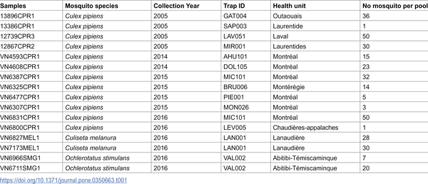
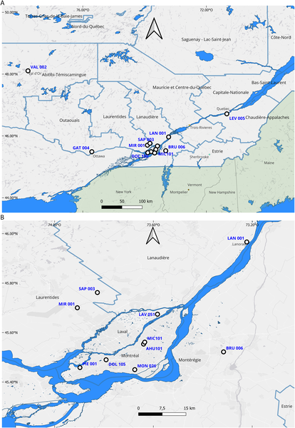
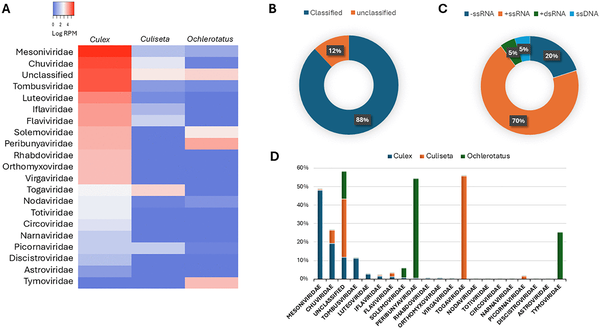

Mosquitoes are often seen as mere nuisances, but these tiny insects harbor a surprisingly complex community of viruses. While much research has focused on mosquitoes in tropical regions, less is known about the viral passengers of mosquitoes living in northern temperate areas like Québec, Canada. Recent advances in genetic sequencing have now opened a window into this hidden world, revealing a rich diversity of viruses—including some never described before—that coexist within local mosquito populations.

> **TL;DR**
> - Researchers used RNA metagenomic sequencing to analyze mosquitoes collected in Québec, identifying 60 viral species, including medically important arboviruses and novel insect-specific viruses.
> - This comprehensive viral profiling provides valuable insights for improving surveillance and understanding of mosquito-borne diseases such as West Nile virus in northern temperate regions.

Mosquitoes are well-known vectors for viruses that cause diseases in humans and animals, such as West Nile virus (WNV) and Eastern equine encephalitis virus (EEEV). However, mosquitoes also carry many insect-specific viruses that do not infect humans but may influence mosquito biology and their ability to transmit pathogens. While tropical mosquito viromes have been studied extensively, northern temperate regions like Québec have remained understudied despite the presence of arboviruses and changing climate conditions that may affect mosquito populations and disease risk. Understanding the full viral community—or virome—within mosquitoes can help public health officials better track and predict outbreaks.

In this study, scientists analyzed 16 pools of archived mosquito samples collected across Québec between 2005 and 2016. These pools included multiple mosquito species known to carry arboviruses, such as Culex pipiens, Culiseta melanura, and Ochlerotatus stimulans. Using metagenomic RNA sequencing, the researchers extracted and sequenced total RNA from mosquito homogenates, enabling an unbiased detection of all RNA viruses present. Advanced bioinformatic tools filtered out mosquito genetic material and identified viral sequences by comparing them to global databases. The team also reconstructed complete viral genomes and performed phylogenetic analyses to understand the relationships between detected viruses and those found worldwide.

The analysis revealed a remarkably diverse viral community comprising 60 distinct viral species, including three known arboviruses—West Nile virus, Eastern equine encephalitis virus, and Snowshoe Hare virus—as well as numerous insect-specific viruses and viruses with dual-host potential. Notably, the researchers discovered a newly proposed bipartite Culex tombus-like virus, expanding the catalog of mosquito-associated viruses. Viral reads constituted a significant portion of the genetic material in Culex pipiens samples, highlighting the richness of their virome. Phylogenetic comparisons showed that many viruses detected in Québec mosquitoes are genetically related to viruses identified in other regions, underscoring global viral connectivity. These findings demonstrate the complexity of mosquito viromes in a northern temperate ecosystem.

This study provides the first comprehensive characterization of mosquito viromes in Québec, filling a critical knowledge gap for northern temperate regions. By uncovering both known and novel viruses, the research enhances our understanding of the viral ecology within mosquito populations that influence disease transmission dynamics. The use of metagenomic sequencing offers a powerful, unbiased approach to surveillance, enabling detection of emerging or previously unrecognized arboviruses. Such information is vital for public health preparedness, especially as climate change may alter mosquito distribution and increase the risk of vector-borne diseases in cooler climates. Ultimately, this work lays the groundwork for improved monitoring and control strategies tailored to northern ecosystems.

While metagenomic sequencing provides broad detection capabilities, it does not directly measure the infectivity or pathogenicity of the viruses identified. The study analyzed a limited number of mosquito pools collected over several years, which may not capture temporal or spatial fluctuations in viral diversity. Additionally, some detected viral sequences remain unclassified or poorly characterized, requiring further investigation to understand their biology and potential impact. Finally, the findings are region-specific to Québec and may not fully represent mosquito viromes in other northern areas. Continued surveillance and functional studies are needed to translate these discoveries into public health action.

## Figures

*Table showing mosquito species studied and where they were caught.*

*Map showing 13 mosquito sampling sites, including detailed locations in the greater Montreal area.*

*This figure shows the variety and amount of viruses found in different mosquito species, including their types and genetic structures.*

## Sources

- [RNA metagenomic profiling of mosquito viromes associated with Vector-Borne diseases in Quebec, Canada](https://journals.plos.org/plosone/article?id=10.1371/journal.pone.0350663)
- DOI: [10.1371/journal.pone.0350663](https://doi.org/10.1371/journal.pone.0350663)
