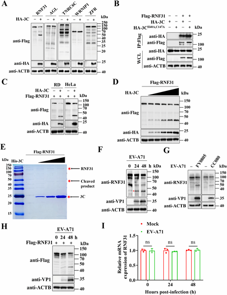
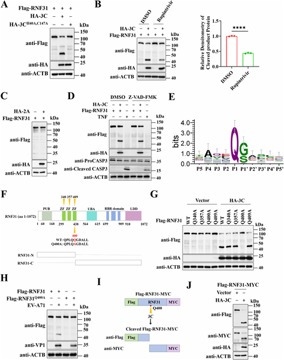
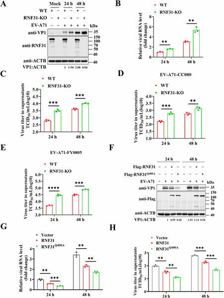
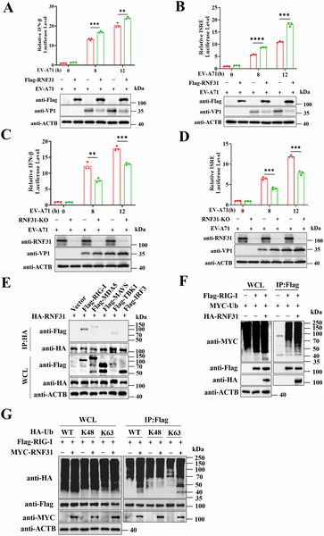

Viruses and their hosts are locked in an ongoing evolutionary battle, each trying to outsmart the other. Enteroviruses, a group of RNA viruses responsible for illnesses like hand, foot, and mouth disease, have evolved clever ways to bypass our immune defenses. But our cells are not defenseless. Recent research has uncovered a host protein, RNF31, that plays a critical dual role in fighting off these viruses. Even more fascinating is how enteroviruses strike back by disabling RNF31 with a specialized viral enzyme. Let’s dive into this molecular arms race and uncover the hidden strategies at play.

> **TL;DR**
> - RNF31 restricts replication of multiple enteroviruses by boosting antiviral immune signaling and directly targeting a viral protein (VP4) for degradation.
> - Enteroviruses evade this defense by using their 3C protease to cleave RNF31, disabling its antiviral functions—a strategy conserved across several enteroviruses.

Enteroviruses, including Enterovirus A71 (EV-A71), are common pathogens that can cause diseases ranging from mild symptoms to severe neurological complications. These viruses enter host cells and hijack their machinery to replicate. The host’s innate immune system, particularly pathways triggered by proteins like RIG-I, usually detects viral invaders and mounts a defense by producing antiviral molecules such as type I interferons. However, viruses have evolved mechanisms to evade or suppress these defenses, ensuring their survival and spread. Understanding the molecular details of this interaction is crucial for developing new antiviral therapies.

Researchers investigated how the host protein RNF31 interacts with EV-A71 and other enteroviruses. They used molecular biology techniques including protein co-immunoprecipitation to detect interactions between viral and host proteins, and mass spectrometry to identify proteins cleaved by the viral 3C protease. They also employed mutagenesis to pinpoint the exact cleavage site on RNF31 and used protease inhibitors to confirm the dependence on viral enzymatic activity. Functional assays measured viral replication levels in cells with altered RNF31 expression, and biochemical methods assessed how RNF31 modifies both host and viral proteins through ubiquitination, a process that tags proteins for degradation or signaling.

The study revealed that RNF31 serves as a host restriction factor against EV-A71 and other enteroviruses by two complementary mechanisms. First, RNF31 enhances innate immune signaling by promoting K63-linked polyubiquitination of RIG-I, a key sensor that triggers antiviral responses. Second, RNF31 directly targets the viral structural protein VP4 for K27- and K48-linked polyubiquitination, marking it for proteasomal degradation and thereby disrupting a critical step in viral entry and genome release. However, enteroviruses counter this defense by producing the 3C protease, which cleaves RNF31 at a specific amino acid (Q400), abolishing both its immune-activating and VP4-degrading functions. This cleavage mechanism is conserved across multiple enteroviruses, including Coxsackieviruses and Enterovirus D68, highlighting a shared viral strategy to evade host immunity.

These findings illuminate a sophisticated molecular battle between enteroviruses and their hosts. Identifying RNF31 as a broad-spectrum antiviral factor expands our understanding of innate immunity and reveals a novel target for therapeutic intervention. The discovery that viral 3C proteases disable RNF31 by cleavage underscores the importance of viral proteases not only in processing viral components but also in subverting host defenses. This knowledge could inform the design of antiviral drugs that protect RNF31 from cleavage or inhibit the viral protease, potentially enhancing the body’s ability to control enterovirus infections.

While the study provides compelling molecular evidence for RNF31’s antiviral role and the viral countermeasures, it primarily relies on cell culture models. The complexity of viral infections in living organisms involves additional factors such as immune cell interactions and tissue-specific responses that were not addressed here. Furthermore, the exact impact of RNF31 cleavage on disease severity and progression in patients remains to be explored. Future research will be needed to validate these mechanisms in vivo and to assess the therapeutic potential of targeting this pathway.

## Figures

*EV-A71 virus protein 3Cpro interacts with and cleaves the host protein RNF31, reducing its levels in infected cells.*

*EV-A71 3Cpro enzyme cuts the RNF31 protein at a specific site, shown by experiments blocking or mutating the enzyme in human cells.*

*RNF31 protein reduces EV-A71 virus levels in cells, showing less virus growth when RNF31 is present or overexpressed.*

*RNF31 boosts the body's antiviral response by enhancing key proteins that activate type I interferon during viral infection.*

## Sources

- [RNF31 restricts EV-A71 replication through innate immune activation and VP4 degradation, and is antagonized by viral 3C proteases](https://journals.plos.org/plospathogens/article?id=10.1371/journal.ppat.1014415)
- DOI: [10.1371/journal.ppat.1014415](https://doi.org/10.1371/journal.ppat.1014415)
