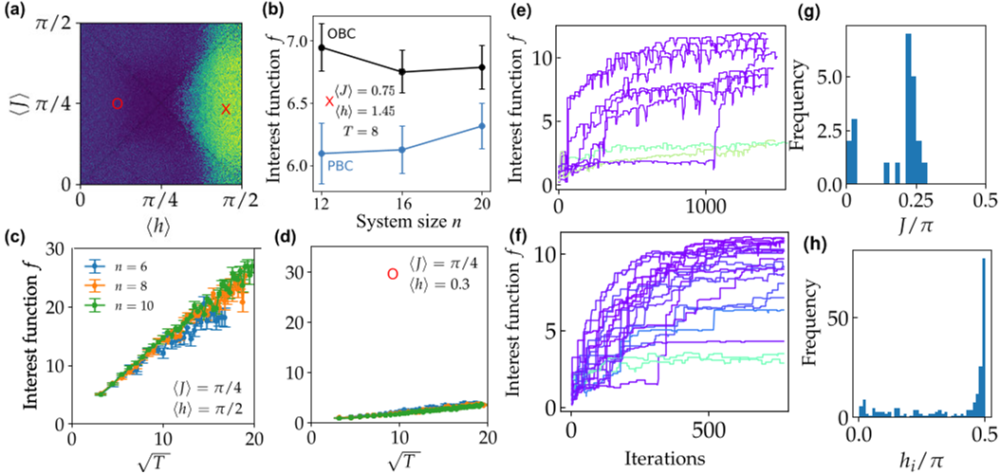
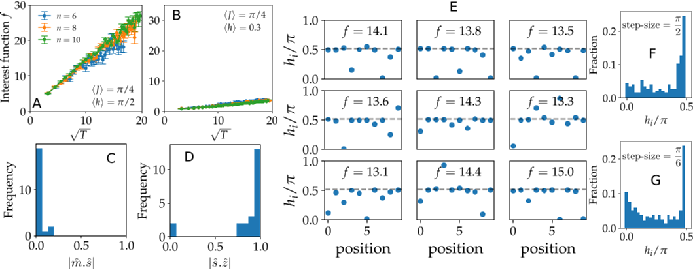
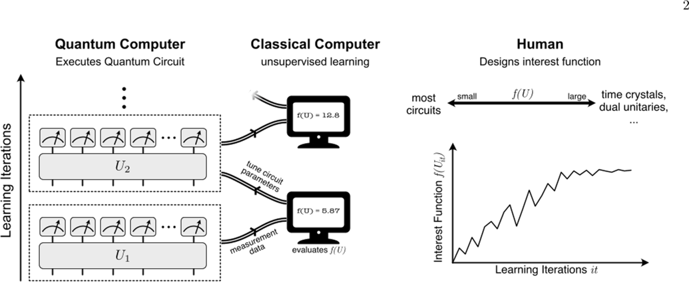

What if quantum computers could teach themselves to find new physics? Recent research demonstrates that by teaming up with artificial intelligence, quantum processors can autonomously discover exotic quantum states—like discrete time crystals—without explicit human guidance. This marks a fresh paradigm where machines don’t just run calculations but actively explore the vast landscape of quantum phenomena.

> **TL;DR**
> - Quantum computers combined with classical machine learning agents can optimize quantum circuits to discover interesting many-body dynamics.
> - Using a 36-qubit superconducting processor, researchers successfully identified discrete time crystals by maximizing a specially designed 'interest function' that quantifies the classifiability of quantum states.

*Note: this summary is based on a preprint — research shared ahead of formal peer review.*

Quantum computing is rapidly advancing, with devices soon capable of manipulating thousands of qubits through complex circuits. Traditionally, quantum computers are used either as universal digital machines or as analog simulators of specific quantum systems. However, the immense space of possible quantum circuits—far too large for humans to exhaustively explore—calls for new strategies. The idea of running quantum computers in 'discovery mode' involves defining what makes a quantum circuit 'interesting' and then using machine learning to search for such circuits autonomously. This approach leverages the quantum device’s ability to efficiently generate data about quantum dynamics and the classical computer’s strength in optimization and pattern recognition.

The researchers introduced 'interest functions'—mathematical criteria that quantify how intriguing a quantum circuit’s behavior is. One such function measures how well the sequence of quantum states generated by repeatedly applying a circuit can be classified into distinct clusters, indicating nontrivial dynamics. To evaluate this, they represent quantum states using a technique called classical shadows, which allows efficient measurement and reconstruction of quantum states from repeated experiments. They then apply unsupervised machine learning methods, like principal component analysis and hierarchical clustering, to detect patterns in the data. A classical optimizer adjusts the parameters defining the quantum circuit to maximize the interest function, effectively steering the quantum processor towards circuits exhibiting novel phenomena. This feedback loop was implemented on a superconducting quantum processor with up to 36 qubits.

Applying this discovery mode, the team focused on identifying discrete time crystals (DTCs)—exotic phases of matter that break time-translation symmetry and exhibit oscillations with a period longer than the driving force. By optimizing the interest function related to the classifiability of quantum states, the quantum processor consistently found circuits that generate DTC behavior. Experimental runs on devices with 12, 24, and 36 qubits showed that the interest function peaked when circuit parameters matched those known to produce DTCs. Optimization trajectories revealed that the learning agent could navigate the complex parameter space to find configurations forming large coherent DTC regions, confirming the robustness of the approach. Additionally, classical simulations suggested that similar strategies could discover other interesting quantum circuits, such as dual-unitary circuits, which have special spectral properties.

This work pioneers a new mode of using quantum computers—not just as calculators but as autonomous explorers of quantum phenomena. By combining quantum hardware with classical machine learning, researchers can systematically search the vast landscape of quantum circuits to uncover new physics. This approach could accelerate discoveries in quantum many-body dynamics and inform the design of future quantum algorithms and materials. It also points toward a future where quantum research facilities integrate advanced quantum devices with AI-driven analysis, akin to large-scale experimental centers in other fields of physics.

While the results are promising, the current experiments are limited to relatively small system sizes and rely on carefully designed interest functions. The optimization landscapes in quantum circuit space can be complex, and scaling the approach to larger, noisier devices remains a challenge. Moreover, the definition of what constitutes 'interesting' physics is subjective and requires human input to design effective interest functions. Practical applications beyond proof-of-concept demonstrations are still exploratory, and further work is needed to generalize and automate the discovery process in more complex quantum systems.

## Figures

*This figure shows how a metric measures phases and optimization in a quantum spin model with disorder, time steps, and varying interaction directions. — Figure from Aydin Deger et al., [CC BY 4.0](http://creativecommons.org/licenses/by/4.0/), caption edited.*

*This figure shows how a key function changes over time and the angles and field values in optimized quantum states with 10 qubits after 500 iterations. — Figure from Aydin Deger et al., [CC BY 4.0](http://creativecommons.org/licenses/by/4.0/), caption edited.*

*Quantum computers run circuits guided by AI to discover new physics, like time crystals, by maximizing a user-defined 'interest' measure. — Figure from Aydin Deger et al., [CC BY 4.0](http://creativecommons.org/licenses/by/4.0/), caption edited.*

## Sources

- [Running Quantum Computers in Discovery Mode](https://arxiv.org/abs/2507.01013)
- DOI: [10.48550/arxiv.2507.01013](https://doi.org/10.48550/arxiv.2507.01013)

*This article reuses and adapts text and figures from the original research by Aydin Deger et al., available via arXiv Quantum Physics, under the [CC BY 4.0](http://creativecommons.org/licenses/by/4.0/) license.*
