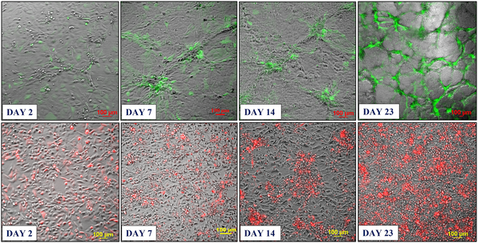
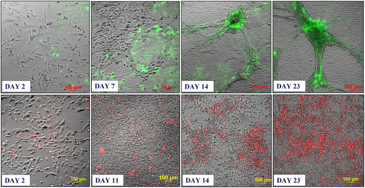
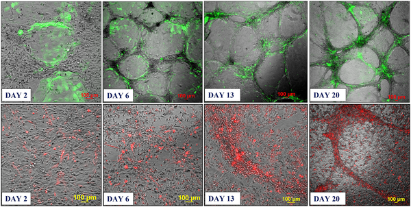

Cancer’s ability to spread, or metastasize, to the brain presents a major challenge for treatment and understanding. Scientists have now created a novel three-dimensional (3D) cell culture system that mimics the brain’s microvascular environment, allowing them to observe how cancer cells interact with brain blood vessels in a lab setting. This new model could accelerate research into brain metastases and help evaluate new drugs more effectively.

> **TL;DR**
> - A scaffold-free 3D co-culture system was developed using human brain endothelial cells and cancer cells to mimic brain metastasis.
> - The model enables detailed study of cancer-endothelial cell interactions and offers a promising platform for testing anti-cancer therapies.

The brain’s unique microenvironment, especially its tightly regulated blood vessels formed by endothelial cells, creates a protective barrier that complicates studying metastatic cancer directly. Traditional two-dimensional (2D) cell cultures lack the complexity of real tissue, while many 3D models rely on scaffolds made from animal-derived materials that can introduce variability and reduce reproducibility. To better replicate the brain’s environment, researchers sought to develop a scaffold-free 3D model where cells self-assemble into structures resembling the brain’s microvasculature, providing a more physiologically relevant system to study how cancer cells colonize the brain.

The team used human brain endothelial cells (HBEC-5i) combined with cancer cell lines from breast and ovarian tumors, including aggressive types known to metastasize to the brain. By mixing these cells in specific ratios without any external scaffold, the cells naturally self-organized into 3D networked structures over several weeks. Fluorescent markers allowed visualization of cancer cells and endothelial cells within these networks. The researchers also performed migration assays and microscopy to study how cancer cells attach to and interact with the endothelial networks, tracking changes in cell morphology and signaling over time.

The scaffold-free co-culture model successfully recreated key features of brain metastasis, including cancer cells attaching to and clustering around the endothelial networks that mimic brain microvessels. The endothelial cells produced collagen and chemokines that supported this self-assembly and sustained cancer cell survival, migration, and proliferation. Importantly, the model remained stable and reproducible over long periods, allowing observation of dynamic interactions. This system also showed potential for testing anti-cancer drugs, providing a platform to evaluate how treatments affect cancer-endothelial crosstalk and tumor progression in a brain-like environment.

This innovative scaffold-free 3D model offers a low-cost, physiologically relevant tool to study the complex interactions between metastatic cancer cells and brain endothelial cells. By more closely mimicking the brain’s tumor microenvironment, it opens new avenues for understanding mechanisms of brain metastasis and accelerating drug discovery. Unlike traditional scaffold-based models, this system avoids variability from animal-derived materials and allows direct visualization of cell behaviors in a 3D context. Ultimately, it holds promise to improve diagnostic and therapeutic strategies for patients facing brain metastases.

While promising, this model is a simplified representation of the brain tumor microenvironment and does not include all cell types present in vivo, such as immune or stromal cells. The system relies on immortalized cell lines, which may not fully replicate primary human tissue behavior. Additionally, the model’s ability to predict clinical drug responses requires further validation. Nonetheless, it provides a valuable step toward more physiologically relevant in vitro models for studying brain metastasis.

## Figures

*Two types of mixed cell cultures grew into 3D networks with cancer cells clustering around blood vessel cells over 30 days.*

*Endothelial and cancer cells grown together form 3D networks with cancer cells clustering inside after about 3 weeks in culture.*

*Fluorescent cancer cells were added to 3D blood vessel-like networks, showing cancer cell movement toward these structures over three weeks.*

## Sources

- [Scaffold-free 3D-cell co-culture model system for the study of metastatic cancer in the brain TME](https://journals.plos.org/plosone/article?id=10.1371/journal.pone.0349061)
- DOI: [10.1371/journal.pone.0349061](https://doi.org/10.1371/journal.pone.0349061)
